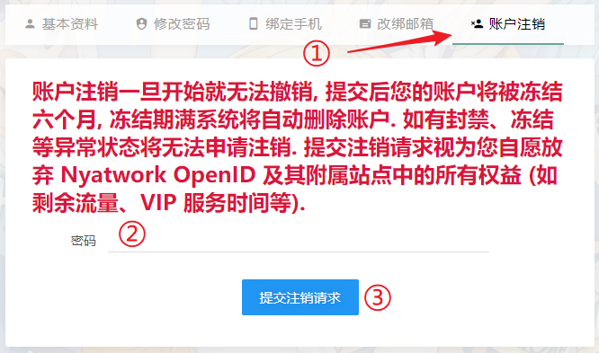

# 常见问题: 账户相关问题

## 怎么更换头像 {#change-avatar}

SakuraFrp 通过 Gravatar 获取头像，您可以 [前往 Gravatar](https://www.gravatar.com/ ':target=_blank') 更换头像。

## 怎么修改用户名 {#change-username}

用户名暂不支持修改，您可以考虑申请注销账户然后重新注册。

## 我的号被盗了怎么办 {#account-hacked}

您有保护好自己账户的义务，请通过邮箱或绑定的手机号进行密码重置，我们无法为您恢复盗号者消耗的流量等权益。

由于改绑邮箱时无需验证旧邮箱，我们推荐您绑定手机号来确保账户可以被找回。

## 怎么换绑手机号 {#change-mobile}

原则上我们不允许换绑手机号，如果确有需要请联系管理员，您需要验证旧手机号和新手机号才能完成换绑。

## 怎么申请账户注销 {#delete-account}

1. 转到 [OpenID 用户中心](https://openid.13a.com/user#tab-4 ':target=_blank')，切换到 **账户注销** 标签
1. 输入密码并点击 **提交注销请求**，按提示操作即可
1. 如果一切顺利，冻结期满后您的账户信息会被自动删除
1. 账户注销完成后，系统将向您发送一封通知邮件，如果您没有收到通知邮件或想确认账户注销状态，请 [联系我们](/about#contact-us)

