# 常见问题: 双击启动器图标后没有反应或崩溃

::: tip 本文仅面向 Windows 用户
如果您是 Linux 用户，您应当根本不会点进这个页面。  
如果您是 macOS 用户，通常来说您不会遇到任何问题，如果遇到了往往是<ruby>系<rp>(</rp><rt>苹</rt><rp>)</rp>统<rp>(</rp><rt>果</rt><rp>)</rp>问<rp>(</rp><rt>搞</rt><rp>)</rp>题<rp>(</rp><rt>事</rt><rp>)</rp></ruby>。
:::

该故障可能是由于您的系统中系统组件损坏导致的，我们为您准备了一些常见的修复系统的指南。

请按下方的指南获取崩溃日志：

1. 右键点击 Windows 图标，然后选择 `事件查看器` 打开。

   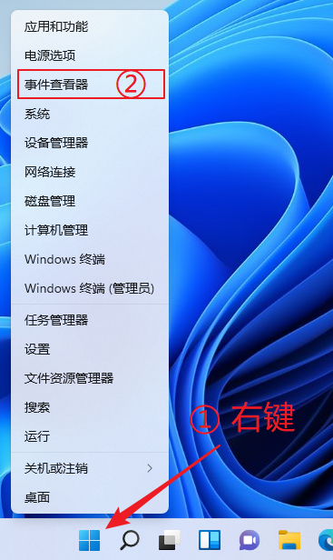

2. 在左边栏展开 `Windows 日志 > 应用程序`，然后向下找到**最近的**两条连续的错误日志（右边显示的 ID 为 `1001` 和 `1000`）。  
   如果在这两条下面还有一个 ID 为 `1026` 的错误日志，点击这个日志。如果没有，点击 `1001` 的日志。

   检查下面的文字中是否有 `SakuraLauncher.exe`，没有的话继续找下一个日志。  
   有的话即找到了正确的日志，把整个框的内容复制出来：

   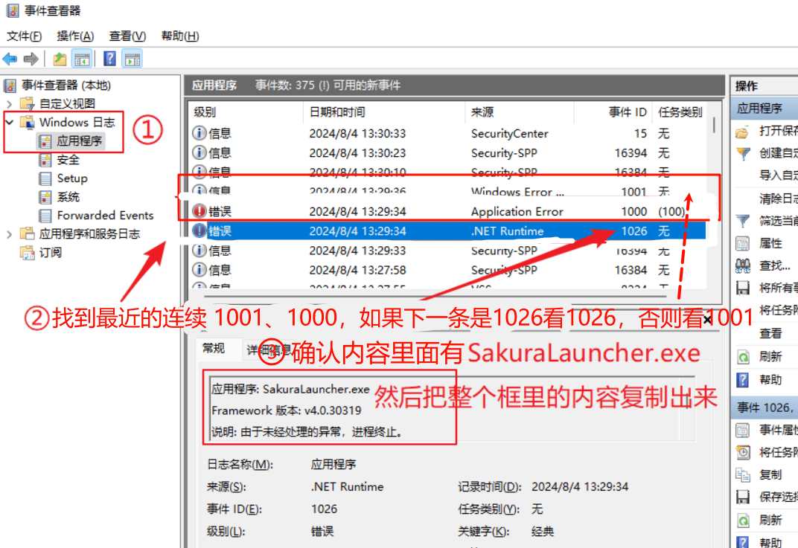

::: warning 注意
请 **对照日志内容** 选择 **对应的** 修复方案，日志不匹配时请勿随意尝试任何的修复方案。  
如果您不确定且经验不足以判断问题，请加入 公开用户反馈群 / VIP 反馈群 联系管理员远程检查。
:::

如果您有日志 ID `1026` 的错误日志，您的问题来自系统组件 .Net Framework，请点击 [Net 问题](#net-problems) 查看修复方案。

如果您没有 `1026` 错误日志，请点击 [其他系统问题](#other-problems) 查看修复方案。

## .NET 相关问题 {#net-problems}

请检查复制出来的崩溃日志，如果开头是如下内容，请点击 [问题 A](#net-a) 查看修复方案：

```log
异常信息: System.TypeLoadException
   在 System.Windows.Automation.Peers.AutomationPeer.Initialize()
   在 System.Windows.Automation.Peers.AutomationPeer..cctor()

异常信息: System.TypeInitializationException
   在 System.Windows.Controls.ComboBox.OnSelectionChanged(System.Windows.Controls.SelectionChangedEventArgs)
```

否则，如果日志以下述任一内容开头，请点击 [问题 B](#net-b) 查看修复方案：

```log
异常信息: System.BadImageFormatException
```

```log
异常信息: System.IO.FileNotFoundException
   在 System.Windows.UIElement.RegisterEvents(System.Type)
   在 System.Windows.UIElement..cctor()
```

否则，如果日志以下述内容开头，请点击 [问题 C](#net-c) 查看修复方案：

```log
异常信息: System.Configuration.ConfigurationErrorsException
   在 System.Configuration.ConfigurationSchemaErrors.ThrowIfErrors(Boolean)
   在 System.Configuration.BaseConfigurationRecord.ThrowIfParseErrors(System.Configuration.ConfigurationSchemaErrors)
   在 System.Configuration.ClientConfigurationSystem.EnsureInit(System.String)
```

### 问题 A ：精简版 Windows 更新后 WPF 损坏 {#net-a}

精简版、Ghost 版等 Windows 10 21H2、22H2 或 Windows 11 21H2 在安装 `KB5011048` 后、无法正常安装后续更新时就会碰到此错误：

```log
System.TypeLoadException:
  Method 'GetSelection' in type 'MS.Internal.Automation.SelectionProviderWrapper' does not have an implementation
  类型“MS.Internal.Automation.SelectionProviderWrapper”的方法“GetSelection”没有实现
```

在有条件的情况下，请尝试将系统更新到最新版，确保 Windows 更新中所有更新都正常安装并且没有提示失败。如果还是无法解决，建议使用 **微软官方镜像** 重新安装最新版 Windows，并且 **不要** 使用各种 “系统优化工具” 对系统进行修改。

如果没有重装的条件，请 [点击这里](ms-settings:windowsupdate) 打开 Windows 更新。滚动到最底部，点击 `更新历史记录`：

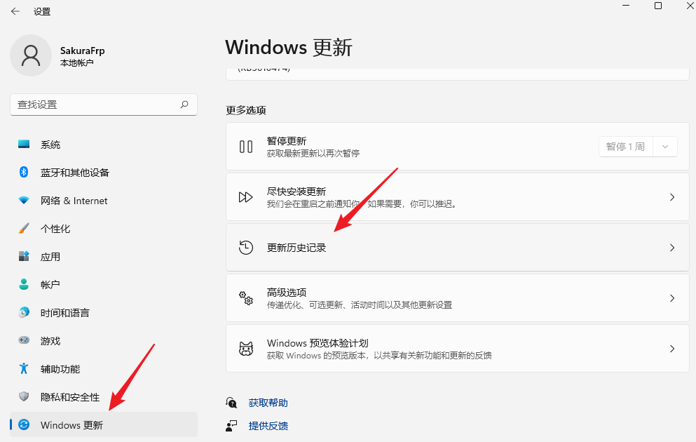

再滚动到最底部，点击 `卸载更新`：

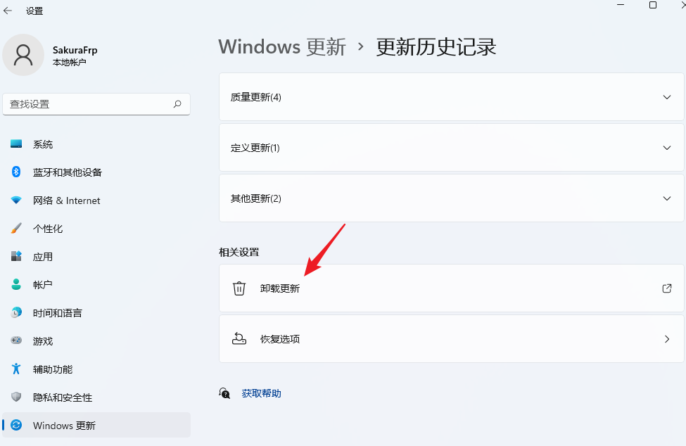

找到 `KB5011048`，双击卸载此更新，然后重启电脑：

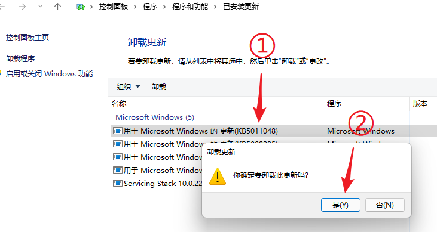

重启后再次尝试打开启动器，如果可以正常打开，请继续下面的操作。否则，请加入公开用户反馈群联系管理员远程检查。

然后，[点击这里](https://download.microsoft.com/download/f/2/2/f22d5fdb-59cd-4275-8c95-1be17bf70b21/wushowhide.diagcab) 下载 `wushowhide.diagcab` (或 [从 Nyatwork CDN 下载](https://nya.globalslb.net/wushowhide.diagcab))，打开并点击 `下一页` 直到出现下图中的选项，点击 `Hide updates`：

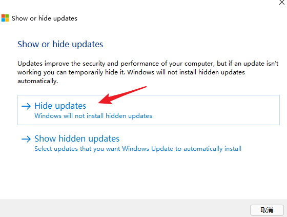

在列表中找到并勾选 `KB5011048`，然后点击 `下一页`：

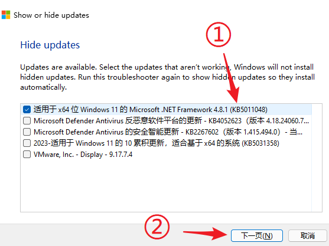

看到如图所示的 `已修复` 提示后，关闭工具即可：

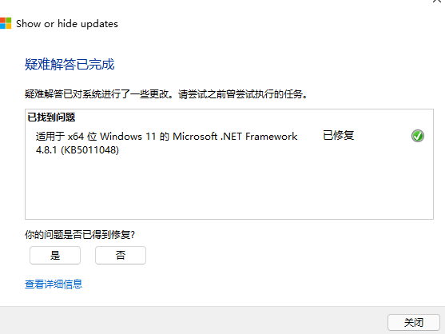

### 问题 B：系统 .NET Framework 组件损坏或缺失 {#net-b}

这种情况通常是由于电脑断电、强制关机等造成系统文件损坏导致的，也可能是部分 “精简”、“优化” 软件所致。如果您使用过这些 “系统优化” 软件或是安装了精简版系统，请不要使用下方的步骤，而是直接使用 **微软官方镜像** 重新安装最新版 Windows。

::: tip 关于 Windows 7 的额外说明
下方的步骤适用于 Windows 10 / 11 用户。如果您正在使用 Windows 7，请直接到控制面板卸载系统中的 .NET Framework 4.8 运行时，然后 [点击这里](https://dotnet.microsoft.com/download/dotnet-framework/thank-you/net48-web-installer) 下载安装包重新安装即可  
:::

右键点击 Windows 图标，然后选择 `终端管理员` 或 `命令提示符 (管理员)` 或 `Windows PowerShell (管理员)`：

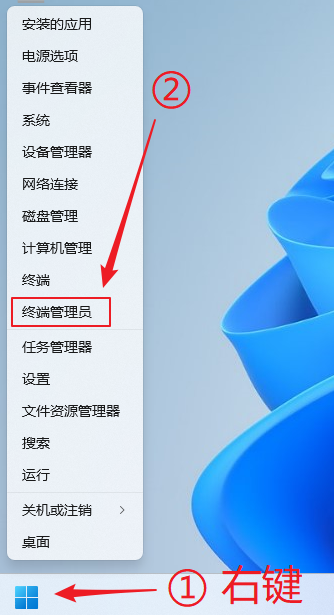

粘贴下方的命令并检查输出内容：

```cmd
Dism /Online /Cleanup-Image /ScanHealth
```

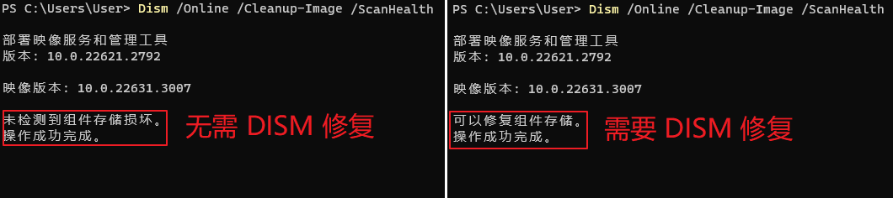

修复 .NET Framework 组件通常需要一步或两步：

- 如果需要 DISM 修复就按顺序进行 `1. DISM 修复` 和 `2. SFC 修复` 两个步骤
- 否则，直接进行下面的 `2. SFC 修复` 步骤即可，这样可以节省一些时间

**1. DISM 修复**

::: tip 请确保 Windows 更新能正常工作
进行 DISM 修复前，请先确保 **Windows 更新** 可以正常工作，否则修复可能会失败  
如果您曾禁用或删除过自动更新，请先使用 [Windows 更新修复工具](https://support.microsoft.com/en-us/windows/windows-update-troubleshooter-19bc41ca-ad72-ae67-af3c-89ce169755dd) 进行修复
:::

```cmd
Dism /Online /Cleanup-Image /RestoreHealth
```

DISM 修复通常需要十几分钟，并且可能需要从 Windows 更新下载损坏的文件，请确保网络连接正常。修复完成后确认最终的输出和下方截图中一致：

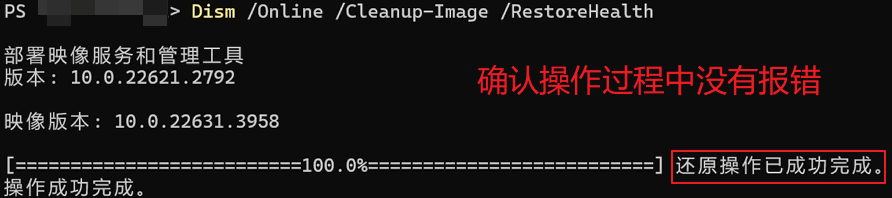

如果看到错误提示，请尝试重新运行上述命令，如果多次尝试后仍然无法修复，请加入公开用户反馈群联系管理员远程检查。

**2. SFC 修复**

粘贴下方的命令并检查输出内容（如果前面的步骤中提示需要重启，请先重启电脑）：

```cmd
sfc /scannow
```

请确认输出中有 `Windows 资源保护找到了损坏文件并成功修复了它们。` 字样，没有任何 `无法修复` 或其他提示：

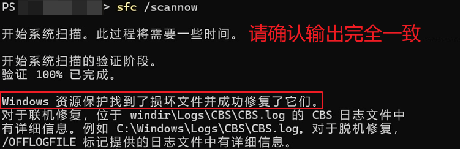

如提示需要重启电脑，请重启电脑。否则，再次双击启动器图标查看能否正常打开。如果仍然存在问题，请加入公开用户反馈群联系管理员远程检查。

### 问题 C：系统级 .NET Framework 配置文件损坏或缺失 {#net-c}

这种情况通常是由于电脑断电、强制关机等造成系统 `machine.config` 损坏或缺失导致的。

分别前往下述两个文件夹：

- `C:\Windows\Microsoft.NET\Framework64\v4.0.30319\Config`
- `C:\Windows\Microsoft.NET\Framework\v4.0.30319\Config`

在每个文件夹中都进行一次下面的检查（两个步骤都要做）：

1. 检查 `machine.config` 文件是否存在，如果存在，将其改名为 `machine.config.bak`，否则直接跳到下一步
2. 将同一个文件夹中的 `machine.config.default` 文件 **复制一份** 并重命名为 `machine.config`

操作完成后再次尝试双击启动器图标查看是否能正常打开。如果仍然存在问题，请加入公开用户反馈群联系管理员远程检查。

## 其他系统问题 {#other-problems}

请检查复制出来的崩溃日志，如果其中包含有下面的内容，请点击 [问题 M-1](#other-m-1) 查看修复方案：

```log
EmbeddedBrowserWebview.dll
```

### 问题 M-1：系统 WebView2 组件损坏 {#other-m-1}

WebView2 是微软提供的 Windows 组件，我们暂不清楚这种问题的来源，可能是使用“优化软件”导致的。请尝试使用下面的方法让 WebView2 自修复：

右键点击 Windows 图标， 点击 `安装的应用` (如果是 Windows 10 则为 `应用与功能`)。

在应用列表中找到 `Microsoft Edge WebView2 Runtime`，点击右边三个点，点击 `修改` 按钮 （Windows 10 直接点击修改即可）  
在弹出的窗口中点击 `修复`：


WebView2 自修复完成后窗口会直接消失，请再次尝试双击启动器图标查看能否正常打开。
