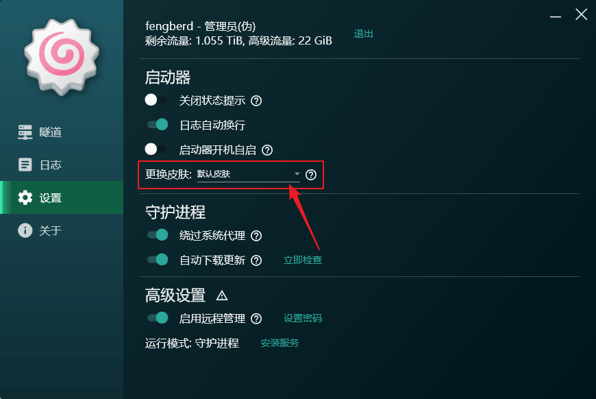
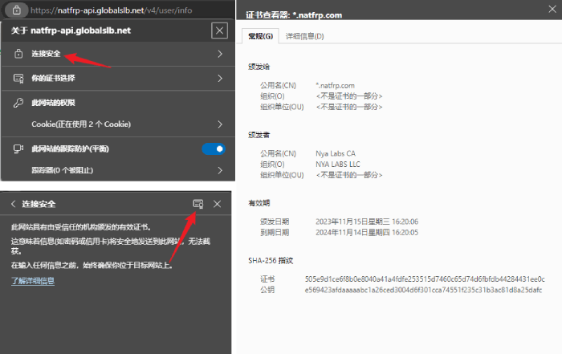
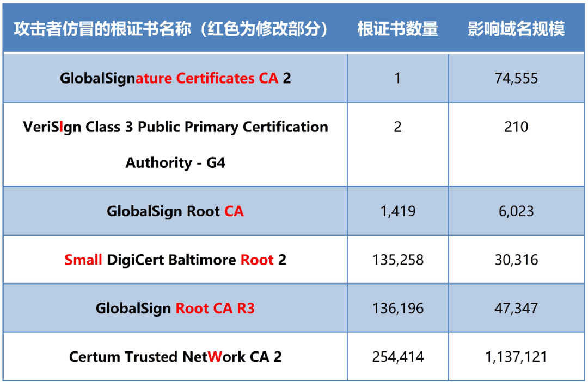

# 常见问题: SakuraFrp 启动器

## 各平台常见问题 {#common}

### unknown status code: 403 / 远程服务器返回错误：（403）已禁止 {#api-error-403}

这通常是由于您的 IP 被 Cloudflare 判定为高危造成的。

请打开此网页检查您的 Cloudflare 威胁指数：[cf.qn.md](https://cf.qn.md/)

通常情况下，您的 IP 威胁指数应该是 0。超过 0 的指数都可能碰到此错误。

如果威胁指数超过 0，建议您更换 IP（重启光猫和路由器）或是尝试使用手机热点进行操作。

### 怎么关闭自动更新功能 {#disable-update}

直接关闭 **设置** 标签中的 **自动更新** 开关即可，关闭后启动器不会进行任何更新检查或下载。

## Windows 常见问题 {#windows}

### 安装更新时卡在 "等待启动器退出" 或是启动器关闭后没有任何反应 {#update-hang}

该问题是由于您使用 **管理员身份** 运行了 **启动器用户界面** 造成的。

- 在 **守护进程** 模式下会表现为持续的 "等待启动器退出....."
- 在 **系统服务** 模式下会表现为确认更新后启动器退出，但没有执行更新。再次打开启动器界面可能提示 "未连接到守护进程"

请 **不要** 使用管理员身份运行启动器用户界面，如果您已经使用管理员权限运行了启动器用户界面，请在安装更新前右键托盘图标，选择 **退出启动器**，然后重新以 **普通用户权限** 运行启动器用户界面。

### 守护进程异常退出 {#daemon-fault}

请在错误信息中寻找下列关键词，点击展开对应章节：

::: details 启动器文件损坏

这通常是用于杀毒软件误伤启动器组件（特别是 `frpc.exe`），请：

1. 点击 **中止** 按钮退出用户界面
1. 参考 [这篇文档](/launcher/antivirus.md) 在杀软中添加白名单
1. 重新下载安装包覆盖安装启动器
1. 重新打开启动器

:::

::: details 文件签名验证失败

这很可能意味着您的电脑可能已经被病毒感染，请：

1. 点击 **中止** 按钮退出用户界面
1. 卸载启动器，清除可能被感染的文件
1. 使用正规杀毒软件进行全盘杀毒
1. 重新下载安装包进行安装

:::

::: details singleton check failed, do not start duplicate process

如果您没有进行过高级配置，这通常是由于自动更新卡住了，请：

1. 同时按下 `Ctrl-Shift-Esc` 组合键打开任务管理器
1. 找到并结束 `SakuraFrpService.exe`
1. 如果您安装更新后看到此错误，再找到并结束 `update.exe`
1. 点击 **重试** 按钮或重启一下用户界面

:::

::: details failed to load config

这通常是由于配置文件损坏，如果您的电脑最近出现过蓝屏、死机、异常断电就可能碰到此错误。请：

1. 同时按下 `Win-R` 组合键打开运行窗口
1. 输入 `%ProgramData%\SakuraFrpService` 并回车打开配置文件夹
1. 删除 `config.json` 文件
1. 点击 **重试** 按钮或重启一下用户界面

:::

### 守护进程启动失败 {#daemon-launch-failed}

请在错误信息中寻找下列关键词，点击展开对应章节：

::: details 无法启动计算机 "." 上的服务，服务没有及时响应启动或控制请求

这通常是由于守护进程报错退出，在系统服务模式下我们无法获取到具体的错误信息。

- 先点击 **忽略** 按钮抑制提示
- 在高级设置中点击 **卸载服务**
- 然后参考 [守护进程异常退出](#daemon-fault) 一节进行排查

:::

### 系统服务状态异常, 启动器可能无法正常运行 {#service-abnormal}

- 点击 **卸载服务** 并等待卸载完成
- 随后重新点击 **安装服务** 进行安装

### 未连接到守护进程, 大部分功能将不可用, 请尝试重启启动器 {#service-disconnected}

:::: details 如果您使用的是 Windows 7 与早期 3.0 版启动器，点击此处

这是一个已知 BUG，我们已在核心服务 **3.0.5** 中修复此问题（发布于 **2023-08-16**）。

请重新下载启动器安装包，确认安装包 MD5 与网站上发布的一致（避免下载到缓存的旧版），然后覆盖安装。

临时缓解措施：

1. 打开启动器，看到 "未连接到守护进程" 提示后稍等几秒
1. 在任务栏找到启动器图标，右键并点击 **退出启动器**

   ::: warning
   **不要** 使用 **彻底退出** 按钮，该缓解措施的原理就是让启动器 UI 重新连接，点 **彻底退出** 就没有意义了
   :::

1. 再次打开启动器，现在应该能正常使用了
1. 每次重启核心服务（比如重启电脑后）都需要重复上述操作，建议在有条件的情况下尽快更新到最新版

::::

请按顺序尝试以下操作:

1. 重新安装启动器
1. 右键启动器，选择 **以管理员身份运行**
1. 点击 **卸载服务** 并重启启动器（如果需要使用系统服务，稍后再点安装）
1. 若问题持续存在，可以加入官方反馈群联系管理员

### 如何自定义安装路径 {#installation-path}

默认安装路径为 `C:\Program Files\SakuraFrpLauncher`，这通常能满足绝大多数用户的需求。

部分启动器功能需要注册系统服务才能正常工作，为了避免这些功能故障，GUI 不提供自定义安装路径的选项。

如您确有特殊需要，请参阅 [Inno Setup 文档](https://jrsoftware.org/ishelp/index.php?topic=setupcmdline) 传入恰当的命令行参数（`/DIR`）来设置安装路径。

::: warning 注意
安装路径必须以 `SakuraFrpLauncher` 结尾来建立单独的文件夹，以免卸载时误删其他文件
:::

```sh
# 例如安装到 D:\MyFolder\SakuraFrpLauncher
SakuraLauncher.exe /DIR="D:\MyFolder\SakuraFrpLauncher"
```

### 这个程序需要 Windows 服务包 1 或更高 {#requires-sp1}

出现此提示说明系统版本过旧，Windows 7 用户必须更新到 Service Pack 1 或以上才可以正常使用。

我们推荐您更新到最新版 Windows 10 (或者 11) 来获取更好的使用体验，关于兼容性问题请参阅 [启动器系统需求](#system-requirement)。

### 安装时出现错误代码 5100 {#error-net-5100}

根据 [微软官方文档](https://learn.microsoft.com/en-us/dotnet/framework/deployment/guide-for-administrators)，此问题为 **用户计算机不符合系统需求**。

请检查您的系统是否符合 [启动器系统需求](#system-requirement)，如果是 Windows 7 系统请升级到 SP1 再试。

### 启动器系统需求 {#system-requirement}

| 硬件 | 最低需求 | 推荐配置 |
| --- | --- | --- |
| CPU | 1 GHz | 2.3 GHz, 4 线程或更高 |
| RAM | 700 MiB | 4 GiB 或更高 |
| 硬盘剩余空间 | 50 MiB | 2 GiB 或更高 |

启动器依赖于微软的 .NET Framework 4.8 运行时，因此启动器的系统需求也与微软提供的 .NET Framework 4.8 运行时系统需求相同。

| 操作系统 | 兼容性 |
| --- | --- |
| Windows 11 | 直接安装启动器即可使用 |
| Windows 10, 1903 及以上 | 直接安装启动器即可使用 |
| Windows 10, 1607~1809 | 需额外安装 .NET Framework 4.8 |
| Windows 10, 1511 及以下 | 不兼容 |
| Windows 8.1 | 需额外安装 .NET Framework 4.8 |
| Windows 8 | 不兼容 |
| Windows 7 SP1 | 需额外安装 .NET Framework 4.8 |
| Windows 7 | 不兼容 |
| Windows Vista SP2 | 不兼容 |
| Windows Vista SP1 | 不兼容 |
| Windows Vista | 不兼容 |
| Windows XP | 不兼容 |

### 下载附加文件时出错 / .NET Framework 安装失败 {#error-on-download-extra-files}

如果您在使用非常古早的操作系统，安装程序可能在 `正在下载附加文件...` 一步提示 `Server Certificate Invalid or not present` 等错误。

请参考下一条 FAQ 手动安装相关运行时。

### 如何在 Windows 7 (Windows Server 2008) 上安装启动器运行时 {#install-runtime-on-win7}

::: warning
Windows 7 和 Server 2008 早已停止支持，微软已不再提供安全更新  
我们强烈建议您尽快升级到 Windows 10 (或者 11) / Windows Server 2022 或更新版本
:::

请先确保您已将系统更新到 **Windows 7 SP1** / **Windows Server 2008 R2 SP1** 版本。

然后，按顺序安装以下更新，安装过程中如果提示需要重启请务必重启：

- [KB3020369](https://www.catalog.update.microsoft.com/Search.aspx?q=KB3020369)
- [KB3125574](https://www.catalog.update.microsoft.com/Search.aspx?q=KB3125574)
- [KB4474419](https://www.catalog.update.microsoft.com/Search.aspx?q=KB4474419)
- [KB4490628](https://www.catalog.update.microsoft.com/Search.aspx?q=KB4490628)
- （请注意顺序）[KB4536952](https://www.catalog.update.microsoft.com/Search.aspx?q=KB4536952)
- （请注意顺序）[KB4534310](https://www.catalog.update.microsoft.com/Search.aspx?q=KB4534310)
- 如果您购买了 ESU 订阅，也可以使用 Windows Update 自动安装相关更新

然后，按照下面的两条 FAQ 手动下载并安装对应的运行时文件：

- [该软件需要安装 .NET Framework 4.0 及以上](#dotnet-required)
- [无法初始化 WebView2 运行环境 / WebView2 初始化失败](#webview2-init-failed)

安装后可能需要重启电脑，根据提示重启后正常运行启动器安装程序进行安装即可。

### 该软件需要安装 .NET Framework 4.0 及以上 {#dotnet-required}

启动器依赖于微软的 .NET Framework 4.8 运行时。

- 安装 `.NET Framework 4.8` 即可 ([点击这里下载](https://dotnet.microsoft.com/download/dotnet-framework/thank-you/net48-web-installer))

您也可以选择不安装 WPF / 传统用户界面并使用 Web UI（只推荐高级用户使用）。

### 无法初始化 WebView2 运行环境 / WebView2 初始化失败 {#webview2-init-failed}

启动器的创建、编辑隧道功能依赖于微软的 Microsoft Edge WebView2 运行时。

- 启动器 `3.1.0.0` 要求 WebView2 运行时版本 `>= 120.0.2210.55`
- 启动器 `3.1.0.1` 要求 WebView2 运行时版本 `>= 104.0.1293.70`，支持 Windows 7 / 8.1 系统
- 安装（或更新） `Microsoft Edge WebView2 运行时` 然后重启启动器即可 ([点击这里下载](https://go.microsoft.com/fwlink/p/?LinkId=2124703))

::: details 您也可以手动配置固定版本的 WebView2 运行时 (仅限高级用户)

- 从 [Windows Update Catalog](https://www.catalog.update.microsoft.com/Search.aspx?q=webview2) 或 [此仓库 (由第三方提供, 请注意校验数字签名)](https://github.com/westinyang/WebView2RuntimeArchive/releases) 下载固定版本的运行时文件
  - Windows 10 / 11 用户直接下载最新版即可，注意选择正确的架构
  - Windows 7 / 8.1 用户请下载 [109.0.1518 版本](https://www.catalog.update.microsoft.com/Search.aspx?q=Microsoft%20Edge-WebView2%20Runtime%20Version%20109) \[[GitHub (由第三方提供, 请注意校验数字签名)](https://github.com/westinyang/WebView2RuntimeArchive/releases/tag/109.0.1518.78)\]
- 将下载到的文件解压到 `工作目录\WebView2` 文件夹中并重启启动器，启动器会优先使用该文件夹中的版本
  - 从 Windows Update Catalog 下载时，您可能会得到一个 exe 文件，请自己想办法提取对应文件
  - 从第三方 GitHub 仓库下载时，请注意校验文件的数字签名
- 如果您下载了 `v120` 及以上版本且运行 Windows 10 或更新系统，还需要执行 [此文档](https://learn.microsoft.com/en-us/microsoft-edge/webview2/concepts/distribution#details-about-the-fixed-version-runtime-distribution-mode) 中的 **步骤 6** 相关命令

   ```cmd
   icacls %ProgramData%\SakuraFrpService\WebView2 /grant *S-1-15-2-2:(OI)(CI)(RX)
   icacls %ProgramData%\SakuraFrpService\WebView2 /grant *S-1-15-2-1:(OI)(CI)(RX)
   ```

:::

您也可以打开高级选项里的 `传统创建隧道窗口` 选项来使用传统的创建隧道窗口（不推荐），但编辑隧道功能将无法正常工作。

### 隧道启动失败: 拒绝访问 / 系统找不到指定的文件 / file does not exist / access is denied {#tunnel-start-failed}

这种情况通常是杀毒软件误杀了 frpc 造成的，请：

1. 参考 [这篇文档](/launcher/antivirus.md) 在杀软中添加白名单
1. 重新下载安装包覆盖安装启动器
1. 重新打开启动器

### 杀毒软件提示启动器有病毒怎么办 {#misc}

请检查杀毒软件提示的具体病毒名称，如果是 `PUA`、`Not-A-Virus`、`Riskware` 等类别，通常都是对 `frpc.exe` 的误报。

您可以校验启动器安装程序的 MD5 是否与我们网站上发布的 MD5 值相匹配，如果这个值不匹配可能说明您下载到的安装程序被病毒感染了。

如果这个 MD5 值是匹配的，建议您参考 [这篇文档](/launcher/antivirus.md) 在杀软中添加白名单然后重新安装启动器。

### 打开创建隧道窗口、编辑隧道窗口后显示白屏 {#blank-create-window}

您的网络环境可能无法正常连接到 SakuraFrp 管理面板，可以在创建隧道窗口按 F5 刷新页面试试。

如果还是无法正常使用，请使用浏览器打开管理面板创建隧道，或是打开高级选项里的 `传统创建隧道窗口` 选项（不推荐）。

### 点击 创建隧道/加号 按钮后闪退 {#crash-on-create-tunnel}

:::tip
该问题应该不会在 3.0 及以上版本的启动器中出现
:::

出现此问题说明您的系统中存在一些有问题软件塞满了系统的临时文件夹后没有及时释放。

一般出现此问题时，会伴随出现系统不稳定、其他软件假死、闪退等问题。

请在 文件资源管理器 的地址栏中输入 `%TEMP%` 并回车进入临时文件夹，删除其中较旧的文件即可。

### 怎么更换启动器主界面显示的图标 {#change-icon}

快速点击图标，只要您手速够快就可以更换图标。我们有三个图标供您选择。

如果想换回来，退出启动器并修改 `%localappdata%/SakuraLauncher/<Hash>/<版本号>/user.config` 中 `LogoIndex` 项对应的值为 `0` 即可。

### 怎么更换启动器主题皮肤 (主题) {#change-theme}

如果您在使用 **v2.0.4.0** 及以上版本启动器，前往设置页面更换皮肤即可。更换后需要重启启动器才能生效。



如果您在使用旧版本启动器，关闭启动器，修改 `%localappdata%/SakuraLauncher/<Hash>/<版本号>/user.config` 中 `Theme` 项对应的值:

| Theme | 主题名称 |
| --- | --- |
| 0 | 默认主题 |
| 1 | <b style="color: #be853d">黑 金 贵 族</b> |
| 2 | <b style="color: #584572">童 话 世 界</b> |
| 3 | <b style="color: #3f689e">海 阔 天 空</b> |
| 4 | <b style="color: #92513d">丰 收 时 节</b> |
| 5 | <b style="color: #529a82">前 途 光 明</b> |

修改完毕后重新打开启动器即可。

### 打开启动器时登录失败，tls {#tls-login-error}

``` log
Get "~": tls: failed to verify certificate: x509: certificate signed by unknown authority
```

如果您在登录启动器时遇到了此错误，这一般是有第三方正在试图窃听我们和您之间的流量导致的。

:::tip 如果您对系统安全、网络安全并不关心
您可以无视下面的内容，下面的内容旨在揪出问题源头，  
您只需参考 [启动器用户文档](/launcher/manual) 中 [api_ca_mode 配置项](/launcher/manual#config-api-ca-mode)，  
通常来说将其配置为 `system` 即可达成掩耳盗铃的目的。

如果仍然存在问题，您可以更进一步，将其配置为 `no-verify`。
:::

您可以关闭电脑中所有抓包软件、监听软件后再次尝试。

如果仍未解决，请在浏览器中打开 [https://natfrp-api.globalslb.net/1](https://natfrp-api.globalslb.net/1)

确认网页内容为 `API 连接性正常`，再按照如下步骤查看网站证书，核对颁发者是否为 `Nya Labs CA` 。



如果出现了诸如下图中的颁发者或其他非法根证书，您的电脑大概率遭遇了病毒入侵。  
（下表数据来自 [Rusted Anchors: A National Client-Side View of hidden Root CAs in the Web PKI Ecosystem](https://doi.org/10.1145/3460120.3484768)）



请尝试使用杀毒软件进行全盘查杀，或使用 [卡巴斯基病毒清除工具](https://www.kaspersky.com.cn/downloads/free-virus-removal-tool)、[360系统急救箱](https://bbs.360.cn/thread-14699478-1-1.html) 或 [火绒恶性木马专杀工具](https://bbs.huorong.cn/thread-18575-1-1.html) 等工具进行查杀。

如果仍未能清除病毒，您可以考虑到 [火绒安全论坛](https://bbs.huorong.cn/forum-44-1.html) 发帖求助。

清除病毒后，您应当删除对应的假证书，尽管保留它们通常不会造成明显的问题。

## Linux 常见问题 {#linux}

### 登出后隧道断开、启动器退出 {#linux-logout-disconnect}

如果您使用 Systemd 配置了用户服务，这通常是由于用户服务在会话结束后被关闭造成的。

您可以考虑下列方案之一：

- 使用 `loginctl enable-linger` 命令来启用 lingering
- 将启动器配置为 Systemd 系统服务。

  如果您之前配置了用户服务，记得删除相关文件（文档示例为 `~/.config/systemd/user/natfrp.service`）。
  
  下面提供了一个简单的系统服务例子，将其放到 `/etc/systemd/system/natfrp.service` 中即可，记得修改用户名：

  ```systemd
  [Unit]
  Description=SakuraFrp Launcher
  After=network.target

  [Service]
  # 在后面加上您的用户名，例如（这里的 alice 只是举个例子，请写实际的用户名）:
  # User=alice
  # Group=alice
  User=
  Group=

  Type=simple
  TimeoutStopSec=20

  Restart=always
  RestartSec=5s

  # 在这里填写启动器的绝对路径和 --daemon 选项，例如：
  # ExecStart=/home/alice/.config/natfrp/natfrp-service --daemon
  ExecStart=

  [Install]
  WantedBy=multi-user.target
  ```

### 安装启动器后登录桌面卡在黑屏 {#linux-stuck-login}

如果您的 Linux 桌面环境在启动器运行时（如配置了开机启动后）登录后卡在黑屏、可以看到鼠标光标但无法进入桌面，可能是由于启动器的 Web UI 端口 `4101` 与 BrlAPI 的默认端口发生了冲突。

采用 BrlAPI 的程序如 `xbrlapi`、`BRLTTY`、屏幕阅读器等会尝试连接到 4101 端口，但启动器无法作出正确的响应导致这些程序卡住。对于 xbrlapi，卡住会导致登录后黑屏。

如果您已经卡在黑屏界面了，可以尝试按下 `Ctrl-Alt-F3` 组合键进入命令行终端（如果 F3 还是登录界面，可以依次尝试 F1~F6），登录后先关闭启动器再进行后续操作。

您可以考虑下列方案之一：

- 编辑 `<工作目录>/config.json`，更改启动器的 Web UI 监听端口
- 如果您不使用这些辅助功能，请参考发行版的相关说明卸载 `xbrlapi` 软件包  
  该问题常见于 Debian 系发行版，可通过 `apt remove xbrlapi` 卸载
