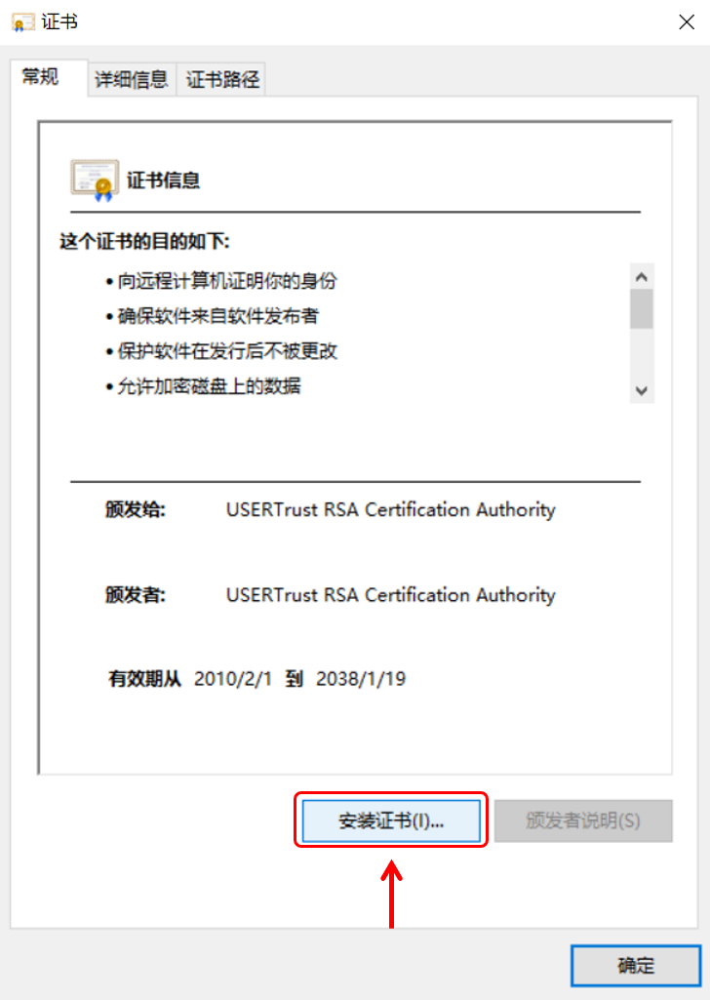
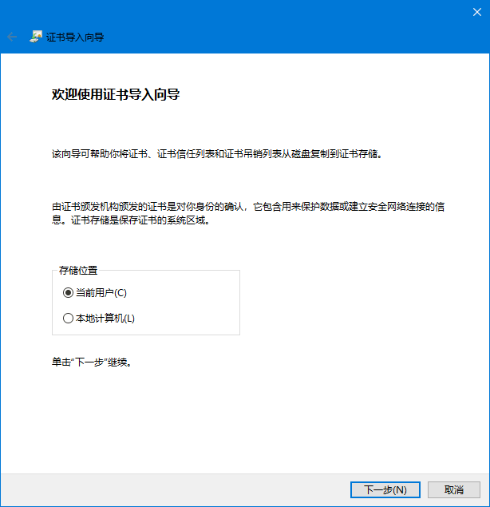
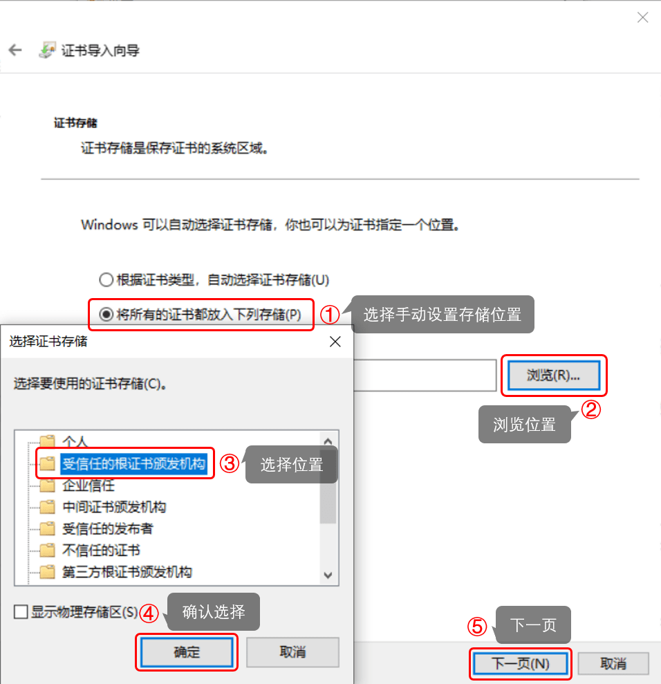
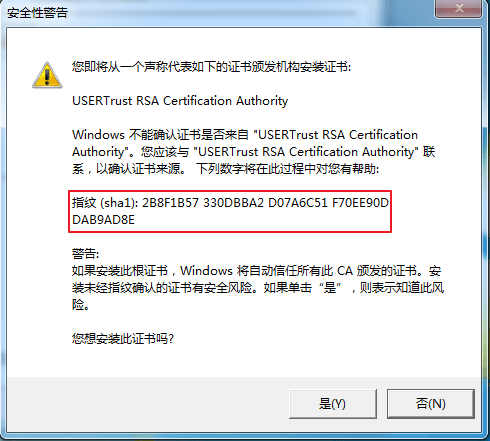

# 常见问题: 启动器

## 安装问题 :id=install

### 下载附加文件时出错

如果在 **正在下载附加文件...** 时报错 **Server Certificate Invalid or not present**，请按顺序操作:

1. 检查系统时间是否正确，然后重试
1. 点击 [这里](https://dotnet.microsoft.com/download/dotnet-framework/net48 ':target=_blank')，然后点击 **Download .NET Framework 4.8 Runtime** 下载框架安装程序
1. 关闭启动器安装程序，运行刚才下载的框架安装程序，安装框架
1. 重新运行启动器安装程序，正常进行安装

### 这个程序需要 Windows 服务包 1 或更高

出现此提示说明系统版本过旧，Windows 7 用户必须更新到 Service Pack 1 或以上才可以正常使用。

我们推荐您更新到最新版 Windows 10 来获取更好的使用体验，关于兼容性问题请参阅 [启动器系统需求](#system-requirement)。

### 启动器系统需求 :id=system-requirement

| 硬件 | 最低需求 | 推荐配置 |
| --- | --- | --- |
| CPU | 1 GHz | 2.3 GHz, 4 线程或更高 |
| RAM | 700 MiB | 4 GiB 或更高 |
| 硬盘剩余空间 | 50 MiB | 2 GiB 或更高 |

| 操作系统 | 兼容性 |
| --- | --- |
| Windows 10, 1903 及以上 | 直接安装启动器即可使用 |
| Windows 10, 1607~1809 | 需额外安装 .NET Framework 4.8 |
| Windows 10, 1511 及以下 | 不兼容 |
| Windows 8.1 | 需额外安装 .NET Framework 4.8 |
| Windows 8 | 不兼容 |
| Windows 7 SP1 | 需额外安装 .NET Framework 4.8 |
| Windows 7 | 不兼容 |
| Windows Vista SP2 | 不兼容 |
| Windows Vista SP1 | 不兼容 |
| Windows Vista | 不兼容 |
| Windows XP | 不兼容 |

## 常见报错 :id=error

### 系统服务状态异常, 启动器可能无法正常运行

打开启动器，点击 **卸载服务** 并等待卸载完成，随后重新点击 **安装服务** 安装即可。

### 未连接到守护进程, 大部分功能将不可用, 请尝试重启启动器

请按顺序尝试以下操作:

1. 重新安装启动器
1. 右键启动器，选择 **以管理员身份运行**
1. 点击 **卸载服务** 并重启启动器

?> 如果您之前使用的是压缩包 (绿色版) 启动器，在更新后无法正常使用  
请 **删除所有启动器文件** 后重新安装启动器，然后点击 **卸载服务**

### 该软件需要安装 .NET Framework 4.0 及以上

出现 `该软件需要安装 .NET Framework 4.0 及以上` 类似提示。

- 安装 `.NET Framework 4.8` 即可 ([点击前往微软官方下载页面](https://dotnet.microsoft.com/download/dotnet-framework/net48 ':target=_blank'))。

### 远程证书无效

报错 `System.Net.WebException: 基础连接已关闭，根据验证过程，远程证书无效`。

碰到这个问题说明您的系统上缺少 *USERTrust RSA Certification Authority* 根证书，需要安装此证书。

1. 首先，点击 [这里](https://crt.sh/?d=1199354 ':target=_blank') 下载证书文件。

   

2. 下载完成后，双击打开这个 crt 文件，点击 `安装证书`：

   

3. 存储位置选择 `当前用户`：

   

4. 按照下图选择好证书存储路径，注意不要选错了，然后点下一步：

   

5. 这个时候计算机应该会弹出安全警告，确认图中红框圈出的部分和您看到的提示完全一致后点击 `是`，证书就安装完成了。

   !> 如果您看到的证书指纹和图中不一致，请立即点击 `否` 取消安装

   

## 其他问题 :id=misc

### 杀毒软件提示启动器有病毒怎么办

您可以校验启动器安装程序的 MD5 是否与我们网站上发布的 MD5 值相匹配，如果这个值不匹配可能说明您下载到的安装程序被病毒感染了。

如果这个 MD5 值是匹配的，建议您在杀毒软件中添加白名单然后重新安装启动器。

您也可以选择到 [GitHub](https://github.com/fengberd/SakuraFrpLauncher ':target=_blank') 获取启动器源码自行编译，如果您决定自己编译启动器的 Release 版本，请记得修改 `SakuraLibrary/Utils.cs` 中的 `VerifySignature` 函数跳过签名验证。

### 怎么关闭自动更新功能

直接关闭 **设置** 标签中的 **自动更新** 开关即可，关闭后启动器不会进行任何更新检查或下载。

您可以在 [GitHub](https://github.com/fengberd/SakuraFrpLauncher/blob/master/SakuraFrpService/Manager/UpdateManager.cs ':target=_blank') 审计相关代码，如果您想彻底移除此功能，请自行编译启动器。

### 怎么更换启动器主界面显示的图标

快速点击图标，只要您手速够快就可以更换图标。我们有三个图标供您选择。

### 怎么更换启动器主题皮肤 (主题)

如果您在使用 v2.0.4.0 及以上版本启动器，前往设置页面更换皮肤即可。更换后需要重启启动器才能生效。

如果您在使用旧版本启动器，关闭启动器，修改 `%localappdata%/SakuraLauncher/<Hash>/<版本号>/user.config` 中 `Theme` 项对应的值:

| Theme | 主题名称 |
| --- | --- |
| 0 | 默认主题 |
| 1 | <b style="color: #be853d">黑 金 贵 族</b> |
| 2 | <b style="color: #584572">童 话 世 界</b> |
| 3 | <b style="color: #3f689e">海 阔 天 空</b> |
| 4 | <b style="color: #92513d">丰 收 时 节</b> |
| 5 | <b style="color: #529a82">前 途 光 明</b> |

修改完毕后重新打开启动器即可。
