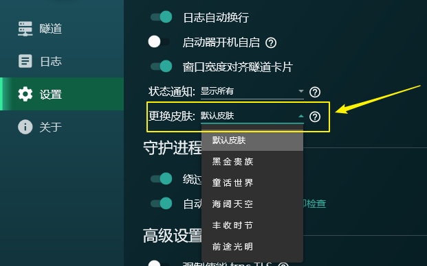

# 常见问题: SakuraFrp 启动器

## 远程服务器返回错误：（403）已禁止。 {#api-error-403}

这通常是由于您的 IP 被 Cloudflare 判定为高危造成的。

请打开此网页检查您的 Cloudflare 威胁指数：[cf.qn.md](https://cf.qn.md/)

通常情况下，您的 IP 威胁指数应该是 0。超过 0 的指数都可能碰到此错误。

如果威胁指数超过 0，建议您更换 IP（重启光猫和路由器）或是尝试使用手机热点进行操作。

## 如何自定义安装路径 {#installation-path}

默认安装路径为 `C:\Program Files\SakuraFrpLauncher`，这通常能满足绝大多数用户的需求。

部分启动器功能需要注册系统服务才能正常工作，为了确保这些功能不出问题，启动器安装程序不提供自定义安装路径的选项。

如您确有特殊需要，想自定义启动器安装路径，您可以参阅 [Inno Setup 文档](https://jrsoftware.org/ishelp/index.php?topic=setupcmdline) 传入恰当的命令行参数来设置安装路径。

## 下载附加文件时出错 {#error-on-download-extra-files}

如果在 **正在下载附加文件...** 时报错 **Server Certificate Invalid or not present**，请按顺序操作:

1. 检查系统时间是否正确，然后重试
1. 点击 [这里](https://dotnet.microsoft.com/download/dotnet-framework/net48)，然后点击 **Download .NET Framework 4.8 Runtime** 下载框架安装程序
1. 关闭启动器安装程序，运行刚才下载的框架安装程序，安装框架
1. 重新运行启动器安装程序，正常进行安装

## 这个程序需要 Windows 服务包 1 或更高 {#requires-sp1}

出现此提示说明系统版本过旧，Windows 7 用户必须更新到 Service Pack 1 或以上才可以正常使用。

我们推荐您更新到最新版 Windows 10 来获取更好的使用体验，关于兼容性问题请参阅 [启动器系统需求](#system-requirement)。

## 启动器系统需求 {#system-requirement}

| 硬件 | 最低需求 | 推荐配置 |
| --- | --- | --- |
| CPU | 1 GHz | 2.3 GHz, 4 线程或更高 |
| RAM | 700 MiB | 4 GiB 或更高 |
| 硬盘剩余空间 | 50 MiB | 2 GiB 或更高 |

| 操作系统 | 兼容性 |
| --- | --- |
| Windows 11 | 直接安装启动器即可使用 |
| Windows 10, 1903 及以上 | 直接安装启动器即可使用 |
| Windows 10, 1607~1809 | 需额外安装 .NET Framework 4.8 |
| Windows 10, 1511 及以下 | 不兼容 |
| Windows 8.1 | 需额外安装 .NET Framework 4.8 |
| Windows 8 | 不兼容 |
| Windows 7 SP1 | 需额外安装 .NET Framework 4.8 |
| Windows 7 | 不兼容 |
| Windows Vista SP2 | 不兼容 |
| Windows Vista SP1 | 不兼容 |
| Windows Vista | 不兼容 |
| Windows XP | 不兼容 |

## 系统服务状态异常, 启动器可能无法正常运行 {#service-abnormal}

打开启动器，点击 **卸载服务** 并等待卸载完成，随后重新点击 **安装服务** 安装即可。

## 未连接到守护进程, 大部分功能将不可用, 请尝试重启启动器 {#service-disconnected}

请按顺序尝试以下操作:

1. 重新安装启动器
1. 右键启动器，选择 **以管理员身份运行**
1. 点击 **卸载服务** 并重启启动器

::: tip
如果您之前使用的是压缩包 (绿色版) 启动器，且在更新后无法正常使用，请 **删除所有启动器文件** 后重新安装启动器，然后点击 **卸载服务**
:::

## 该软件需要安装 .NET Framework 4.0 及以上 {#dotnet-required}

出现 `该软件需要安装 .NET Framework 4.0 及以上` 类似提示。

- 安装 `.NET Framework 4.8` 即可 ([点击前往微软官方下载页面](https://dotnet.microsoft.com/download/dotnet-framework/net48))。

## 启动器文件损坏，提示下列文件不存在

这种情况通常是杀毒软件误杀了启动器相关组件造成的，请参考 [这篇文档](/launcher/antivirus.md) 在杀软中添加白名单然后重新安装启动器。

## 突然不能启动隧道，提示隧道启动失败: 拒绝访问 / 系统找不到指定的文件

这种情况通常是杀毒软件误杀了 frpc 造成的，请参考 [这篇文档](/launcher/antivirus.md) 在杀软中添加白名单然后重新安装启动器或从杀软隔离区恢复 frpc。

## 杀毒软件提示启动器有病毒怎么办 {#misc}

您可以校验启动器安装程序的 MD5 是否与我们网站上发布的 MD5 值相匹配，如果这个值不匹配可能说明您下载到的安装程序被病毒感染了。

如果这个 MD5 值是匹配的，建议您参考 [这篇文档](/launcher/antivirus.md) 在杀软中添加白名单然后重新安装启动器。

您也可以选择到 [GitHub](https://github.com/natfrp/SakuraFrpLauncher) 获取启动器源码自行编译，如果您决定自己编译启动器的 Release 版本，请记得修改 `SakuraLibrary/Utils.cs` 中的 `VerifySignature` 函数跳过签名验证。

## 点击 创建隧道/加号 按钮后闪退

出现此问题说明您的系统中存在一些有问题软件塞满了系统的临时文件夹后没有及时释放。

一般出现此问题时，会伴随出现系统不稳定、其他软件假死、闪退等问题。

请在 文件资源管理器 的地址栏中输入 `%TEMP%` 并回车进入临时文件夹，删除其中较旧的文件即可。

## 怎么关闭自动更新功能 {#disable-update}

直接关闭 **设置** 标签中的 **自动更新** 开关即可，关闭后启动器不会进行任何更新检查或下载。

您可以在 [GitHub](https://github.com/natfrp/SakuraFrpLauncher/blob/master/SakuraFrpService/Manager/UpdateManager.cs) 审计相关代码，如果您想彻底移除此功能，请自行编译启动器。

## 怎么更换启动器主界面显示的图标 {#change-icon}

快速点击图标，只要您手速够快就可以更换图标。我们有三个图标供您选择。

如果想换回来，退出启动器并修改 `%localappdata%/SakuraLauncher/<Hash>/<版本号>/user.config` 中 `LogoIndex` 项对应的值为 `0` 即可。

## 怎么更换启动器主题皮肤 (主题) {#change-theme}

如果您在使用 **v2.0.4.0** 及以上版本启动器，前往设置页面更换皮肤即可。更换后需要重启启动器才能生效。

如果您在使用旧版本启动器，关闭启动器，修改 `%localappdata%/SakuraLauncher/<Hash>/<版本号>/user.config` 中 `Theme` 项对应的值:

| Theme | 主题名称 |
| --- | --- |
| 0 | 默认主题 |
| 1 | <b style="color: #be853d">黑 金 贵 族</b> |
| 2 | <b style="color: #584572">童 话 世 界</b> |
| 3 | <b style="color: #3f689e">海 阔 天 空</b> |
| 4 | <b style="color: #92513d">丰 收 时 节</b> |
| 5 | <b style="color: #529a82">前 途 光 明</b> |

修改完毕后重新打开启动器即可。
