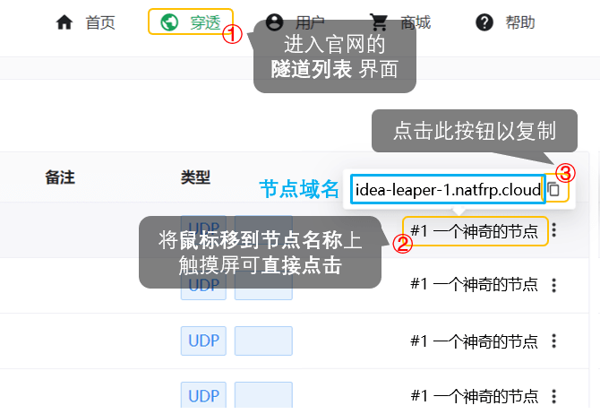

# 常见问题: 其他

## 点击签到时卡住怎么办 {#daily-checkin-stuck}

通常此问题是由网络不好造成的，您可以尝试下列操作：

- 多刷新几次页面，每次刷新后点一下 **点击签到**，稍后几秒钟再刷新
- 更换网络环境或更换设备重试
- 更换浏览器重试，我们推荐使用 Google Chrome、Microsoft Edge 或 Firefox 浏览器

## 创建隧道时提示 您选择的端口不可用 (被其他人占用) {#port-unavailable-occupied}

端口被别人占用了，您没有抢过来使用的特权。请换一个端口或者换一个节点试试。我们建议留空远程端口让系统自动生成。

## 创建隧道时提示 您选择的端口不可用 (超出允许端口范围) {#port-unavailable-out-of-range}

请点击远程端口旁边的 **查看规则** 查看节点允许使用的端口。

## 我可以使用超出可用端口范围 (如 10240 以下) 的端口吗 {#lower-ports}

不能，开放这些端口可能造成安全隐患或加重服务滥用。

### 但是我就是想用 / 我的 XXX 服务一定要用 XXXX 端口，能不能开放一下

您没有使用这些端口的特权，建议您找其他服务商。

## 有没有全端口映射 {#mapping-all-ports}

没有。

## HTTP(S) 隧道支持泛域名匹配吗 {#http-wildcard}

由于滥用严重，目前我们不支持泛域名匹配，并且每条隧道最大只允许绑定 3 个域名。

## GitHub 上的 SakuraFrp 源码和你们是什么关系 {#relationship-with-sakurapanel-on-github}

原站长已于 **2020.01.20** 将 SakuraFrp 转交给 **iDea Leaper** 进行运营。

我们从 0 开始重写了整个站点的代码，而且为了解决大量 Tech Debt 重写了两次 (3.0，4.0 版本)。

除了名字与之前保持一致，目前的 SakuraFrp 与托管于 GitHub 的开源面板及其作者无任何关联。

其给出的任何授权行为皆只代表其个人行为，与 SakuraFrp 网站及项目无关，即使您获得其授权仍不可以使用、重标、改编 SakuraFrp 的创意项目、前端页面、用户条款、帮助文档等内容。

## 我想通过 GitHub 上的 SakuraFrp 源码搭建穿透面板，能帮帮我吗 {#i-wanna-use-sakurapanel-on-github}

我们不提供此类支持，请联系原作者 [@kasuganosoras](https://github.com/kasuganosoras)。

## 你们的 frpc 可以开源吗 {#frpc-open-source}

可以，但没必要。因为要把 frps 和 frpc 的源码分开太麻烦了。

如果您不信任我们分发的二进制文件，请使用 [上游的开源 frpc](https://github.com/fatedier/frp)，我们会尽量保持对 `0.18.0` 到最新版上游 frpc 的兼容性。

## 隧道或软件可以重复开启吗 {#run-multiple-clients}

一条隧道只能对应一个运行中的 frpc 进程。“重复开启” 的定义较为模糊，请参考下表中的说明：

| 具体情况 | 可行性 | 说明 |
| --- | --- | --- |
| 一台电脑开启多个 frpc，连接 **ID 相同的** 隧道 | 不可以 | 如果这么做，节点就不知道应该把请求转发给哪个 frpc 了 因此隧道无法正常启动，会提示 `port already used` 等错误信息 |
| 在电脑 A 上开启一条和电脑 B 上 **ID 相同的** 隧道 | 不可以 | 参考上面 ↑ |
| 在一台电脑上开启多条 **ID 不同的** 隧道 | 可以 | 这是很常见的场景 |
| 在多台电脑的 **启动器** 上 **登录同一个账号** | 可以 | 我们不限制启动器的登录设备数量 |

## 如何设置解析 {#configure-dns-for-domain}

- 请自行查看您域名解析提供商的帮助文档，并设置 `CNAME` 记录到节点域名。

  您可以前往隧道页面查看节点域名：

  

## 游戏连不上的解决办法 {#game-not-connecting}

- 部分游戏需要本地端口与远程端口相同才可以连接。
- 检查隧道启动状态。
- 检查游戏服务端是否开启。
- 请检查端口是否配置正确。
- 请检查游戏服务端配置是否正确。

## 哪个节点好用 {#choosing-node}

节点速度受以下因素影响：

- 该节点的使用人数
- 节点到客户端的物理距离
- 节点到客户端的网络状况
- 客户端、节点的网络环境差异
- 国家政策
- 部分不可抗力因素
- 某些“带佬”恶意攻击

> 送某些人一句话：如果有 10% 的利润，它就保证到处被使用；有 20% 的利润，它就活跃起来；有 50%的利润,它就铤而走险；为了 100% 的利润，它就敢践踏一切人间法律；有 300% 的利润，它就敢犯任何罪行，甚至绞首的危险。

综上所述，我们无法告知您哪个节点最好用，另外也请您不要相信网络上所谓 `XX节点最好用` 的言论，建议您自己进行测试。

**请您牢记：在没有亲身验证之前，任何关于 `XX节点最好用` 的言论都是不可靠的。**
