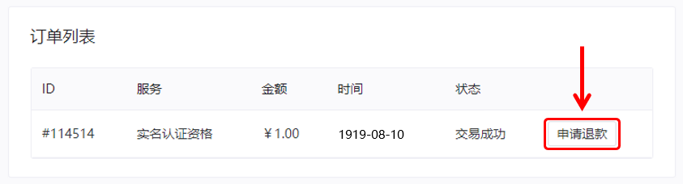
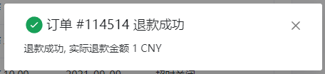
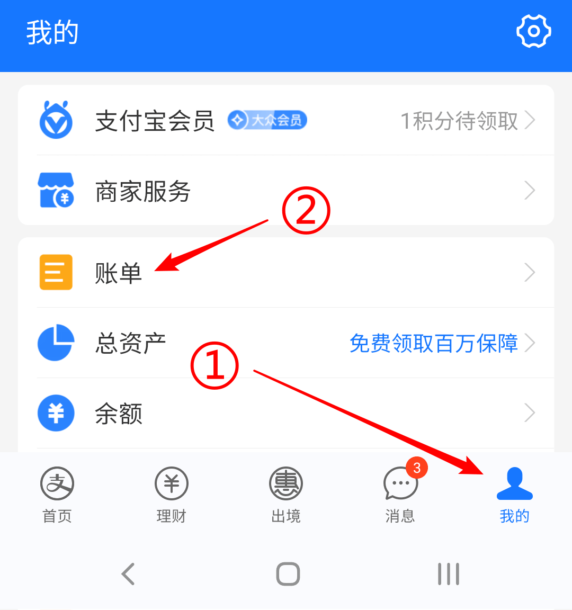
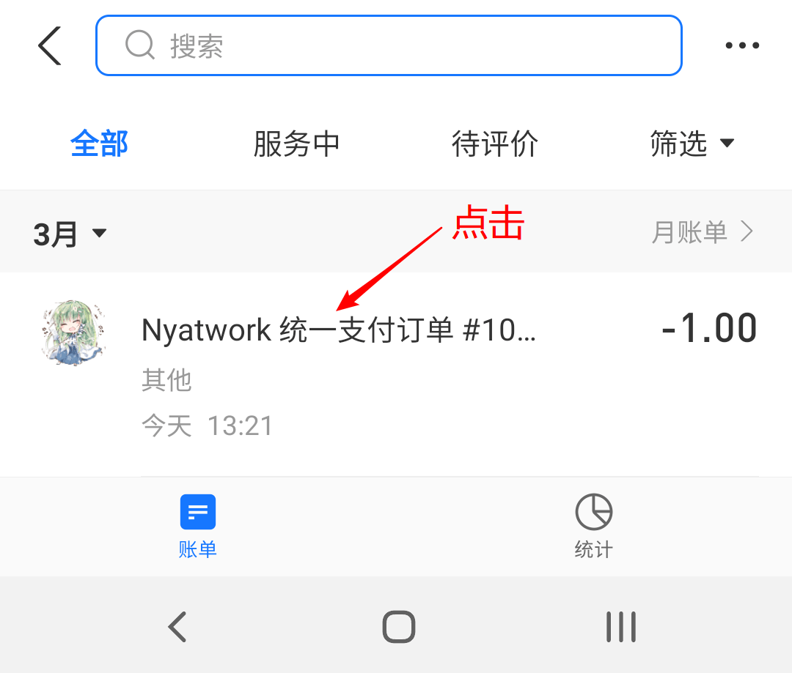
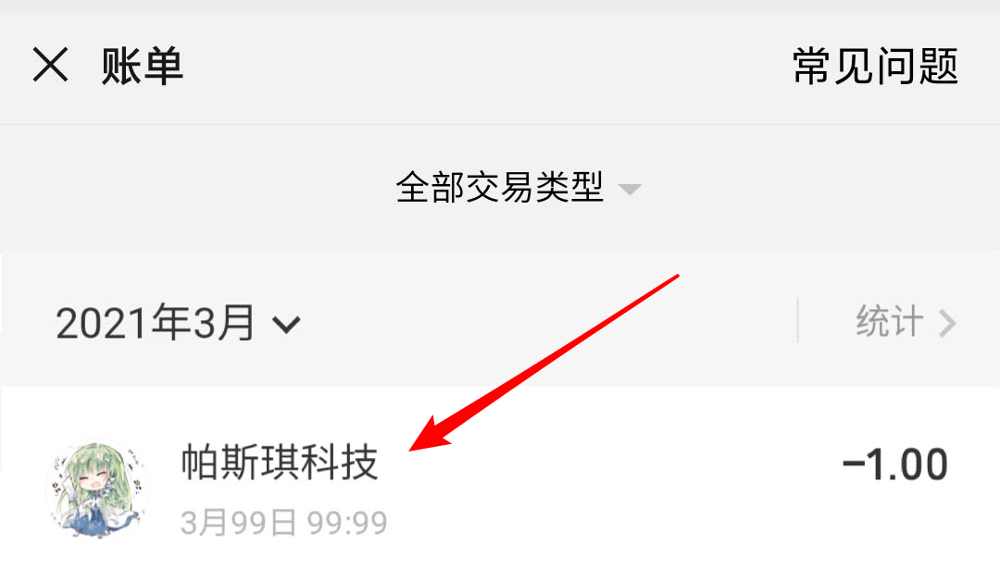
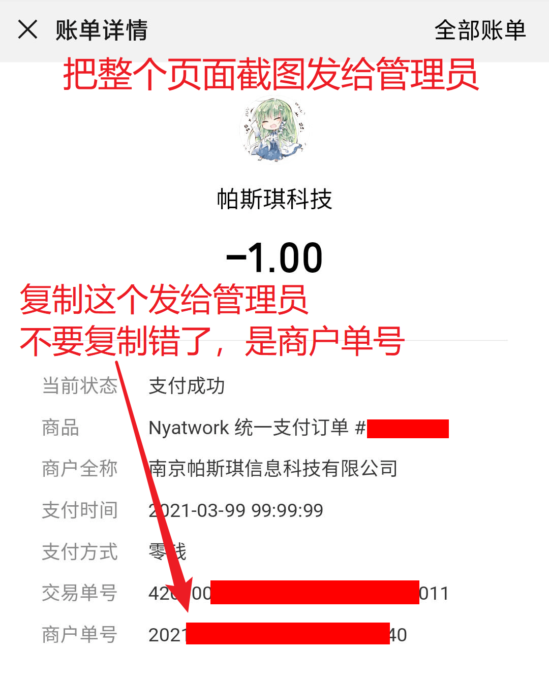

# 常见问题: 付款、订单问题

## 怎么进行退款 {#refund}

::: warning
滥用系统机制大量退款将被封禁账户，此时需联系管理员说明情况并人工解封
:::

1. 首先请确保您满足 [退款策略](https://www.natfrp.com/policy/refund) 中的退款条件，不满足退款条件的原则上不予退款。

2. 转到 [订单列表](https://www.natfrp.com/purchase/list) 页面找到您想退款的订单，点击右侧的 **申请退款**：

   

3. 按提示进行操作，系统将会自动进行审批和退款。如果一切正常，您应该会看到下面的提示：

   

4. 一分钟内对应的款项会被原路退回，如果您没有收到退款或看到错误提示，请 **截图错误提示** 并立即联系管理员处理。

## 我创建了两个不想要的商品订单，无法创建新订单怎么办 {#wrong-order}

由于系统限制，出现这种情况管理员也无法为您处理，请尝试下列操作：

- 等待 24 小时后重新下单，之前的订单会被自动关闭 (推荐)
- 如果有特殊情况不能等这么久，可以尝试支付一个订单然后申请退款 (不推荐，没有特殊情况请不要使用此方法)

## 付款过程中切换了付款方式导致重复付款怎么办 {#duplicate-payment}

请耐心等待几分钟，系统会自动退款重复的支付单，确保每个订单只进行了一次有效支付。

如果十分钟后仍未收到相关退款，请按下方 [付款后服务没有到帐怎么办](#payment-not-received) 中的指引截图 **所有渠道中** 涉及到的订单信息 [发送给管理员处理](/about.md#contact-us)。

## 付款后服务没有到帐怎么办 {#payment-not-received}

首先请耐心等待 1~2 分钟，然后转到 [订单列表](https://www.natfrp.com/purchase/list) 页面查看订单 **状态** 一栏是否显示 *交易成功*。

如果订单状态仍然为 *待付款*，请不要着急，按下面的步骤获取必要信息，然后将这些信息 [发送给管理员处理](/about.md#contact-us)：

:::: details 支付宝用户操作方法 (点击展开)

1. 打开支付宝，点击右下角 **我的**，然后点击 **账单**：

   

2. 找到您的未到帐账单，点击进入详情页面：

   

3. 点击 **更多** 展开订单号：

   

4. 对整个页面进行截图，然后复制 **商家订单号** 一起发给管理员等待处理。

   ::: warning
   请不要复制 **订单号**，我们需要的是 **商家订单号**  
   请不要遮盖截图中的任何信息，此处因演示需要进行了打码
   :::

   

::::

:::: details 微信用户操作方法 (点击展开)

1. 打开微信，点击右下角 **我**，然后点击 **支付**：

   

2. 点击 **钱包**：

   

3. 点击右上角 **账单**：

   

4. 找到您的未到帐账单，点击进入详情页面：

   

5. 对整个页面进行截图，然后复制 **商户单号** 一起发给管理员等待处理。

   ::: warning
   请不要复制 **订单号**，我们需要的是 **商家订单号**  
   请不要遮盖截图中的任何信息，此处因演示需要进行了打码
   :::

   

::::

## 有没有年费 VIP {#vip-annual-plan}

目前没有，并且在可预见的未来也不会推出此类套餐。

## 为什么 VIP 购买上限是 6 个月 {#vip-time-limit}

由于我们的服务质量会受国内政治环境、网络环境以及各种不可知因素的影响，我们推荐您按需购买 VIP，并且在购买前确认当前的服务质量可以满足您的使用需求。

当然，我们也理解频繁续费会给您带来不必要的麻烦，因此半年进行一次续费是一个相对合理的折中方案。

## SakuraFrp 支持哪些付款方式 {#payment-methods}

本平台支持下列付款方式：

- [支付宝](https://www.alipay.com/)
- ~~[微信支付](https://pay.weixin.qq.com/)~~ (自 **2023/01/12** 起无限期暂停)

目前没有添加其他付款方式 (如 QQ 钱包) 的计划。

## 如何申请开票 {#invoice}

请使用账户的 **绑定邮箱** (可以在 [OpenID 用户中心](https://openid.13a.com/user) 找到) 发送邮件到 `support@natfrp.cloud` 申请开具发票。

申请邮件中 **必须提供** 以下信息：

- 您的 **用户名** 或 UID
- 要开具发票的 **订单 ID** 和 **订单对应的金额** (可以在 [订单列表](https://www.natfrp.com/purchase/list) 找到)，可以为多个订单
- 要开具发票的 **抬头** 和 **税号**
- 如需开具 **增值税专用发票** 请在邮件中说明，同时提供购买方的真实 **地址**、**电话**、**开户行** 以及 **银行账号**  
  若没有进行说明或提供的信息不完整，我们将为您开具普通发票

请注意下列事项：

- 建议您将多个订单一起申请开票，避免大量申请小额发票。如果您超出合理限度地多次申请小额发票，我们可能会将您账户中所有的未开票订单合并在一张发票中开出
- 没有支付成功的订单、已退款的订单 **均不支持** 开票，请确认订单状态显示的是 `交易成功` 而不是其他状态
- 已开具发票的订单 **不支持** 再次开票，并且发票信息 **不可更改**

为了避免发票信息出错，发送邮件后请您再次确认已发送的内容。我们可能会通过邮件与您二次确认开票信息，请务必留意确认邮件并及时进行回复，以免耽误开票进度。
