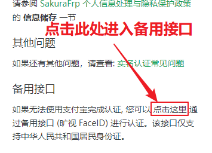

# 常见问题: 实名认证

## 怎么进行实名认证

1. 到 [增值服务](https://www.natfrp.com/purchase/buy ':target=_blank') 页面购买一次实名认证资格
1. 到 [实名认证](https://www.natfrp.com/user/realname ':target=_blank') 页面输入姓名和证件号，点击 `确认提交` 按钮
1. 使用 [支付宝 APP](https://mobile.alipay.com/ ':target=_blank') 扫描弹出的二维码，根据提示完成操作  
   _* 此步骤需要刷脸，但是无需支付额外费用_

## 没有支付宝怎么认证 / 支付宝提示 "对比源不清晰" 等错误

我们推荐您注册一个支付宝账号，然后使用支付宝 APP 完成实名认证。

如果因为特殊原因无法通过支付宝进行认证，请使用 **手机** 访问 **备用接口** 进行操作。

!> 如果您已提交验证请求，请点一下二维码页面上的 "我已完成认证" 按钮使当前认证失败，否则无法进入备用接口  

## 没有手机怎么进行实名认证

暂不支持此操作，如果您购买了实名认证资格请转到 [订单列表](https://www.natfrp.com/purchase/list ':target=_blank') 页面申请退款。

## 我的实名信息安全吗

我们会严格遵守隐私保护的相关法律法规，并根据本站 [隐私策略](https://www.natfrp.com/policy/privacy ':target=_blank') 进行信息的储存、披露、删除等操作。

同时，实名认证中涉及的刷脸、拍摄身份证等操作均由您在 [支付宝](https://www.alipay.com/ ':target=_blank') 或 [旷视](https://megvii.com/ ':target=_blank') 平台上进行操作，我们无法触及您的照片等信息。

## 怎么删除我的实名信息

转到 [实名认证](https://www.natfrp.com/user/realname ':target=_blank') 页面，点击 `申请清除实名信息` 按钮并根据提示进行操作。

## 使用海外节点建站是否需要备案 / 实名

必须进行实名认证，不需要备案。网站内容不得违反您所在地区、中国内地、节点所在地区的相关法律法规。

## 使用海外节点穿透其他内容 (如游戏联机) 是否需要备案 / 实名

不需要进行实名认证，不需要备案。穿透的内容不得违反您所在地区、中国内地、节点所在地区的相关法律法规。

## 搭建网站要实名还是备案

必须实名，不一定要备案。请参阅 [建站条件](#site-requirement) 了解更多建站条件。
