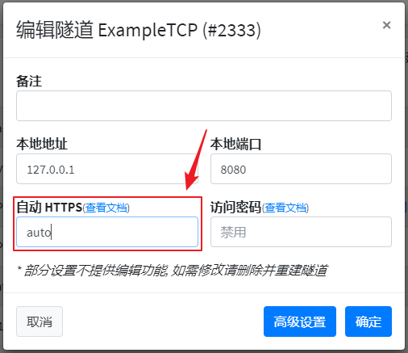

# 常见问题: 无法访问映射的网站

首先，您需要正确区分 **HTTP(S) 隧道** 和 **TCP 隧道映射 HTTP(S) 流量**：

| 网站访问方式 | 穿透类型 |
| --- | --- |
| `http://www.example.com` 或 `https://www.example.com` | HTTP(S) 隧道 |
| `http://www.example.com:12345` (注意此处带了端口 `12345`) | TCP 隧道映射 HTTP 流量 |
| `https://www.example.com:54321` (注意此处带了端口 `54321`) | TCP 隧道映射 HTTPS 流量 |

## 建站条件 {#site-requirement}

不满足下表中的任一条件均会造成网站无法访问，此时请更换映射方式或节点：

::: tip
此处的 *需实名认证* 指的是在 **SakuraFrp 管理面板** 完成 [实名认证](https://www.natfrp.com/user/realname)，而非 **域名提供商的** 实名认证
:::

| 节点类型 | HTTP(S) 隧道 | TCP 隧道映射 HTTP 流量 | TCP 隧道映射 HTTPS 流量 |
| --- | --- | --- | --- |
| 海外节点 | 需实名认证 | √ | √ |
| 其他节点 | 需实名认证和 [ICP备案](https://baike.baidu.com/item/ICP%E5%A4%87%E6%A1%88) | × (请 [配置自动 HTTPS](#frpc-auto-https)) | √ |

## 配置 frpc 的自动 HTTPS 功能 {#frpc-auto-https}

::: danger 请确保您完全理解这个功能再进行配置
我们已经碰到上百例因为 **乱开自动 HTTPS 开关** 造成隧道访问不了、出现神秘报错的问题了  
在打开自动 HTTPS 前请先 **完全搞清楚** 这个功能有什么用、在什么情况下需要打开
:::

自动 HTTPS 功能的本质就是借助 frpc 给流量套一层 TLS，frpc 采用 TLS 暴露端口并采用明文连接本地服务。

我们推荐您尽可能使用所穿透服务内建的 TLS 实现，不要过度依赖此功能。

:::: tabs

@tab 简易配置

中国内地节点不允许直接通过 TCP 隧道转发明文 HTTP 流量，您可以配置 frpc 并将 HTTP 服务自动转换为 HTTPS 服务：

1. 编辑隧道并在 **自动 HTTPS** 处选择 `自动`

   

1. 重启 frpc
1. 使用 `https://连接方式` 的形式访问您穿透的服务即可
1. (可选) 如果您想避免证书错误提示，请 [配置 SSL 证书](/frpc/ssl.md)

@tab 高级配置

`auto_https` 开关取值如下：

| auto_https | 说明 |
| :---: | --- |
| 留空<br>**[默认值]** | 禁用自动 HTTPS 功能 |
| auto | frpc 将使用 `server_name` 作为证书 **CommonName** 生成自签证书 |
| 其他值 | frpc 将尝试加载 工作目录 下的 `<auto_https>.crt` 和 `<auto_https>.key` 两个证书文件<br>- 若加载成功，`<auto_https>` 就作为一个单纯的文件名进行处理，不会对证书产生影响<br>- 若文件不存在或解析失败则使用 `<auto_https>` 作为 **CommonName** 生成一份自签名证书并保存到上述文件中 |

自 **v0.42.0-sakura-2.1** 起，您可以通过 `auto_https_mode` 开关强制覆写自动 HTTPS 的工作模式：

| auto_https_mode | 说明 |
| :---: | --- |
| 留空<br>**[默认值]** | 自动探测是否为 HTTP 服务并选择恰当的工作模式<br>- frpc 会在隧道启动时发送 `HEAD /\r\n\r\n` 请求检测您穿透的服务是否真的为 HTTPS 服务 |
| http | 使用 HTTP 服务器进行反代并在发给本地服务的请求中追加 `X-Forwarded-For` 请求头 |
| passthrough | 直通模式，单纯的在 TCP 流外面套上一层 TLS，不对数据包进行其他修改操作 |

::::

## HTTP 隧道出现 503 错误 {#http-503}

当您访问映射的网站时，如果出现 `503 Service Unavailable` 错误，请检查是否存在以下情况：

1. 绑定的域名和您访问的域名是否 **完全相同**？配置文件里是否有打错字？
   - `natfrp.com` 和 `www.natfrp.com` 是两个不同的域名，请不要混淆
   - 同理，`a.natfrp.com` 和 `b.natfrp.com` 自然也是两个不同的子域名

1. 域名解析到的节点是否和隧道所在的节点相同？
   - DNS 解析修改后并不是立即生效的，解析结果缓存时长从 10 分钟到一星期不等，请等待解析生效后再试
   - Windows 用户可以使用这条命令查询 DNS 解析结果：

     ```batch
     nslookup <你的域名>
 
     # 例如
     nslookup www.example.com
     ```

   - *nix 用户可以使用这条命令查询 DNS 解析结果：

      ```bash
      dig <你的域名>

      # 例如
      dig www.example.com
      ```

1. 本地的 Web 服务是否成功启动？隧道映射的本地 IP 和端口号是否正确？
   - 是否能在 **运行 frpc 的电脑** 通过 **本地 IP** 和 **本地端口** 访问您的网站？
   - frpc 有没有显示 `无法连接到本地服务` 等错误？

1. 客户端是否成功启动并出现 `start proxy success` 字样？
   - 不要先急着设置开机自启，先手动启动程序确认是否可以成功启动
   - 在 Windows 上最好使用启动器管理隧道

1. (HTTPS 隧道) 隧道是否正确创建？访问的时候有没有输入完整的 `https://` 前缀？
   - 只创建 HTTPS 隧道会导致使用 HTTP 协议访问时出现 503 错误

如果使用以上方法都不能排除故障，那么请尝试 **更换节点**，如果还是不行可以考虑更换服务商。
