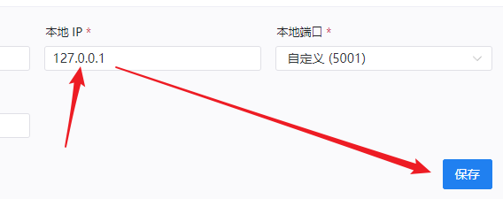

SakuraFrp 提供 [frpc 镜像](https://hub.docker.com/r/natfrp/frpc) 以便您借助 Docker 管理 frpc。

### 图形用户界面 {#docker-gui}

本教程只展示命令行操作，如果您使用以下平台，点击链接可查看对应的 GUI 操作说明：

- [群晖 DSM](/app/synology)
- [威联通 QNAP](/app/qnap)
- [Unraid](/app/unraid)
- [绿联 NAS](/app/ugreen)

### 设置隧道 {#docker-create-tunnel}

因为 docker 网络模型的原因，我们像从前一样把隧道的 本地IP 设置为 `127.0.0.1` 已经不再奏效，必须修改设置中的此项。

因为默认的 `bridge` 网桥模式兼容性和安全性更高，**下面的教程默认采用此方案**

首先运行下面的指令读出 docker 默认网桥的 网关IP

`ip addr show docker0`

结果预期如下：

```
4: docker0: <NO-CARRIER,BROADCAST,MULTICAST,UP> mtu 1500 qdisc noqueue state DOWN group default 
    link/ether 02:42:c4:f5:83:8f brd ff:ff:ff:ff:ff:ff
    inet 172.17.0.1/16 brd 172.17.255.255 scope global docker0
       valid_lft forever preferred_lft forever
```

其中 `172.17.0.1` 这一部分就是我们要的 IP

然后在新建隧道时将其设置为 本地IP


或者在 隧道列表 中，编辑一条隧道，设置 本地IP 为该 IP



这样隧道就准备完了

### 设置 Docker {#docker-setup-docker}

只需要执行：

```bash
# 默认 DockerHub 源，国内可能较慢：
docker run \
-d \ # 后台运行
--restart=always \ # 自动启动
--pull=always \ # 自动更新
--name=sakura1 \ # 为容器设定一个名字
natfrp/frpc \
-f <启动参数> --remote_control <远程控制密码>

###### 或者 ######

# 阿里云容器镜像 香港地区源，适合国内用户：
docker run \
-d \ # 后台运行
--restart=always \ # 自动启动
--pull=always \ # 自动更新
--name=sakura1 \ # 为容器设定一个名字
registry.cn-hongkong.aliyuncs.com/natfrp/frpc \
-f <启动参数> --remote_control <远程控制密码>
```

如果一切顺利，Docker 会为我们下载并启动镜像，您会看到只有一行奇怪的hash的输出，也就是运行容器的 ID。

_* `--restart=always` 选项并非必须，但开启此选项后可以自动重启容器实例_

### 获取连接信息 {#docker-how-to-connect}

连接信息在 docker实例 的日志中，执行 `docker logs <容器名字|容器ID>` 即可查看。

如对于上面设置的启动参数，执行 `docker logs sakura1` 即可。

### 停止、删除与更新容器 {#docker-stop-delete-update}

停止： `docker stop <容器名字|容器ID>`

删除： `docker rm <容器名字|容器ID>`

更新： 在使用带有 `--pull=always` 的启动指令另启动一个备用容器后，停止并删除当前容器。

### 挂载文件 {#docker-mount-file}

如果您需要挂载文件到容器内（如为 自动 HTTPS 使用自定义证书），您可以在启动命令中加入 `--mount` 参数：

```
docker run \
-d \ # 后台运行
--restart=always \ # 自动启动
--pull=always \ # 自动更新
--name=sakura1 \ # 为容器设定一个名字
--mount type=bind,source=/home/homo/zhengshu.crt,target=/run/frpc/example.crt \ # 将容器外的 /home/homo/zhengshu.crt 映射到容器内的 /example.crt
--mount type=bind,source=/home/homo/zhengshu.key,target=/run/frpc/example.key \ # 将容器外的 /home/homo/zhengshu.key 映射到容器内的 /example.key
natfrp/frpc \
-f <启动参数> --remote_control <远程控制密码>
```
