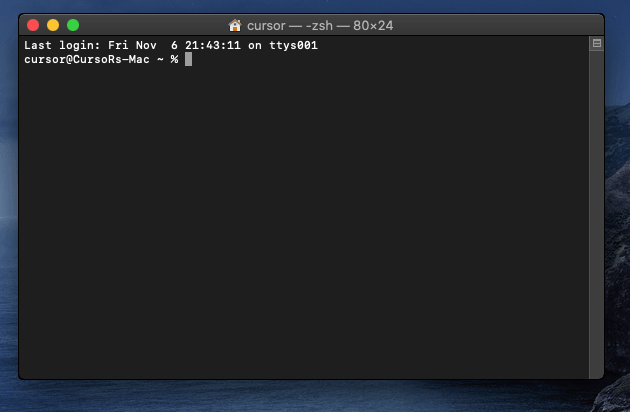
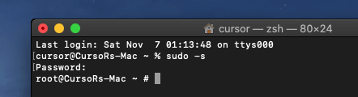
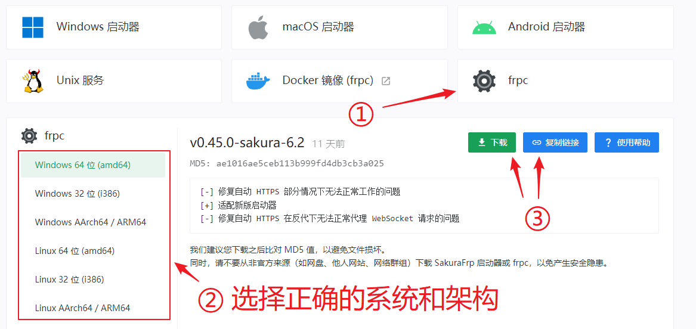
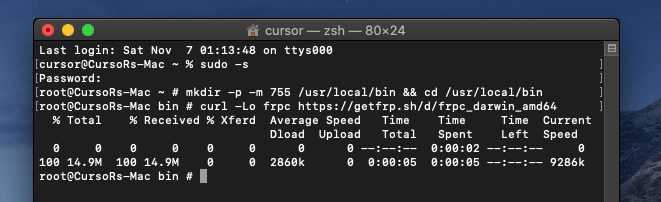

<!-- markdownlint-disable MD041 -->

::: warning 注意
我们不推荐在 macOS 系统上直接使用 frpc，除非您有特殊需求，否则请 [使用启动器](/launcher/usage.md#macos)
:::

在 macOS 安装 frpc 需要在 **终端** (`Terminal.app`) 下执行一些命令。

如果您对 macOS 的命令行操作不熟悉，请严格按照文档进行操作避免出现意外。

### 打开终端并提升到 root 权限 {#macos-open-terminal}

1. 按下键盘上的 `⌘ + 空格` 调出聚焦搜索并键入 `终端`，双击终端图标

   

   您应该会看到类似下图的窗口

   

2. 执行下面的命令

   ```bash
   sudo -s
   ```

   

3. 输入您当前账户的密码并按下回车

   ::: tip
   您会发现终端并没有显示您输入的密码，不用担心，“摸黑”输入密码后按下回车即可，退格按键同样可用
   :::

   

4. 如果您看到和图里一样的输出（出现 `#`），说明您已成功提升到 `root` 权限

### 安装 frpc {#macos-install-frpc}

1. 登录管理面板，转到 “软件下载”：

   

1. 选择 **frpc**，然后选择正确的系统和架构，复制下载链接：

   

   ::: warning
   我们建议您复制链接并使用命令下载 frpc，如果您用浏览器下载可能会出现无法运行的问题  
   如果出现上述问题，您可以参考 [此 FAQ](/faq/frpc.md#macos-run-frpc-issue) 解决
   :::

1. 使用下面的命令进入 `/usr/local/bin` 文件夹：

   ```bash
   mkdir -p -m 755 /usr/local/bin && cd /usr/local/bin
   ```

   然后，使用下面的命令下载 frpc：

   ```bash
   curl -Lo frpc <刚才复制的下载链接>
   ```

   

1. 使用下面的命令设置权限并检查输出：

   ```bash
   chmod 755 frpc
   ls -ls frpc
   ```

1. 如果您看到和图中红框标记匹配的输出，说明 frpc 已完成安装并准备就绪

   

1. 您可以执行下面的命令再次确认以及查看 frpc 版本号

   ```bash
   frpc -v
   ```

### 使用 frpc {#macos-using}

请查看 [启动隧道](#running-frpc) 一节了解如何启动 frpc 并连接到您的隧道。

通过本文档中介绍的方法安装后，您应该可以在任何目录直接输入 `frpc <参数>` 运行 frpc，**不需要** 输入完整路径
