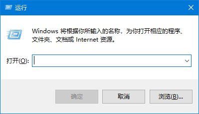
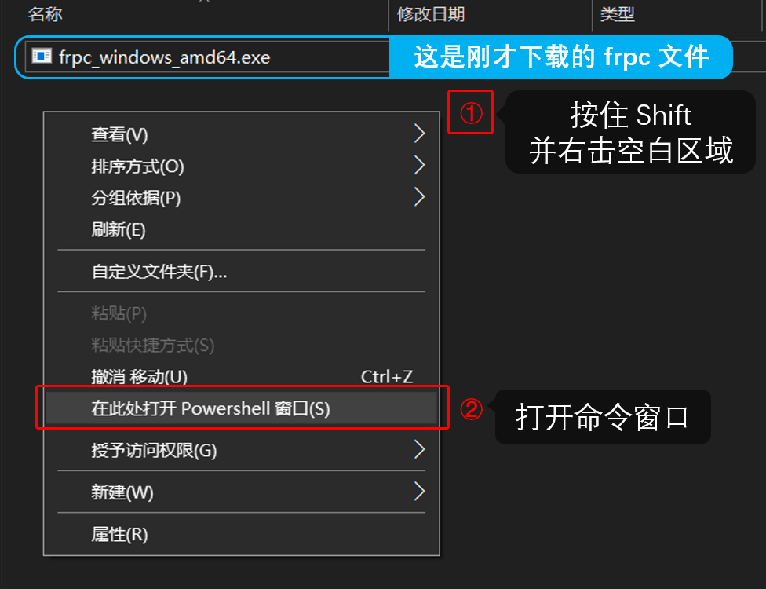
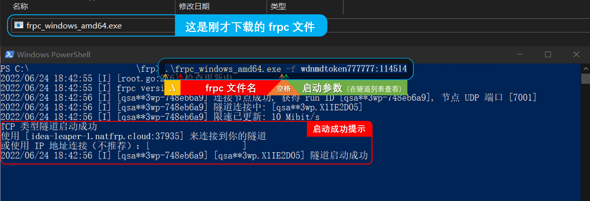

我们不推荐在 Windows 系统上直接使用 frpc，除非您有特殊需求，否则请 [使用启动器](/launcher/usage)。

### 确认系统架构 {#windows-check-arch}

下载 frpc 前，请先确认您的处理器架构。按 `Win+R` 打开运行窗口：

输入 `msinfo32` 然后点确定，找到 **系统类型** 一栏显示的 `基于 XXX 的电脑`：

然后根据下表确认您的系统架构：

| 系统类型 | 架构 |
| --- | --- |
| `x86` | i386 |
| `x64` | amd64 |
| `ARM64` | ARM64 |

### 下载 frpc {#windows-install}

1. 登录管理面板，转到 “软件下载”：

   

2. 选择 Windows 系统，然后根据您的系统架构选择一个合适的版本下载

   

### 使用 frpc {#windows-usage}

请查看 [启动隧道](#running-frpc) 一节了解如何启动 frpc 并连接到您的隧道。

这里提供一个简单的命令行启动示例：

1. 首先找到您之前下载的 frpc，在本示例中，文件名为 `frpc_windows_amd64.exe`

2. 按住 **Shift** 然后 **右键** 点击空白区域，选择 `在此处打开 Powershell 窗口` 或者 `在此处打开命令窗口`：

   

3. 然后按下图中的说明输入您下载的 frpc 文件名和启动参数，按回车启动 frpc：

   
