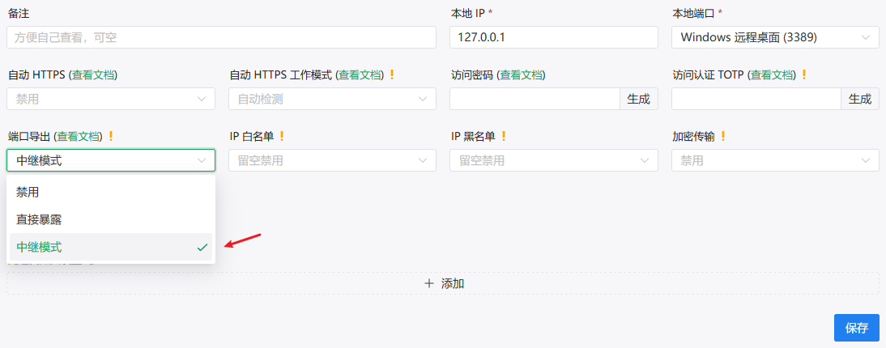
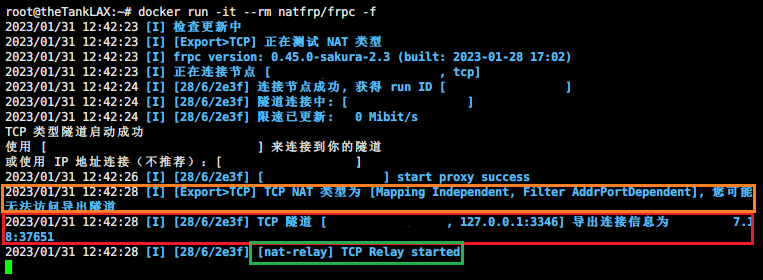

# 使用端口导出功能暴露服务

在 v0.45.0-sakura-2.3 之后，我们在客户端中添加了名为端口导出的功能，
以帮助您在打开正常转发隧道的同时，尝试以打洞的方式暴露本机的服务。

因为访问此功能的隧道流量不会经过我们服务器，我们不会为您使用端口导出的流量计费。

::: tip
该功能为高级功能，请使用时确定您清楚自己在做什么。

启用此功能需要在网页中启用高级用户模式，请务必仔细阅读弹窗警告。

如果您使用此功能时不启用 [访问验证](/bestpractice/frpc-auth) 或白名单，您可能会遭遇巨大的网络风险，因为此时我们服务端的安全强化已经无法保护您。
:::

## 原理及使用

此功能原理即为常见的 NAT 打洞服务，通过 NAT 时部分防火墙会使内部地址长期唯一对应外部地址，并允许流量进入，此时即成功打洞。

我们在打洞时将尝试通过 UPnP 通过路由器，当您不想在路由器上运行客户端，或路由器是傻路由器时，仍然能为您降低失败几率。

我们提供独立的 ETCP/EUDP 隧道类型仅用于此，同时在 TCP/UDP 隧道的高级用户选项中提供了一个顺带尝试打洞的功能。

### 中继模式

::: warning
为了解决 “某某功能开关为什么在直接模式下不起作用?” 的问题，直接模式已经被直接移除，现在您总是应该使用中继模式。
:::

启用此模式只需将端口导出选项调整为中继模式：



在中继模式下，您的入网流量将先经过 frpc 中继，因此您**不需要**修改监听 IP。

使用中继模式时，您将可以使用 访问验证、黑白名单、Proxy Protocol 等功能。

此模式中网络流量路径如下：

```flow
start=>operation: 外部流量
end=>operation: 本地服务端
f=>operation: frpc 客户端

start->f->end
```

## 使用解疑

### 开启后日志

在端口导出功能正常开启后，您将看到类似下面这样的日志：



其中红框部分即您的连接信息，尝试直接使用即可。

橙框部分为预检测结果。如果您的检测结果并不提示 `NAT 开放，您的端口导出应当可以工作`，而是如上图橙框所示，您的网络可能并不适合我们的导出隧道功能，将有很大的可能不可用。

如果您打开了中继模式，您将看到绿框中的中继已启用日志。
