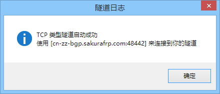
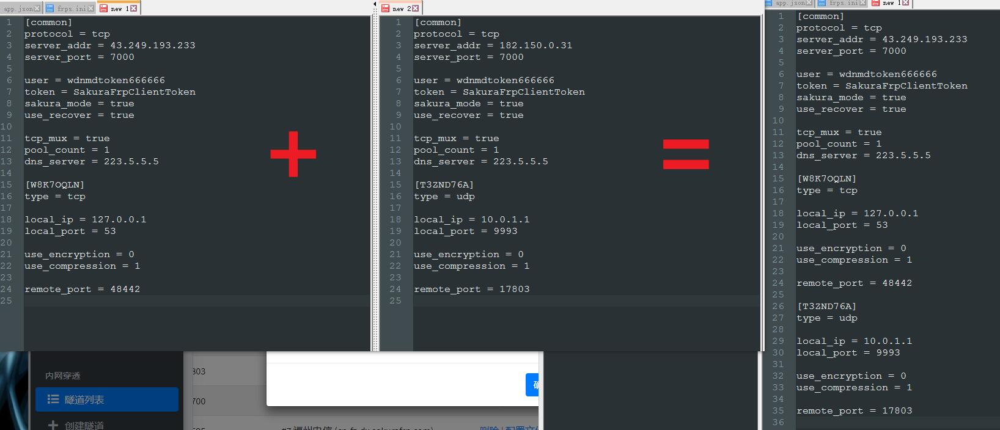

## frpc 常见问题

### 隧道启动成功后么查看数字 IP

!> 该部分内容已经过期，新版本已经恢复 IP 地址显示。

ping 一下就有了，例如你获取到的域名是 `cn-zz-bgp.sakurafrp.com`



请直接执行命令 `ping cn-zz-bgp.sakurafrp.com`


### frpc 配置文件拼合

!> 此部分内容仅适用于使用配置文件启动 frpc 的用户。



如图所示。

### 提示信息怎么是英文的，为什么不提供中文版

汉化提示信息有可能造成以下后果：

- 部分用户无法正确理解 FAQ 内容。
- 增大版本更新时的工作量，导致无法及时修复 bug。
- 造成显示乱码导致无法查看日志信息。

综上所述，我们暂时没有汉化提示信息的这类打算。

<!-- ?> _TODO_ 中英对照表 -->

### frpc 日志分析

#### 无法连接到本地服务

```log
connect to local service [xxxx:xxxx] error: dial tcp 127.0.0.1:25565: connectex: No connection could be made because the target machine actively refused it.
```

这类日志说明 frp 在正常工作中，但是 frpc 无法连接到你的本地服务，请检查是否出现以下情况：

1. 本地服务 (例如 Minecraft 服务器，HTTP 服务器) 是否已经正常启动。
2. 创建隧道时填写的 **本地端口**、**本地地址** 是否有误。
3. 防火墙或杀毒软件是否拦截了 `frpc` 请求本地服务。

#### 无法连接到 API

```log
Request failed after 3 retries: /xxxxx
```

这类日志说明 frpc 无法连接到我们的 API 服务器并获取配置文件、更新数据等信息，请检查是否出现下方的情况：

- 设备是否能正常访问 API 服务器
  - DNS 解析是否正常?
    - 可以使用 `ping api.natfrp.com` 命令检查，如果获取到 `127.0.0.1` 则不正常，请排查 DNS 问题
  - SSL 证书是否正常?
    - Windows 系统请使用 **Internet Explorer** 访问 `https://api.natfrp.com/` 查看是否出现安全警告，如果出现请参考 [这篇 FAQ](/launcher/faq#远程证书无效) 安装根证书
    - Linux 系统可以使用 `curl https://api.natfrp.com/` 查看是否存在错误输出，如果出现证书错误可以尝试安装 `ca-certificates` 证书包以解决此问题。
- 防火墙或杀毒软件是否拦截了 frpc 的请求。
- Sakura Frp 是否出现可用性问题。

#### 已存在相同的绑定域名

```log
start error: router config conflict
```

这类日志说明 frp 服务端已存在相同的绑定域名，无法创建 HTTP(S) 隧道，请检查

- 创建隧道时填写的域名是否有误。
- 本地/其他设备上是否已经开启了 frpc 或存在 frpc 进程残留，占用了这个隧道。
- 如果您确认上面两条都没有问题，通常稍等 2 到 3 分钟即可正常连接到服务端，请注意等待期间不要尝试连接。

### Windows 系统命令行版 frpc 开机自启设置方法

- 第一步：将 `frpc.exe` 放置到 `C:\` 目录下
- 第二步：在 `C:\` 目录下新建一个空白文件，命名为 `frpc.bat` 。
- 第三步：在 `C:\frpc.bat` 文件中写入以下内容
  ```bat
  C:\frpc.exe -f <你的Token>:<隧道ID>
  ```
- 第四步：以管理员身份运行命令提示符，运行以下命令：
  ```bat
  sc create frpc binPath=C:\frpc.bat start=auto
  ```
- 第五步：重启系统，检查效果。

### Linux 系统命令行版 frpc 开机自启设置方法

- 获取 frpc 主程序&启动命令： `bash <(curl -s https://getfrp.sh)`
- 由于发行版种类较多，且自启动配置方式各不相同，请百度 `开机自启+你的系统发行版名称+系统版本`。

  - 开机自启需运行的命令：脚本运行完毕时提示的启动命令。
