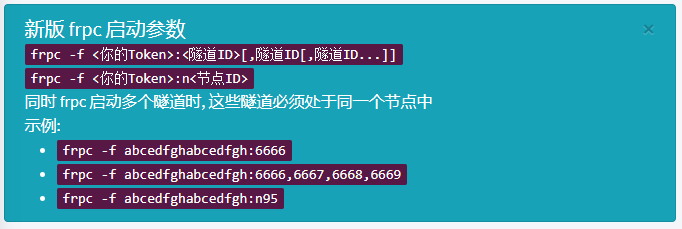
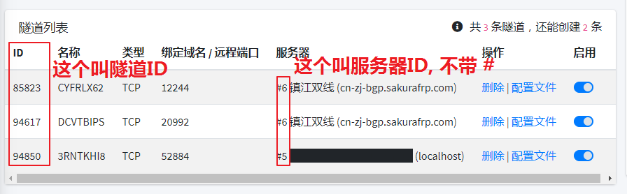

# frpc 用户手册

Sakura Frp 基于原版 frpc 进行了一些修改，下面是 Sakura Frpc 的用户手册，高级用户请直接查看 [此章节](#高级用户)。

## 普通用户

### 说明



此处的 frpc 在启动的时候要换成实际下载的文件名，如 `frpc_windows_386.exe` 、 `frpc_linux_amd64` 等文件名。

### 示例

若用户 Token 为 `wdnmdtoken6666666`


用户隧道列表如下图所示



若当前运行的系统为 32 位的 Windows 系统，且下载的 frpc 文件名是 `frpc_windows_386.exe` 。

1. 启动图中的第一条隧道，执行下方的命令：

```cmd
frpc_windows_386.exe -f wdnmdtoken666666:85823
```

1. 启动 “镇江双线” 节点下的所有隧道，可以不输入隧道 ID，执行下方的命令即可：

```cmd
frpc_windows_386.exe -f wdnmdtoken666666:n6
```

1. 上方的第二条指令也可以替换为手动输入两个隧道 ID，即执行第二条命令和本条命令效果相同。示例如下：

```cmd
frpc_windows_386.exe -f wdnmdtoken666666:85823,94617
```

## 高级用户

下面的文档详细解释了 Sakura Frp 提供的 frpc 与原开源版本的差异

### 新增启动参数

1. `-f, --fetch_config`
   - 从 Sakura Frp 服务器自动拉取配置文件
   - 参数列表 1: `<Token>:<TunnelID>[,<TunnelID>[,<TunnelID>...]]`
   - 参数列表 2: `<Token>:n<NodeID>`
1. `-w, --write_config`
   - 拉取配置文件成功后将配置文件写入 `./frpc.ini` 中。
1. `--update`
   - 进行自动更新，如果不设置该选项默认只进行更新检查而不自动更新。
1. `-n, --no_check_update`
   - 启动时不检查更新。

### 新增配置文件选项

1. `sakura_mode = <Boolean>`
   - 该选项用于启用 Sakura Frp 自有的各类特性，设置为 `false` 将 **禁用所有** Sakura Frp 相关特性，默认值为 `false` 。
1. `use_recover = <Boolean>`
   - 该选项用于启用重连功能，默认值为 `false`。
1. `persist_runid = <Boolean>`
   - 该选项启用后 RunID 将不再从服务器拉取而是根据本机特征 & 隧道信息生成，默认值为 `true`。

### 新增特性

#### frpc

1. 日志输出会对用户 Token 进行打码，防止 Token 泄漏。
1. 连接成功后会输出一段提示信息，提示用户当前隧道的连接方式.
   - 该提示信息不会匹配日志格式。目的是兼容启动器对旧版本 frpc 日志解析的逻辑。
1. 与服务器连接断开后会尝试自动进行重连，客户端将尝试直接恢复 MUX 连接，因此短暂的断线 (10 秒内) 能实现用户无感知重连。
1. 将根据本机特征 & 隧道信息生成 `RunID`。
   - 这有助于服务端快速辨识掉线的 `frpc` 并进行重连作业。生成的 `RunID` 为一串 `Hash`，不会包含敏感信息。
1. 启动时会从 API 服务器的 `/client/get_version` 获取最新版本信息, 并提示用户进行更新或进行自动更新

#### frps

1. ~~根据保密需要，删除数据~~
1. ~~根据保密需要，删除数据~~
1. ~~根据保密需要，删除数据~~
1. ~~根据保密需要，删除数据~~
