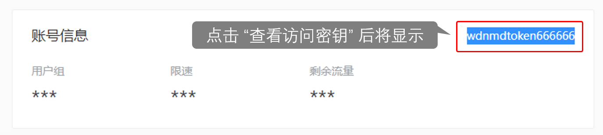
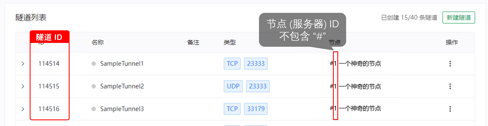
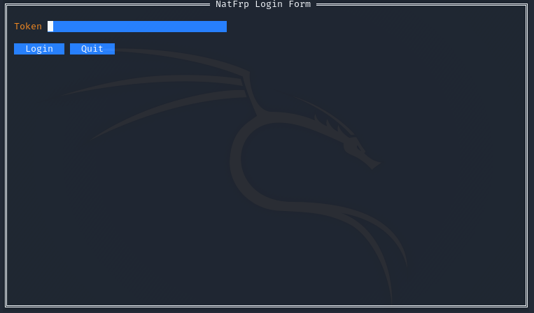
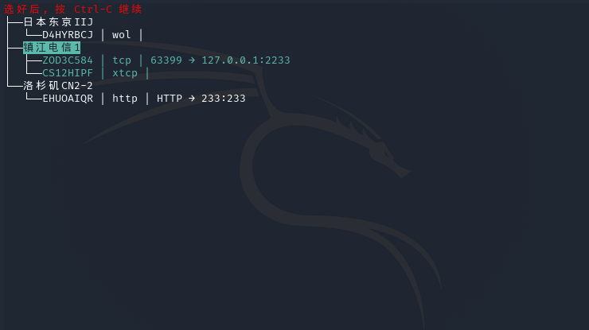
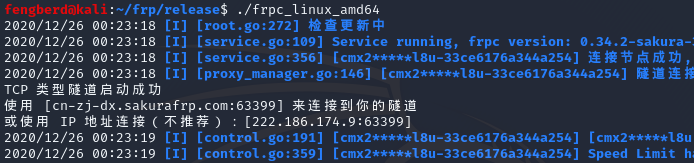

# frpc 用户手册

Sakura Frp 基于原版 frpc 进行了一些修改，下面是 Sakura Frpc 的用户手册，高级用户请直接查看 [此章节](#高级用户)。

## 普通用户

### 从命令行启动

!> 如果您没有按照 [Linux 使用教程](/usage/linux) 安装 frpc，只是下载了文件  
或是使用 Windows 系统，启动时 frpc 要换成下载到的的文件名  
如 `frpc_windows_386.exe` 、 `frpc_linux_amd64` 等


假设您的 Token 为 `wdnmdtoken6666666`



您的隧道列表如下图所示



假设当前运行的系统为 32 位的 Windows 系统，因此您下载到的 frpc 文件名是 `frpc_windows_386.exe` 。

1. 启动图中的第一条隧道：
```cmd
frpc_windows_386.exe -f wdnmdtoken666666:85823
```

1. 启动 **#6 镇江双线** 节点下的所有隧道，可以不输入隧道 ID：
```cmd
frpc_windows_386.exe -f wdnmdtoken666666:n6
```

1. 第二条命令也可以替换为手动输入两个隧道 ID，效果是相同的：
```cmd
frpc_windows_386.exe -f wdnmdtoken666666:85823,94617
```

### 使用TUI启动

在没有配置文件的情况下，直接不带参数运行 frpc 即可得到一个交互式 UI 选择需要使用的隧道。



按 `Tab` 键切换到 Token 输入框后输入 Token（访问密钥），然后切换到 Login 按钮并回车（终端支持的话，也可使用鼠标操作）。



然后选择您想要启动的节点，按空格标为绿色。



选择了所有想要启动的节点后，按 `Ctrl-C` 即可启动，本次启动参数会被保存到配置文件 `./frpc.ini` 中，下次启动时默认不再显示 TUI ，而是直接启动。


## 高级用户

下面的文档详细解释了 Sakura Frp 提供的 frpc 与原开源版本的差异

### 新增启动参数

1. `-f, --fetch_config`
   - 从 Sakura Frp 服务器自动拉取配置文件
   - 参数列表 1: `<Token>:<TunnelID>[,<TunnelID>[,<TunnelID>...]]`
   - 参数列表 2: `<Token>:n<NodeID>`
1. `-w, --write_config`
   - 拉取配置文件成功后将配置文件写入 `./frpc.ini` 中
1. `--update`
   - 进行自动更新，如果不设置该选项默认只进行更新检查而不自动更新
1. `-n, --no_check_update`
   - 启动时不检查更新
2. `--watch`
   - 监控指定 PID 并在进程退出时退出 frpc，该参数用于避免启动器崩溃造成的进程残留
   - 参数列表: `<PID>`

### 新增配置文件选项

##### [common]
1. `sakura_mode = <Boolean>`
   - 启用 Sakura Frp 自有的各类特性，设置为 `false` 将 **禁用所有** Sakura Frp 相关特性，默认值为 `false` 
2. `use_recover = <Boolean>`
   - 启用重连功能，默认值为 `false`
3. `persist_runid = <Boolean>`
   - 该选项启用后 RunID 将不再从服务器拉取而是根据本机特征 & 隧道信息生成，默认值为 `true`
4. `remote_control = <String>`
   - 配置 Sakura Frp 远程管理端对端加密密码，留空则禁用远程管理相关功能，默认值为空

##### [tcp_proxy]
1. `concat_packet = <Int>`
   - 配置合并封包功能的最小字节数，有助于减少小包并降低服务器网卡 PPS，设置为 `-1` 将禁用此功能，默认值为 `-1`

##### [https_proxy]
1. `force_https = <Int>`
   - 配置 frps 自动重定向 HTTP 请求到 HTTPS 的功能，有助于减少隧道占用。该值指示一个在重定向时返回给浏览器的 HTTP 状态码，设置为 `0` 将禁用此功能，默认值为 `0`

### 新增特性

1. 日志输出会对用户 Token 进行打码，防止 Token 泄漏
1. 连接成功后会输出一段提示信息，提示用户当前隧道的连接方式
   - 该提示信息不会匹配日志格式。目的是兼容启动器对旧版本 frpc 日志解析的逻辑
1. 与服务器连接断开后会尝试自动进行重连，客户端将尝试直接恢复 MUX 连接，因此短暂的断线 (10 秒内) 能实现用户无感知重连
1. 根据本机特征 & 隧道信息生成 `RunID`
   - 这有助于服务端快速辨识掉线的 `frpc` 并进行重连作业。生成的 `RunID` 为一串 `Hash`，不会包含敏感信息
1. 启动时会从 API 服务器的 `/client/get_version` 获取最新版本信息, 并提示用户进行更新或进行自动更新
1. 内建 TUI，方便用户在无参数启动时进行配置
1. 下发客户端限速，提升连接体验并有助于解决部分应用断线问题
   - 服务端读取限速存在上行速度在 **跑满本地带宽** 和 **0 Byte/s** 之间反复跳动的问题，在客户端也进行限制即可获得稳定的最大速度
