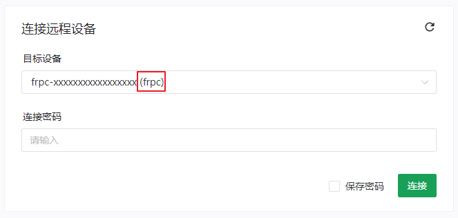
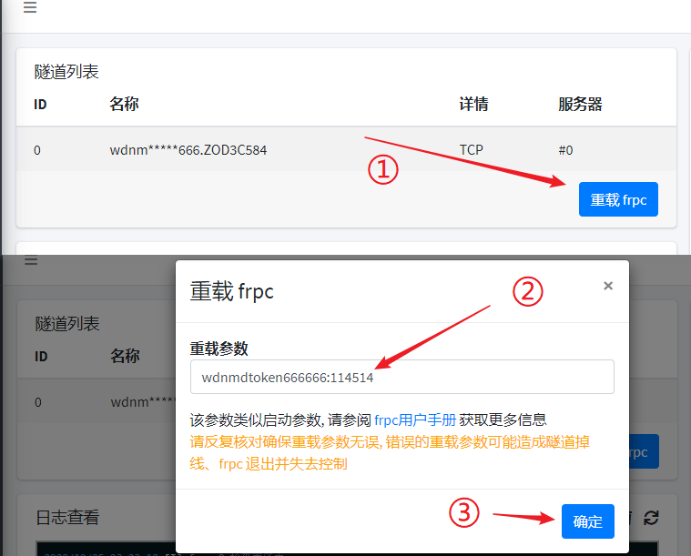

# frpc 远程管理

SakuraFrp frpc v0.34.2-sakura-2 及以上版本提供了远程管理功能，可以在 Sakura Frp 网站上对 frpc 进行管理

!> 使用 frpc 的远程管理功能具有较多的限制条件，详见下方 [限制条件](#限制条件)  
请配合 Systemd/Supervisord/PM2/Docker 等程序进行进程管理确保 frpc 的正常运行，否则远程管理可能无法正常运行

远程管理功能使用端对端加密技术，这可以确保即使 Sakura Frp 的远程管理服务器遭到攻击，您的计算机也不会因为开启了远程管理功能而被攻击

### 配置远程管理

在配置文件 `[common]` 段中加入 `remote_control = 远程管理密码` 即可

!> 该配置需要手动调整配置文件并通过配置文件启动 frpc，通过「编辑隧道」中的「自定义设置」加入将不会生效

或者在启动时在命令行参数中加入 `--remote_control=<远程管理密码>` 启用，使用该方法启用时请注意不要在截图时意外泄漏敏感信息

### 连接远程设备

请参考 [启动器远程管理-连接远程设备](/launcher/remote#连接远程设备) 连接到 frpc

frpc 的设备名均为 `frpc-随机字符串`，且后面会带有 `(frpc)` 标注，便于与启动器远程管理进行区分

### 管理远程设备

?> frpc 远程管理有较大局限性，您只能查看日志、隧道状态或通过重载 frpc 启动参数的方式更新配置

点击 **重载 frpc** 后输入形如 `wdnmdtoken666666:114514` 或 `wdnmdtoken666666:n95` 的启动参数后即可让 frpc 重载配置

请参阅 [frpc 用户手册](/frpc/manual) 获取更多关于启动参数的信息

### 限制条件

frpc 的启动模型决定了 frpc 远程管理将受到下面的限制:

+ 一个 frpc 进程可以同时运行多条隧道，但是这些隧道必须位于同一个节点
+ 您的 VIP 过期时，如果您的 frpc 正在使用 **[VIP]** 节点，frpc 将直接退出，请提前续费以免出现稳定性问题
+ 您的流量告罄后，frpc 也将直接退出，请注意及时补充流量以免出现稳定性问题
