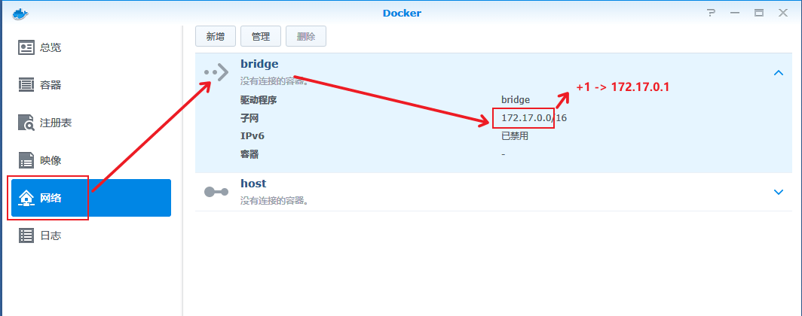
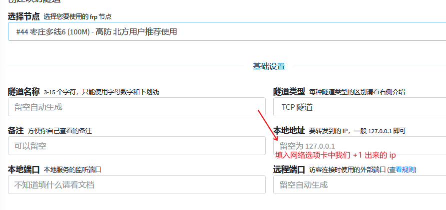
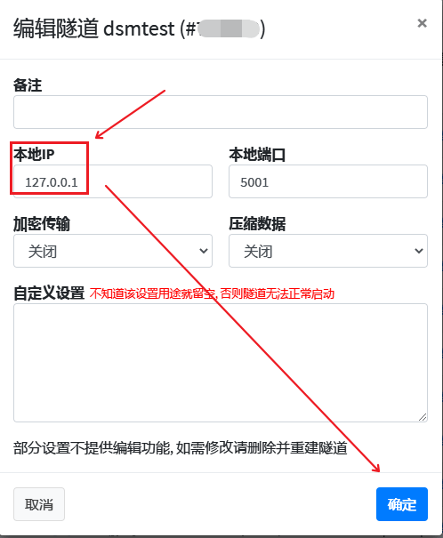
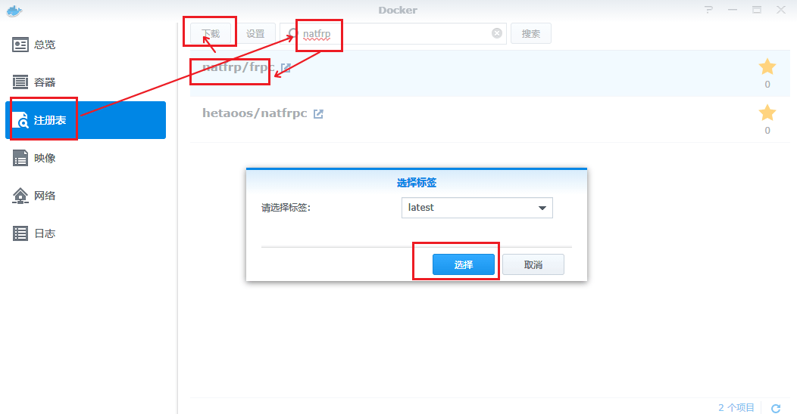
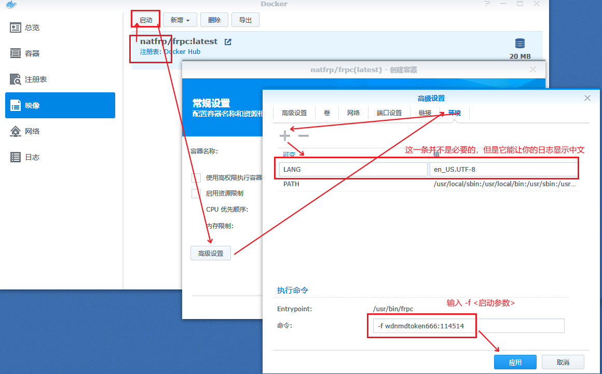
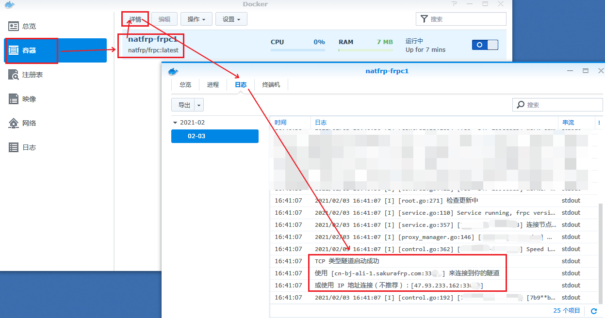
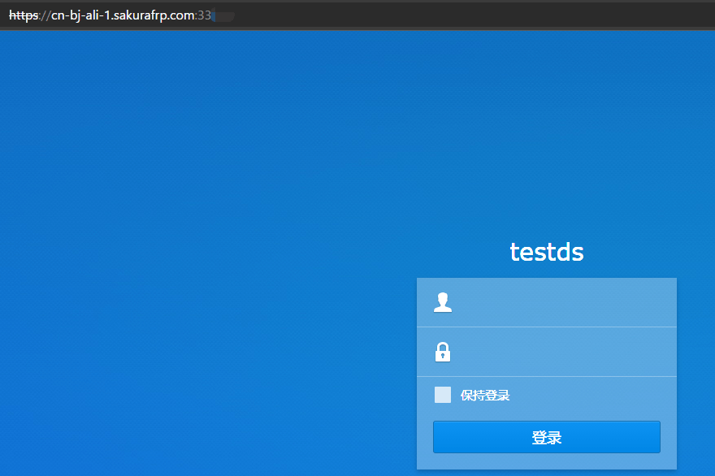
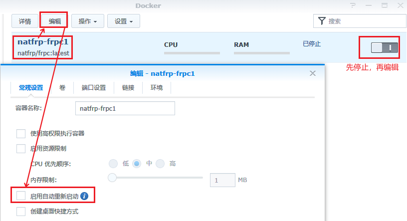

# 使用 docker 管理 frpc 运行

?> 本教程以 DSM 6 系统作为 GUI 操作举例，因为命令行 docker 操作差别不大，请读者自行举一反三（如果这都不会就先别用 docker 了，去隔壁 [systemd](/frpc/service/systemd)）

### 前置知识说明

首先您需要知道启动参数的写法，即：`-f <启动密钥>:<隧道ID>`，如果要启动多个隧道可以 `-f <启动密钥>:<隧道ID1>,隧道ID2,隧道ID3,...`，如果还需深入了解请[转到此](/frpc/manual#从命令行启动)

对于群晖用户，建议您在阅读本篇教程之前，阅读我们的 [传统群晖教程](/app/synology)，阅读全部后，按照指引操作直到完成创建隧道的动作为止

### 设置隧道

因为 docker 网络模型的原因，我们像从前一样把隧道的 本地IP 设置为 `127.0.0.1` 已经不再奏效，必须修改设置中的此项。

此处需要分情况讨论：
 - 当修改为 `host` 宿主网络模式时，只需要设置为上级网关分配给当前设备的 ip 即可（人话：设置为路由器给群晖的ip）
 - 当保持默认的 `bridge` 网桥模式时，我们需要设置为对应网桥的网关 ip 才能恰当的访问当前设备，因为该方案兼容性和安全性更高，**下面的教程默认采用此方案**

首先打开群晖的 Docker 应用，根据图上的方法算出我们需要的 ip

然后在新建隧道时将其设置为 本地IP

或者在 隧道列表 中，编辑一条隧道，设置 本地IP 为该 IP

这样隧道就准备完了

### 设置Docker

首先我们需要获取镜像，跟着图片操作即可（国内使用默认源速度可能较慢，作为一名nas玩家，请自行发挥）：

获取到镜像后就可以启动一个「实例」，请注意，此处「命令」栏中输入的是我们先前准备的启动参数

设置好后应用，然后启动即可

### 获取连接信息

连接信息在 docker实例 的日志中，跟着图片打开它，你就能看到

打开浏览器，试一下（如何访问可能需要回忆 [传统群晖教程](/app/synology) 中的内容）

### 注意事项

群晖的编辑容器中有「启用自动重启启动」的选项，该选项默认关闭，建议打开它

