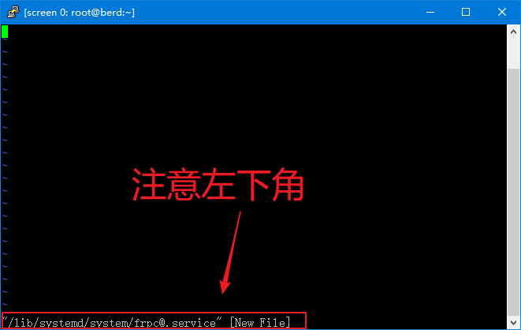
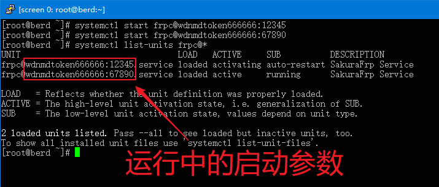
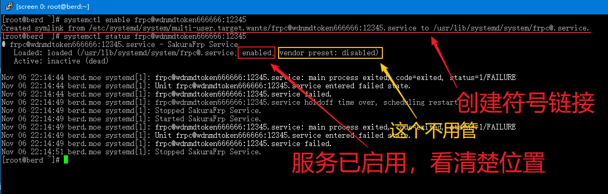

# Systemd 配置 frpc 服务

::: tip
查看此教程前请确保您已阅读 [frpc 基本使用指南](/frpc/usage) 中的 **Linux** 页面
:::

### 前置知识 {#systemd-note}

Systemd 是 Linux 系统的一种初始化系统实现，它管理的各种服务叫做 **Unit**，每个服务对应一个 **Unit 配置文件**

在本教程中，frpc 会被注册为一个服务，我们让 **Systemd** 来自动管理 frpc，借此实现开机自启和后台运行

Systemd 的服务有两种状态:
  - `运行中`/`已停止`/`错误`
  - `启用`/`禁用`

如果 **启用** 了服务，开机的时候服务就会自启，反之就不会

### 编写配置文件 {#systemd-unit}

Systemd 的 **Unit 配置文件** 通常位于这些目录中:
  - /lib/systemd/system （供软件包使用）
  - /etc/systemd/system （供管理员使用）

本教程将选用第二个目录来放置 frpc 的 **Unit 配置文件**，并且 frpc 启用后报错退出时每分钟会自动重启一次

执行下面的命令，您应该会看到图中的提示

```bash
vi /etc/systemd/system/frpc@.service
```



按一下 `i` 键，左下角应该会出现 `-- INSERT --` 或者 `-- 插入 --` 字样


然后复制并粘贴下面提供的服务文件内容，请注意 **不要** 多复制或少复制任何东西，确保粘贴后的内容和图中一模一样

```systemd.unit
[Unit]
Description=SakuraFrp Service
After=network.target

[Service]
Type=idle
User=nobody
Restart=on-failure
RestartSec=60s
ExecStart=/usr/local/bin/frpc -f %i

[Install]
WantedBy=multi-user.target
```

粘贴完成后按一下 `ESC`，左下角的 `-- INSERT --` 会消失，此时输入 `:wq` 并按回车退出


执行下面的命令重载 Systemd，这样服务就配置完成了

```bash
systemctl daemon-reload
```

!> 请记住后续操作中用到的 `Unit 名称` 是 `frpc@<启动参数>`，例如 `frpc@wdnmdtoken666666:12345`

下面本教程将介绍一些 Systemd 的基本操作

### 启动/停止隧道 {#systemd-start-stop}

启动/停止隧道非常简单，使用下面的命令即可，`start` 是启动，`stop` 是停止

```bash
systemctl <start|stop> <Unit名称>
```

::: tip
如果您想开启多条不同隧道，只要更换 `Unit 名称` 中的启动参数并多次执行对应的指令即可
:::

举个例子，开启访问密钥为 `wdnmdtoken666666` 的用户所拥有的 ID 为 `12345` 的隧道:

```bash
systemctl start frpc@wdnmdtoken666666:12345
```

### 查看隧道状态 {#systemd-status}

您可以通过下面的命令查看服务状态

```bash
systemctl status <Unit名称>
```

举个例子，要查看上面开启的隧道状态可以使用

``` bash
systemctl status frpc@wdnmdtoken666666:12345
```

!> **绝对不要** 开启重复的隧道，这会造成出现各种不可预计的 Bug  
执行多次 `systemctl start` 是 **安全** 的  
配置好 Systemd 后，**不要** 再用 `frpc -f <启动参数>` 的形式开启隧道

如果您忘记了之前开启过哪些隧道，使用下面的命令可以列出当前运行中的隧道

```bash
systemctl list-units "frpc@*"
```

下图中的信息表示我们开启了访问密钥为 `wdnmdtoken666666` 的用户所拥有的两条 ID 分别为 `12345` 和 `67890` 的隧道



### 查看隧道日志 {#systemd-log}

您可以通过下面的命令查看隧道日志：

```bash
journalctl -u <Unit名称>
```

举个例子，要查看上面开启的隧道状态可以使用

``` bash
journalctl -u frpc@wdnmdtoken666666:12345
```

如果当前窗口无法显示所有日志，可以用 `↑`、`↓` 方向键滚动，输入大写的 `G` 跳转动到日志底部，输入 `q` 退出日志查看。更多使用方法请参阅 `man journalctl`。

### 配置开机自启 {#systemd-autostart}

装好服务后，实现开机自启非常简单，回顾一下前置知识
  - 我们只要 `启用` 服务就可以实现开机自启
  - 如果不想开机自启了，`禁用` 服务即可

使用下面的命令启用/禁用服务，`enable` 是启用，`disable` 是禁用，操作完成后再用 `status` 检查一下状态

```bash
systemctl <enable|disable> <Unit名称>
systemctl status <Unit名称>
```

如果一切正常，您会看到我图中的两个红色标注的内容

::: tip
没看到第一个创建符号链接的提示也是正常的，只要下面的状态显示为 `enabled` 就行
:::



如果您忘记了之前设置过的自启隧道，可以使用下面的命令列出

和上面是类似的，只是多了个 `--all` 确保停止了的服务也能被列出

```bash
systemctl list-units --all "frpc@*"
```
