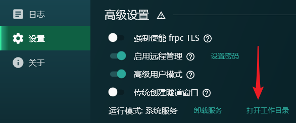

# 配置 frpc 使用的 SSL 证书

在以下两个典型场景中，您可能会需要 **为 frpc 配置 SSL 证书**，以避免证书错误提示：

1. 隧道启用了 [自动 HTTPS](/frpc/auto-https.md)，但服务访问者不支持（或不愿）忽略 **证书错误提示**
1. 隧道启用了 [访问认证](/bestpractice/frpc-auth.md)，但需要避免认证页面的 **证书错误提示** 以增强安全性

本文档将指导您为 frpc 配置 SSL 证书来避免 **自动 HTTPS** 和 **访问认证** 功能造成的证书错误提示。

如果您没有使用上述功能，则 **不适用** 于本文档的内容，请参考您使用的 Web 服务器文档进行配置。

## 获取 SSL 证书 {#get-cert}

::: tip 提示
您需要拥有一个属于自己的域名才能申请、部署 SSL 证书。如果您还没有域名，推荐直接使用 [子域绑定](/bestpractice/domain-bind.md) 功能
:::

有了域名后，选择一个 SSL 服务商，按照他们的流程进行申请即可。下面是一些常见的 SSL 服务商：

- [Let's Encrypt](https://letsencrypt.org/) (免费)
- [Zero SSL](https://zerossl.com/) (免费)
- [Nya SSL](https://get.ssl.moe/) (单域名 ￥19.9/年, 泛域名 ￥199/年，部分用户可在管理面板领取优惠券获取更低的价格)
- [腾讯云](https://cloud.tencent.com/product/ssl)
- [阿里云](https://www.aliyun.com/product/cas)
- [Comodo](https://www.comodo.com/)
- [DigiCert](https://www.digicert.com/)
- [GlobalSign](https://www.globalsign.com/)

SSL 服务商 **不必** 是当前域名的注册商，按需选择适合您的平台即可。

::: warning 证书域名注意事项
如您打算通过 `sub.example.com` 访问隧道，那么就应该为 `sub.example.com` 或 `*.example.com` 申请证书

**单/多域名证书**  
如 `sub.example.com`，仅对证书中单独列出的 `sub.example.com` 等域名有效

**泛域名证书**  
以为 `*` 开头，如 `*.example.com`，对所有二级域名均有效，如 `a.example.com`、`b.example.com` 等  
但对于三级域名如 `sub.sub.example.com` 是无效的，需使用下一级的 `*.sub.example.com` 证书，以此类推
:::

## 配置 frpc 的 SSL 证书 {#install-cert}

1. 如果您没有打开自动 HTTPS 或访问认证功能，修改隧道配置并在 **自动 HTTPS** 处输入 **SSL 证书对应域名**。

   修改完成后启动一次隧道，让 frpc 生成自签名证书文件。

1. 自签名证书会被保存在 **frpc 工作目录** 中，配置前需要确认工作目录的位置。

   使用启动器时，**启动器工作目录** 里有一个 `FrpcWorkingDirectory` 文件夹，这个文件夹才是 **frpc 工作目录**，证书应该放在这个文件夹里。

   下面列出了启动器的常见工作目录位置：

   ::::: tabs

   @tab Windows

   在启动器中点击 `设置 > 高级设置 > 打开工作目录` 按钮即可打开启动器工作目录：

   

   ::: details 进阶说明

   对于 **v2.0.5.0** 及以上版本，工作目录在 `%ProgramData%\SakuraFrpService`。

   对于旧版本启动器，工作目录就是启动器的 **frpc.exe** 所在路径。

   :::

   @tab Linux 桌面

   默认启动器工作目录在 `${XDG_CONFIG_HOME}/natfrp-service`。

   如果您的发行版比较特殊，也可能是 `${HOME}/.config/natfrp-service`。

   @tab Linux 服务器

   对于 **Docker 安装模式**，启动器工作目录在 `/etc/natfrp`。

   对于 **服务端安装**，或者一键脚本的 **常规模式安装**，启动器工作目录在 `/home/natfrp/.config/natfrp-service`。

   @tab 群晖 DSM

   通过群晖套件安装启动器时，启动器工作目录为 `/var/packages/natfrp/var`。

   @tab QNAP

   如果您完全按照 [QNAP 教程](/app/qnap.md) 进行配置，并创建了一个主机存储映射，启动器工作目录就是该 **映射文件夹** 中。

   如果没有创建主机存储映射，启动器工作目录在对应的 Docker 卷中，可通过 `docker inspect <卷名>` 命令查看。

   @tab unRAID

   如果您完全按照 [unRAID 教程](/app/unraid.md) 进行配置，启动器工作目录就是您创建容器时在 **存储位置** 处配置的文件夹。

   @tab 飞牛 fnOS

   如果您完全按照 [fnOS 教程](/app/fnos.md) 进行配置，启动器工作目录就是您创建容器时选择的 **配置文件目录** 中。

   @tab OpenWRT

   通过 LuCI 软件包安装启动器时，启动器工作目录为 `/etc/natfrp`。

   :::::

   ::::: details 如果您没有使用启动器，而是直接运行 frpc，点击展开

   如果您直接复制了 frpc 文档中的 Unit 示例，您的工作目录为 `/usr/local/etc/natfrp`。

   您可也可以自己配置 `WorkingDirectory` 项来指定一个工作目录，例如：

   ```systemd
   [Service]
   WorkingDirectory=/etc/frpc
   ```

   如果需要确认您目前的配置，请执行 `grep "WorkingDirectory" /etc/systemd/system/frpc@.service`。

   如果上面的指令不显示任何内容，请编辑 `/etc/systemd/system/frpc@.service` 加入 `WorkingDirectory=一个目录`。

   **对于 Docker 用户**

   Docker 工作目录默认为 `/run/frpc`，但是该目录中的文件会在容器销毁时丢失。

   请使用 `-v` 或 `--mount` 挂载证书文件到该目录中，并且最好挂载为只读。

   下面的示例将 `/root/my.{crt,key}` 两个文件挂载到容器的 `/run/frpc/example.com.{crt,key}` 中：

   ```bash
   # 用 -v
   docker run (其他参数) \
       -v /root/my.crt:/run/frpc/example.com.crt:ro \
      -v /root/my.key:/run/frpc/example.com.key:ro

   # 用 -mount
   docker run (其他参数) \
       --mount type=bind,src=/root/my.crt,dst=/run/frpc/example.com.crt,ro \
       --mount type=bind,src=/root/my.key,dst=/run/frpc/example.com.key,ro
   ```

   :::::

1. 找到工作目录后，从供应商处下载申请到的 SSL 证书：

   - 如果下载证书时有多种格式可选，请选择 **nginx 格式**，下载后应该得到一个 `.key` 和一个 `.crt` 文件
   - 如果下载到两个 `.pem` 文件，直接将其 **重命名** 为 `.key` 和 `.crt` 文件即可，注意不要搞反证书和私钥
   - 如果下载后有三个文件，说明证书链在独立文件（文件名通常有 `_intermediate` 字样）中，需要手动拼接：  
   把证书链的内容复制出来，隔一个空行粘贴到 `.crt` 文件末尾即可，拼接后的 `.crt` 文件即可直接用于替换

1. 如果刚才已启动过隧道测试，那么此时，在工作目录中就可以看到自签名证书了：

   - `example.com.crt`：自签名证书文件
   - `example.com.key`：自签名证书的私钥文件

   此时应先 **确保隧道已关闭**，随后用下载到的证书文件替换这两个文件。

1. 重新启动隧道并尝试访问。如果您的配置步骤、申请的证书没有问题，那么将不再出现证书错误提示。

   ::: warning
   如果您发现启动隧道后，frpc 工作目录中您替换的 SSL 证书重新被 frpc 替换为自签名证书，那么说明 frpc 未能解析您的 SSL 证书，请检查证书完整性、各文件是否正确。
   :::

### 访问认证配置 SSL 证书 {#authpanel}

frpc **v0.42.0-sakura-3.1** 及以上版本访问认证会遵循 **自动 HTTPS** 配置项的规则加载证书，参考 [配置 frpc 的自动 HTTPS 功能](/frpc/auto-https.md) 和上面的 [配置 frpc 的 SSL 证书](#install-cert) 即可。

对于 **v0.42.0-sakura-3** 及更低版本，您可以通过替换 frpc 工作目录下的 `authpanel.<crt|key>` 让访问认证加载对应的证书。
