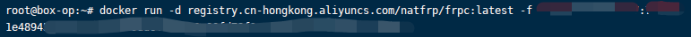
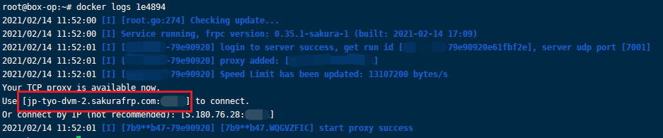
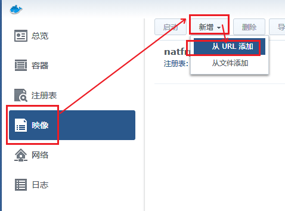
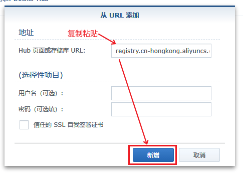

# 使用 docker 管理 frpc 运行

docker 能使我们的部署更加简单可重复，大幅度降低部署难度，管理也更简单，所以我们提供 docker 镜像帮助您享受这种简单。

## 前置知识说明

首先您需要知道启动参数的写法，即：`-f <启动密钥>:<隧道ID>`，如果要启动多个隧道可以 `-f <启动密钥>:<隧道ID1>,隧道ID2,隧道ID3,...`，如果还需深入了解请[转到此](/frpc/manual#从命令行启动)

为了提高可用性，建议您开启远程控制功能，即在启动参数后面加上 ` --remote_control <远程控制密码>`，最终的形态即为： `-f <启动密钥>:<隧道ID> --remote_control <远程控制密码>`

对于群晖用户，建议您在阅读本篇教程之前，阅读我们的 [传统群晖教程](/app/synology)，阅读全部后，按照指引操作「配置 DSM 面板」和「创建隧道」两节

如果您感觉本篇教程对您来讲难以理解，可以试试隔壁 [systemd 教程](/frpc/service/systemd)

本篇教程分为 [命令行操作](#docker-cli) 和 [图形化操作（以群晖为例）](#gui-syno) 两节，请根据您对自己的能力评估自行选用

## docker-CLI

?> 本教程为基于命令行操作的 docker 教程，如果需要 gui 教程请移步 [图形化操作（以群晖为例）](#gui-syno)

### 设置隧道

因为 docker 网络模型的原因，我们像从前一样把隧道的 本地IP 设置为 `127.0.0.1` 已经不再奏效，必须修改设置中的此项。

因为默认的 `bridge` 网桥模式兼容性和安全性更高，**下面的教程默认采用此方案**

首先运行下面的指令读出 docker 默认网桥的 网关IP

`ip addr show docker0`

结果预期如下：

```
4: docker0: <NO-CARRIER,BROADCAST,MULTICAST,UP> mtu 1500 qdisc noqueue state DOWN group default 
    link/ether 02:42:c4:f5:83:8f brd ff:ff:ff:ff:ff:ff
    inet 172.17.0.1/16 brd 172.17.255.255 scope global docker0
       valid_lft forever preferred_lft forever
```

其中 `172.17.0.1` 这一部分就是我们要的 IP

然后在新建隧道时将其设置为 本地IP


或者在 隧道列表 中，编辑一条隧道，设置 本地IP 为该 IP


这样隧道就准备完了

### 设置Docker

首先我们需要获取镜像：

```bash
# 默认 DockerHub 源，国内可能较慢：
docker pull natfrp/frpc

######## 或者 ########

# 阿里云容器镜像 香港地区源，适合国内用户：
docker pull registry.cn-hongkong.aliyuncs.com/natfrp/frpc
```

如果成功的话，返回应该会是下面这样：

```
~# docker pull registry.cn-hongkong.aliyuncs.com/natfrp/frpc
Using default tag: latest
latest: Pulling from natfrp/frpc
4c0d98bf9879: Pull complete 
292f768886fd: Pull complete 
Digest: sha256:9d33d6110ee53480f28cc99e39476d3d845ce70cf8a4d775da78f15620bbab5a
Status: Downloaded newer image for registry.cn-hongkong.aliyuncs.com/natfrp/frpc:latest
registry.cn-hongkong.aliyuncs.com/natfrp/frpc:latest
```

其中最后一行复制一下，这个是实际被下载到本地的镜像tag，启动时会用得上

接下来我们执行：`docker run -d --restart=always <你刚复制的镜像tag> -f <启动参数> --remote_control <远程控制密码>`，如果一切顺利，就能看到只有一行奇怪的hash的输出，就是实例ID

### 获取连接信息

连接信息在 docker实例 的日志中，执行 `docker logs <实例ID>` 就能看到，如对于这样的启动参数：



我们取实例ID的随便前几位就能查到日志：



### 注意事项

`--restart=always` 选项并不是必须，但开启此选项后可以自动重启容器实例

## GUI-syno

?> 本教程以 DSM 6 系统作为 GUI 操作举例，其他工具大同小异。

### 设置隧道

因为 docker 网络模型的原因，我们像从前一样把隧道的 本地IP 设置为 `127.0.0.1` 已经不再奏效，必须修改设置中的此项。

此处需要分情况讨论：
 - 当修改为 `host` 宿主网络模式时，只需要设置为上级网关分配给当前设备的 ip 即可（人话：设置为路由器给群晖的ip）
 - 当保持默认的 `bridge` 网桥模式时，我们需要设置为对应网桥的网关 ip 才能恰当的访问当前设备，因为该方案兼容性和安全性更高，**下面的教程默认采用此方案**

首先打开群晖的 Docker 应用，根据图上的方法算出我们需要的 ip


然后在新建隧道时将其设置为 本地IP


或者在 隧道列表 中，编辑一条隧道，设置 本地IP 为该 IP


这样隧道就准备完了

### 设置Docker

?> 如果您发现自己获取镜像非常慢，并不知道什么叫做 出国网络质量，或者不知道如何改善的话，获取镜像这一步建议跳转到 [获取镜像：中国特色](#获取镜像：中国特色) 试试

首先我们需要获取镜像，跟着图片操作即可：


获取到镜像后就可以启动一个「实例」，请注意，此处「命令」栏中输入的是我们先前准备的启动参数

!> 虽然图中只有 `-f` 部分，但我们非常建议您也启用远程控制，详情见前面的 [前置知识说明](#前置知识说明)

设置好后应用，然后启动即可


### 获取连接信息

连接信息在 docker实例 的日志中，跟着图片打开它，你就能看到


打开浏览器，试一下（如何访问可能需要回忆 [传统群晖教程](/app/synology) 中的内容）


### 注意事项

群晖的编辑容器中有「启用自动重启启动」的选项，该选项默认关闭，建议打开它


### 如何更新

首先，再进行一次下载


接下来你应该看到右下角网络监控处的下载流量提升

等到右上角出现提示时即已经更新完成


接下来停止需要升级的容器，选中它点击 「操作 - 清除」，然后再启动时即升级到了最新版

### 获取镜像：中国特色

因为一些很有中国特色的原因，我国运营商的国际互联带宽长期不足（对于个人用户来说）。反映到您身上可能就是这个 7MiB 的镜像下了一个小时，最后还失败了，这时候就需要一些有中国特色的解决手段。

我们在阿里云的容器镜像服务提供镜像下载服务，镜像地址是 `registry.cn-hongkong.aliyuncs.com/natfrp/frpc`

使用方式如图：



