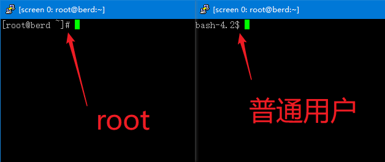

# Linux 系统使用 frpc

### 注意

本文档给出的命令中 `$` 和 `#` 不需要输到终端里，它们只表示您执行这个命令需要的权限

如果您现在已经有 `root` 权限了，可以直接执行 `$` 和 `#` 两种命令，反之您只能执行 `$` 这种命令，要切换到 `root` 账户才能执行 `#` 开头的命令，否则可能出错

您可以直接从您输命令那个地方看到您现在是不是 `root` 权限:



使用 `su` 或者 `sudo -s` 即可切换到 `root` 账户. 如果提示输密码请自行解决，我不可能知道您的系统的密码

### 确认系统架构

下载 frpc 前，请先确认您的 Linux 系统的架构. 执行下面的命令，根据输出结果就可以确定系统架构

```bash
$ uname -a
```

| 架构 | 输出结果 |
| --- | --- |
| i386 | `i386`, `i686` |
| amd64 | `x86_64` |
| arm | `arm`, `armv7l` |
| arm64 | `aarch64`, `armv8l` |
| mips | `mips` |
| mips64 | `mips64` |
| 不支持 | `alpha`, `arc`, `blackfin`, `c6x`, `cris`, `frv`, `h8300`, `hexagon`, `ia64`, `m32r`, `m68k`, `metag`, `microblaze`, `mn10300`, `nios2`, `openrisc`, `parisc`, `parisc64`, `ppc`, `ppcle`, `ppc64`, `ppc64le`, `s390`, `s390x`, `score`, `sh`, `sh64`, `sparc`, `sparc64`, `tile`, `unicore32`, `xtensa` |

如果您看到了不在上面列表中的输出，请访问 [百度](https://www.baidu.com/) 进行搜索

### 安装 frpc

登录管理面板，在侧边栏点击 “软件下载” :


?> 本教程中使用的演示内核为 x86_64 架构，对应文件名为 `frpc_linux_arm64`  
实际操作时需要根据您的架构文件名会有所不同，请自行修改命令中的文件名

找到 frpc 的各种下载地址和您的架构标志，复制右边蓝色的下载地址


使用下面的命令进入 `/usr/local/bin` 目录并下载文件

```bash
$ cd /usr/local/bin
# curl -Lo frpc 您刚才复制的下载地址
```


然后使用下面的命令设置正确的权限并检查输出

```bash
# chmod 755 frpc
# ls -ls frpc
```


如果您看到和图里一样的输出，frpc 就安装完成并可以正常使用了。您可以执行下面的命令来再次确认
```bash
$ frpc -v
```

### 使用 frpc

请查看 [用户手册](/frpc/manual#普通用户) 中的 **普通用户** 一节学习 frpc 基本的指令使用方法

通过本文档中介绍的方法安装后，您应该可以在任何目录直接输入 `frpc <参数>` 运行 frpc ，**不需要** 输入完整路径
