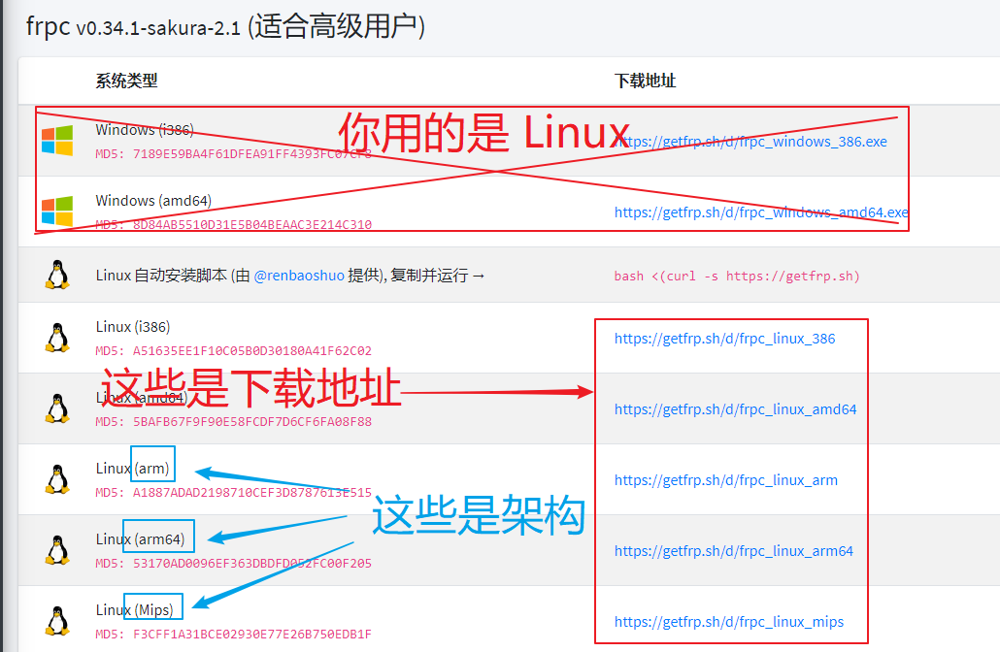
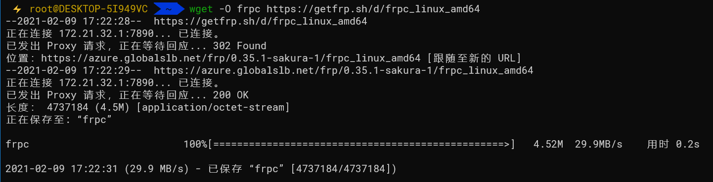
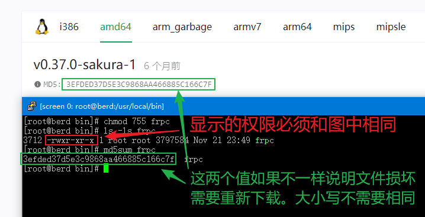
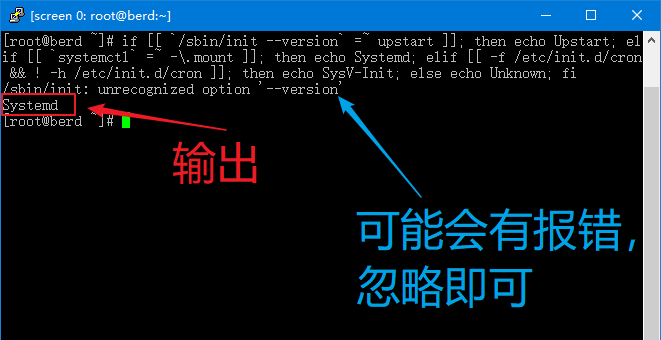

# Linux 系统使用 frpc

<!--
TODO: Update script
如果您符合以下几种情况：
+ 对自己的技术没有信心
+ 不知道该下载什么版本
+ 不会写 systemd 服务

请使用 **一键安装脚本（由 [@renbaoshuo](https://baoshuo.ren) 提供）**：`sudo bash <(curl -Ls getfrp.sh)` （需要 root 权限）
-->

## 注意

本文档中给出的命令大多需要 `root` 权限才能运行，请确保您现在已经处于有 `root` 权限的环境下。

如果您现在没有切换到 `root` 账户下，那么请使用 `su` 或者 `sudo -s` 命令来进行切换。

## 确认系统架构

下载 frpc 前，请先确认您的系统架构。执行下面的命令，根据输出结果查表：

```bash
uname -m
```

| 架构 | 输出结果 |
| --- | --- |
| i386 | `i386`, `i686` |
| amd64 | `x86_64` |
| armv6 | `arm` |
| armv7 | `armv7l` |
| arm64 | `aarch64`, `armv8l` |
| _mips*_ | `mips` |
| _mips64*_ | `mips64` |
| 不支持 | `alpha`, `arc`, `blackfin`, `c6x`, `cris`, `frv`, `h8300`, `hexagon`, `ia64`, `m32r`, `m68k`, `metag`, `microblaze`, `mn10300`, `nios2`, `openrisc`, `parisc`, `parisc64`, `ppc`, `ppcle`, `ppc64`, `ppc64le`, `s390`, `s390x`, `score`, `sh`, `sh64`, `sparc`, `sparc64`, `tile`, `unicore32`, `xtensa` |

?> 如果您的架构为 `mips` 或 `mips64`，还需要使用下面的命令来确定系统的字节序  
其他架构请直接跳到 [安装 frpc](#install-frpc) 一节

```bash
# 一般来说只需要使用这条命令:
echo -n I | hexdump -o | awk '{print substr($2,6,1); exit}'

# 如果上面的命令报错，请尝试这条:
echo -n I | od -to2 | awk '{print substr($2,6,1); exit}'
```

| 下载文件 | 输出结果 |
| --- | --- |
| mips / mips64 | `0` |
| mipsle / mips64le | `1` |

### 安装 frpc :id=install-frpc

登录管理面板，在侧边栏点击 “软件下载” :


找到 frpc 的各种下载地址和您的架构标志，复制右边蓝色的下载地址：



使用下面的命令进入 `/usr/local/bin` 目录并下载文件：

```bash
cd /usr/local/bin

# 一般来说只需要使用这条命令:
wget -O frpc <下载地址>

# 如果上面的命令报错，请尝试这条:
curl -Lo frpc <下载地址>
```



然后设置权限并校验文件是否有损坏：

```bash
chmod 755 frpc
ls -ls frpc
md5sum frpc
```



此时 frpc 就安装完成并可以正常使用了。您可以用此命令查看 frpc 版本号：

```bash
frpc -v
```

### 使用 frpc

请查看 [用户手册](/frpc/manual#普通用户) 中的 **普通用户** 一节学习 frpc 的基本使用方法

通过本文档中介绍的方法安装后，您应该可以在任何目录直接输入 `frpc <参数>` 运行 frpc ，**不需要** 输入完整路径

### 简易后台运行

!> 不推荐采用 `&` 将 frpc 放到后台运行，建议参考下面的 **配置开机自启** 一节将 frpc 注册为系统服务

因为 frpc 总是在读取 stdin，所以如果要使用 `&` 的方式将 frpc 临时放到后台运行，需要提供一个 stdin 让它读取: `echo | <cmd> &`

举个例子:
```bash
echo | frpc -f wdnmdtoken666666:12345 &
```

### 配置开机自启

如果您想让 frpc 在开机时自启或在后台运行，就需要将 frpc 注册为系统服务。

!> 由于文档维护者不了解 Upstart 和 SysV-Init 的传参模式，本文档暂不提供这两种初始化系统的配置指南  
如果您熟悉这些初始化系统并且愿意为本文档作出贡献，欢迎开启 PR 完善相关文档（[GitHub 仓库](https://github.com/natfrp/wiki)）

首先，您要搞清楚您的 Linux 系统使用的 ***初始化系统*** 是什么，常见的初始化系统：

- Systemd
- Upstart
- SysV-Init

执行下面的命令然后查看输出，找到您的初始化系统：

```bash
if [[ `/sbin/init --version` =~ upstart ]]; then echo Upstart; elif [[ `systemctl` =~ -\.mount ]]; then echo Systemd; elif [[ -f /etc/init.d/cron && ! -h /etc/init.d/cron ]]; then echo SysV-Init; else echo Unknown; fi
```



然后，请参考下面的教程配置系统服务:

- [Systemd 配置指南](/frpc/service/systemd)
