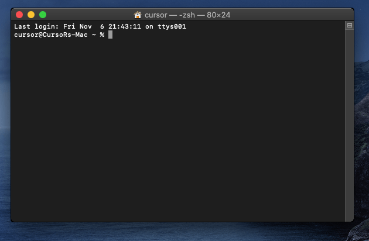
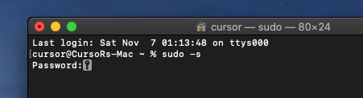
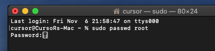
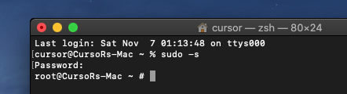
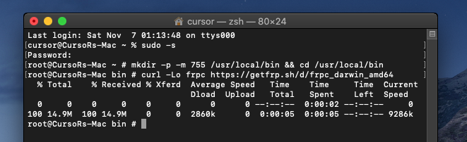
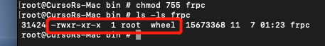

# macOS 系统使用 frpc

## 进入 root 权限

按下键盘上的 `command+空格` 调出聚焦搜索并键入 `终端`  
双击终端图表以打开终端




使用下面的命令进入 `root` 权限

```bash
sudo -s
```



在 `Password:` 处输入您当前账户的密码并按下回车
?> 您会发现终端并没有显示，不用担心，“摸黑”输入密码后按下回车即可，退格按键同样可用



如果您看到和图里一样的输出，说明已成功进入 `root` 权限

## 安装 frpc

打开终端，进入 `root` 权限


使用下面的命令进入 `/usr/local/bin` 文件夹并下载文件

```bash
mkdir -p -m 755 /usr/local/bin && cd /usr/local/bin
curl -Lo frpc https://getfrp.sh/d/frpc_darwin_amd64
```



使用下面的命令设置权限并检查输出

```bash
chmod 755 frpc
ls -ls frpc
```



如果您看到和图里一样的输出，说明 frpc 已完成安装并准备就绪  
您可以执行下面的命令再次确认以及查看 frpc 版本号

```bash
frpc -v
```

## 使用 frpc

请查看 [用户手册](/frpc/manual#普通用户) 中的 **普通用户** 一节学习 frpc 的基本使用方法

通过本文档中介绍的方法安装后，您应该可以在任何目录直接输入 `frpc <参数>` 运行 frpc ，**不需要** 输入完整路径
