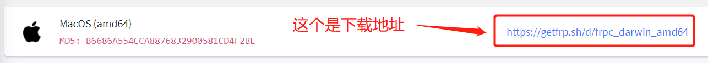

# macOS 系统使用 frpc

### 提升到 root 权限

按下键盘上的 `⌘ + 空格` 调出聚焦搜索并键入 `终端`，双击终端图标以打开终端



您应该会看到类似下图的窗口


执行下面的命令

```bash
sudo -s
```


在 `Password:` 处输入您当前账户的密码并按下回车

?> 您会发现终端并没有显示您输入的密码，不用担心，“摸黑”输入密码后按下回车即可，退格按键同样可用


如果您看到和图里一样的输出（出现 `#`），说明您已成功提升到 `root` 权限

### 安装 frpc :id=install-frpc

?> 安装前请先确保您已提升到 `root` 权限

使用下面的命令进入 `/usr/local/bin` 文件夹：

```bash
mkdir -p -m 755 /usr/local/bin && cd /usr/local/bin
```

!> 我们建议您使用此处的命令下载 frpc，如果您使用浏览器下载可能会出现无法运行的问题  
如果出现上述问题，您可以参考 [此 FAQ](/faq/frpc#macos-run-frpc-issue) 解决

然后，使用下面的命令下载 frpc：

```bash
# 如果您使用的是 Apple Silicon 设备 (如 M1 CPU)，请使用下面的命令
curl -Lo frpc https://getfrp.sh/d/frpc_darwin_arm64

# 否则 (如 Intel CPU)，请使用下面的命令
curl -Lo frpc https://getfrp.sh/d/frpc_darwin_amd64
```


使用下面的命令设置权限并检查输出：

```bash
chmod 755 frpc
ls -ls frpc
```

如果您看到和图中红框标记匹配的输出，说明 frpc 已完成安装并准备就绪


您可以执行下面的命令再次确认以及查看 frpc 版本号

```bash
frpc -v
```

### 使用 frpc

请查看 [用户手册](/frpc/manual#普通用户) 中的 **普通用户** 一节学习 frpc 的基本使用方法

通过本文档中介绍的方法安装后，您应该可以在任何目录直接输入 `frpc <参数>` 运行 frpc ，**不需要** 输入完整路径
