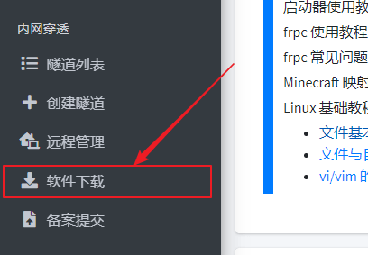
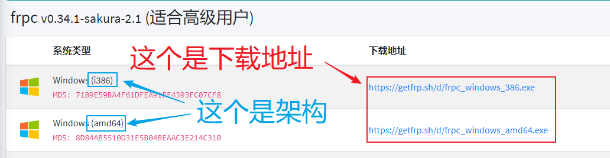
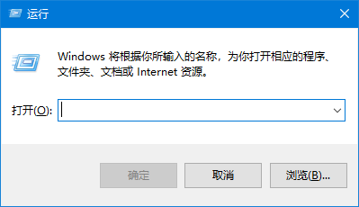
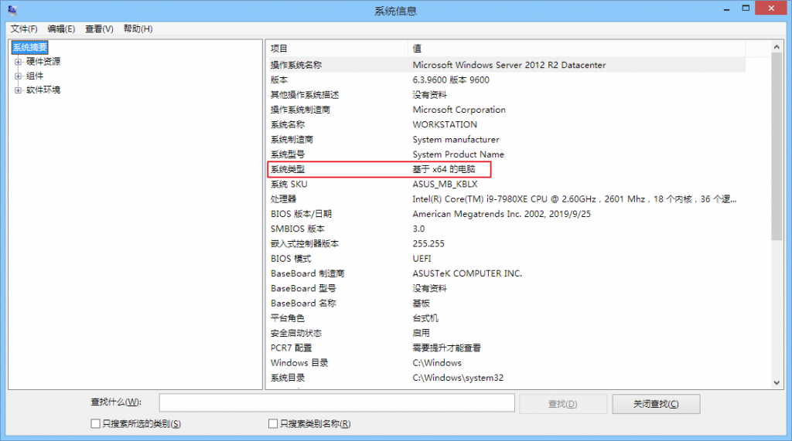
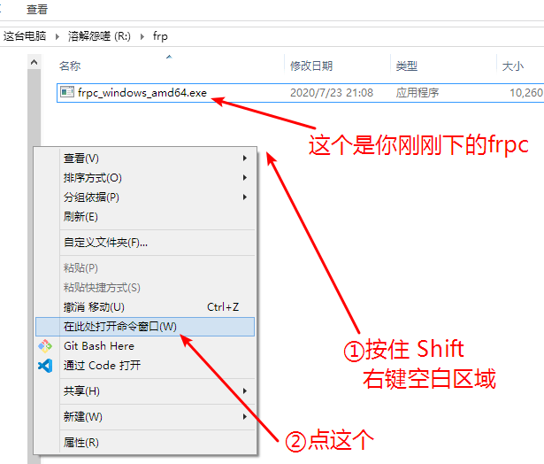
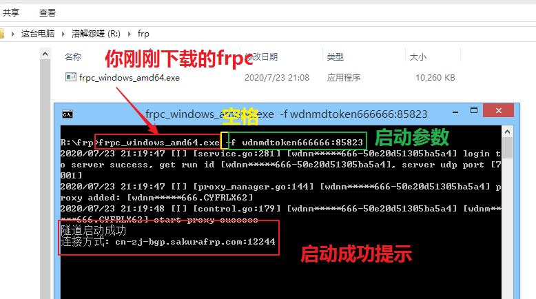

# Windows 系统使用 frpc

!> 我们不推荐在 Windows 系统上直接使用 frpc，没有特殊需求请 [使用启动器](/launcher/usage)  
本文档也不提供 frpc 开机自启配置教程，如有需要请使用启动器

### 下载 frpc

登录管理面板，在侧边栏点击 “软件下载” :

找到 frpc 的下载地址，根据您的系统架构选择一个合适的版本下载
 - 64 位系统下载 amd64 版本
 - 32 位系统下载 i386 版本
 - 暂不支持 arm 架构的 Windows 系统

如果您不知道自己的系统架构，请按 `Win+R` 打开运行窗口

输入 `msinfo32` 然后点确定，在 “系统类型” 里就能看到自己的电脑是 64 位还是 32 位了

* 看到 x86 说明您的系统是 32 位的，不是 86 位

### 使用 frpc

请查看 [用户手册](/frpc/manual#普通用户) 中的 **普通用户** 一节学习 frpc 基本的指令使用方法

### 操作示例

?> 下面的所有示例均以启动手册教程中的第一条隧道为例

首先找到您之前下载的 frpc，在本示例中，文件名为 `frpc_windows_amd64.exe`

按住 **Shift** 然后 **右键** 点击空白区域，选择 “在此处打开命令窗口” 或者 “在此处打开 Windows Powershell”

然后按下面这个图的说明输入您下载的 frpc 文件名和启动参数，按回车启动 frpc

