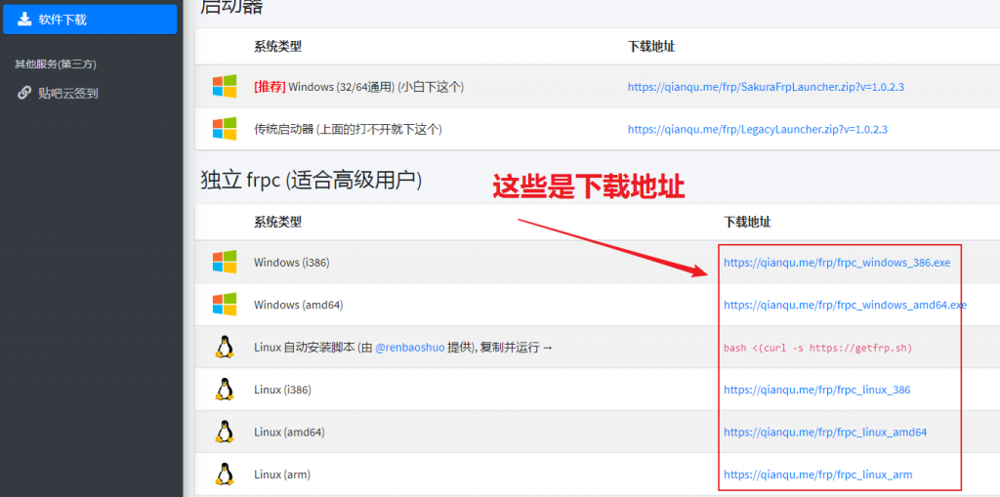
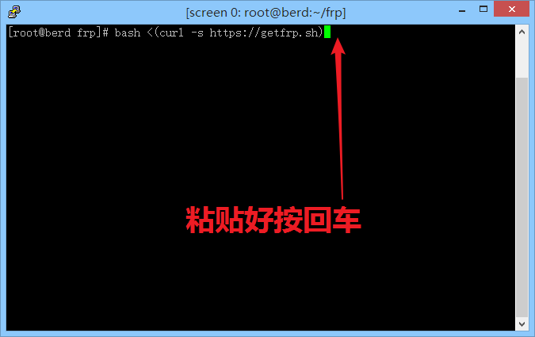
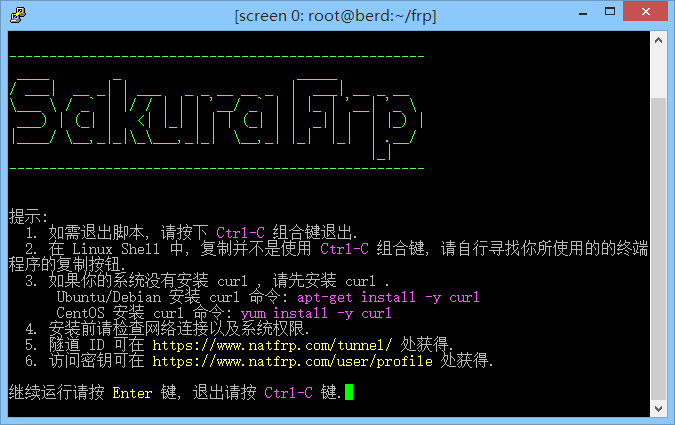
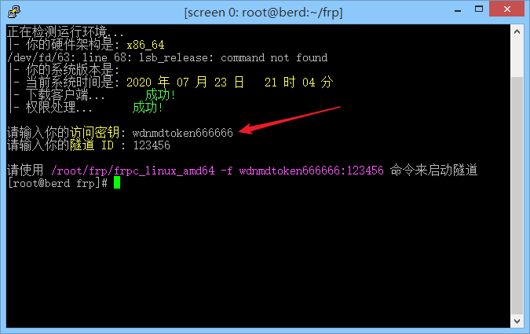
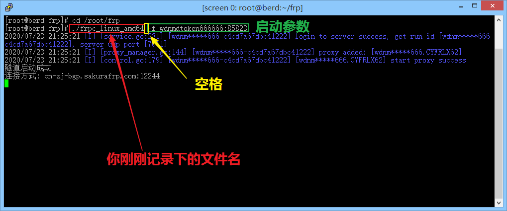

# Linux 系统使用 frpc

首先我们要下载 frpc, 登录网站, 选择 “软件下载”

往下拉, 找到 frpc 的各种下载地址

这里我们选用自动安装脚本, 完整的复制自动安装脚本右边那一行指令, 然后用 root 权限运行

?> 一般 `sudo <指令>` 就能以 root 权限运行一条命令, 例如 `sudo ls` 
如果你的 shell 中光标已经显示 `#` 则说明你已经处于 root 账户下, 无需使用 sudo, 如果显示 `$` 则需要使用 sudo

如果一切正常, 你会看到自动安装界面, 这个时候按回车继续

因为我们要学习直接启动 frpc 的参数, 这个地方可以直接按两下回车跳过, 不需要输入隧道 ID 和 密钥. 记录下提示信息中紫色部分 **最左边** 的那个路径, 在我的示例中即为 `/root/frp/frpc_linux_amd64`, 这就是你下载的 frpc

接下来, 请查看 [用户手册](/frpc/manual#普通用户) 中的 **普通用户** 一节学习 frpc 的指令使用方法

学会怎么用启动参数就可以来实践一下了, 下面的所有示例均以启动我的第一条隧道为例

回忆一下刚刚我们记录的文件路径, 比如我的是 `/root/frp/frpc_linux_amd64`. 我们去掉末尾的文件名, 用 `cd` 切换到这个文件的目录下, 在本示例中我输入 `cd /root/frp/`

然后按下图输入启动参数, 按回车就能启动隧道, 是不是超简单?

