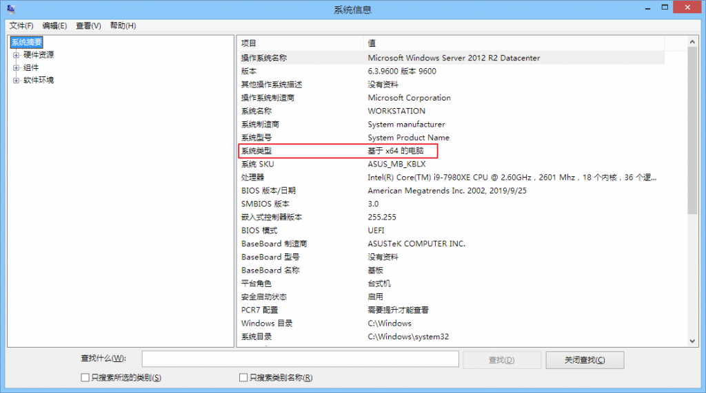
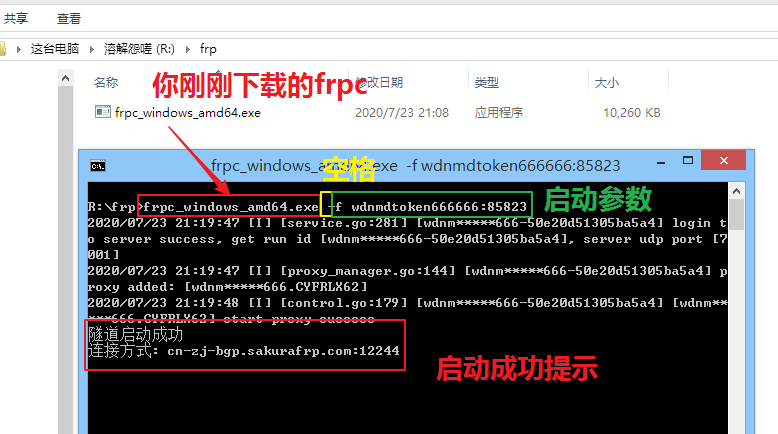

# Windows 系统使用 frpc

首先我们要下载 frpc, 登录网站, 选择 “软件下载”

往下拉, 找到 frpc 的各种下载地址, 选择一个合适的版本下载

64 位系统就下 amd64 版本, 32 位系统就下载 i386 版本, 用 ARM 架构跑 Windows 的用户自己想办法解决

如果你不确定自己的系统架构, 按 Win+R 组合键打开运行窗口, 输入 `msinfo32` 然后按回车, 在 “系统类型” 里就能看到自己的电脑是 64 位还是 32 位了

?> 如果看到 x86 说明你的系统是 32 位的, 不是 86 位

接下来, 请查看 [用户手册](/frpc/manual#普通用户) 中的 **普通用户** 一节学习 frpc 的指令使用方法

学会怎么用启动参数就可以来实践一下了, 下面的所有示例均以启动我的第一条隧道为例

首先找到你之前下载的 frpc, 如果你在用 Windows, 按住 Shift 然后右键文件夹里的空白区域, 选择 “在此处打开命令窗口” 或者 “在此处打开 Windows Powershell”

然后按下面这个图的说明输入你下载的 frpc 文件名和启动参数, 按回车就能启动成功, 是不是很简单?

