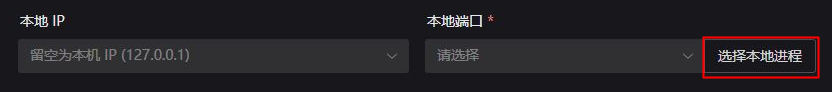
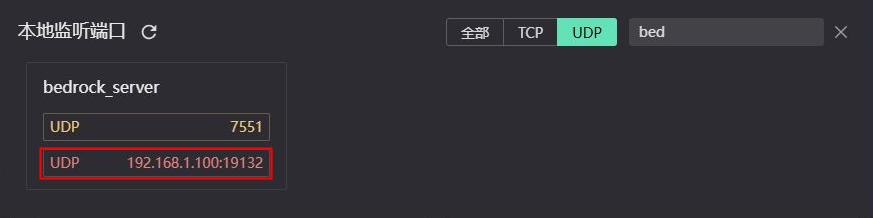
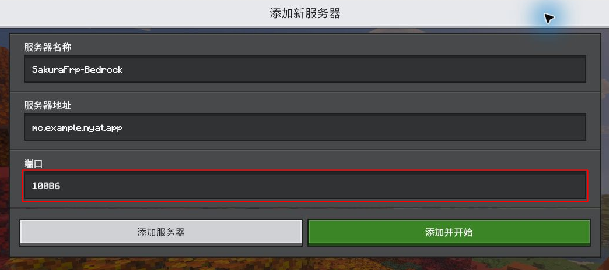

# 我的世界 (Minecraft) 基岩版服务器穿透指南 (NetherNet)

使用 NetherNet 联机时，需要同时穿透 TCP 和 UDP。下文的 Endstone 和 LeviLamina 方案只需 **一条 TCP 隧道和一条 UDP 隧道**，多名玩家可以共用。

如果您使用的是旧版 RakNet 服务端，请参阅[旧版基岩版开服指南](/offtopic/mc-bedrock-server.md)。

## 选择服务端 {#server-options}

| 服务端 | 隧道安排 |
| --- | --- |
| [Endstone](https://github.com/EndstoneMC/endstone) | 一条 TCP + 一条 UDP，按下文配置即可 |
| [LeviLamina](https://github.com/LiteLDev/LeviLamina) | 开启单端口功能 (默认启用) 后，一条 TCP + 一条 UDP |
| [原版 BDS](https://www.minecraft.net/zh-hans/download/server/bedrock/) | **不推荐**，除一条 TCP 外，每多一名在线玩家，就要多开一条 UDP 隧道 |

例如，原版 BDS 两人同时在线需要三条隧道，十人则需要十一条。如果仍要使用原版，需要通过 `server-udp-ports` 逐个配置这些 UDP 端口的公网映射。

本教程只覆盖隧道数量固定的两种方案。

## 准备服务端 {#prepare-server}

选择一套服务端安装即可。请使用支持您游戏版本的最新稳定版，让安装工具下载配套文件；已有服务器请先备份世界。

:::: tabs

@tab Endstone

1. 从 [Endstone 发布页面](https://github.com/EndstoneMC/endstone/releases)下载名称以 `windows-x86_64.zip` 结尾的独立包，完整解压到新文件夹
1. 双击 `start.cmd`，等待首次下载完成，控制台出现 `Server started.`
1. 在控制台输入 `stop`，等待服务器退出，再打开 `bedrock_server` 文件夹中的 `server.properties`

以后都使用 `start.cmd` 启动，不要直接运行 `bedrock_server.exe`。

@tab LeviLamina

1. 按[官方安装说明](https://lamina.levimc.org/zh/user_guides/install/)安装 lip 和所需运行库
1. 新建一个服务器文件夹，在该文件夹中打开 PowerShell，执行：

   ```powershell
   lip install github.com/LiteLDev/LeviLamina
   ```

1. 下载完成后，运行 `bedrock_server_mod.exe`，等待控制台出现 `Server started.`
1. 在控制台输入 `stop`，等待服务器退出，再打开同一文件夹中的 `server.properties`

不要手动用其他版本的原版服务器覆盖安装工具下载的文件。

::::

在 `server.properties` 中找到并修改以下项目，不要直接覆盖整个文件：

```properties
transport=nethernet
server-port=19132
online-mode=true
allow-list=false
```

- `server-port`：服务器的本地端口，下面两条隧道都要填写这个数值
- `online-mode=true`：保留账号验证，您和朋友使用自己的 Microsoft/Xbox 账号登录游戏
- `allow-list=false`：关闭白名单，朋友拿到连接地址后就能加入，不必逐个添加名字

如果您需要限制谁能加入，可保留 `allow-list=true`，启动后在控制台输入 `allowlist add "玩家昵称"`，添加您自己和朋友。

保存后重新启动服务器，先在本机或局域网加入一次，确认能正常进入世界。

## 创建隧道 {#create-tunnels}

在服务器电脑上[安装并登录 SakuraFrp 启动器](/launcher/usage.md)，选择支持 UDP 的 **多线节点**。

下文需要填写节点的公网 IPv4 地址，若您使用 **三线节点**，其他运营商的玩家连接时可能体验会受到影响。

**TCP 和 UDP 两条隧道必须使用同一个节点。**

### TCP 隧道 {#tcp-tunnel}

创建一条 TCP 隧道：

- 隧道名称：`MCBE_TCP`
- 隧道类型：`TCP`
- 本地 IP：服务端与启动器在同一台电脑时填写 `127.0.0.1`
- 本地端口：`19132`，如果改过 `server-port`，这里也要对应修改
- 自动 HTTPS：启用
- 自动 HTTPS 工作模式：点击 `高级` 即可看到此选项，选择 **反代至 HTTP**

按[子域绑定说明](/bestpractice/domain-bind.md#cname-for-site)，为 `MCBE_TCP` 创建 **CNAME** 绑定，**不要选 Minecraft Java 使用的 SRV 绑定**。

启动或重启隧道，打开“日志”，确认已加载绑定域名的证书。下面是一段示例日志：

```log
2077/08/25 09:29:49 I Tunnel/MCBE_TCP [233/10/xxxx] 连接节点成功, 运行 ID [10-xxxx]
2077/08/25 09:29:49 I Tunnel/MCBE_TCP [233/10/xxxx] 已从服务器为 mc.example.nyat.app 加载证书 [CN = *.example.nyat.app, 2077-08-25 - 2077-11-23]
Tunnel/MCBE_TCP TCP 隧道启动成功
Tunnel/MCBE_TCP 使用 >>mc.example.nyat.app:10086<< 连接你的隧道
```

看到 `已从服务器为 ... 加载证书` 后，记下连接地址中的 **域名 `mc.example.nyat.app`** 和 **TCP 远程端口 `10086`**。这些是示例值，连接时请以您自己的日志为准。

### UDP 隧道 {#udp-tunnels}

在 **同一个节点** 创建 UDP 隧道：

- 隧道名称：`MCBE_UDP`
- 隧道类型：`UDP`
- 本地 IP、本地端口：按下方步骤通过 **选择本地进程** 自动填写
- 远程端口：设置为 TCP 隧道对应的远程端口

1. 保持服务端运行，在“本地端口”右侧点击 **选择本地进程**：

   

1. 切换到 **UDP**，在筛选框输入 `bed`。Endstone 选择 `bedrock_server`，LeviLamina 选择 `bedrock_server_mod`。点击其中与 `server-port` 相同的端口，默认是 **19132**，不要选择 `7551`：

   

选择后，启动器会自动填写本地 IP 和本地端口。列表中没有目标端口时，先尝试加入服务器，再点击“本地监听端口”右侧的刷新按钮。

::: tip 每次启动前检查
内网 IP 可能随电脑重启、Wi-Fi 重连或切换网络而变化。每次开启 UDP 隧道前，都要先启动服务端，重新选择本地进程或核对监听项，确认隧道中的本地 IP 和端口仍然正确
:::

::: details 使用 PowerShell 手动查询 (备用)
TCP 与 UDP 的监听地址可能不同，不能直接照抄 `127.0.0.1`。启动服务端并尝试加入一次，再在服务器电脑的 PowerShell 中执行：

```powershell
$mcServers = Get-Process bedrock_server,bedrock_server_mod -ErrorAction SilentlyContinue
Get-NetUDPEndpoint -OwningProcess $mcServers.Id |
    Select-Object LocalAddress, LocalPort
```

找到 `LocalPort` 与 `server-port` 相同的 IPv4 行，将它的 `LocalAddress` 填入隧道。如果显示 `0.0.0.0` 或 `127.0.0.1`，同机运行时可以填写 `127.0.0.1`
:::

启动 UDP 隧道，在“日志”中找到 `或使用 IP 地址连接` 一行，记下 **节点公网 IPv4 地址** 和 **UDP 远程端口**。例如 `114.51.4.191:10086` 中，IP 是 `114.51.4.191`，端口是 `10086`。

## 填写公网地址 {#advertise-address}

在服务端控制台输入 `stop`，退出后按所用服务端选择下方标签。示例中的 `114.51.4.191` 和 `10086` 必须替换为刚才取得的 **节点公网 IPv4** 和 **UDP 远程端口**，请以 UDP 隧道日志为准。这里的 IP 必须填写数字地址，不能用节点域名代替。

:::: tabs

@tab Endstone

打开 `server.properties`，将 `server-udp-ports` 改为：

```properties
server-udp-ports=114.51.4.191:10086:19132
```

三个值依次是 **节点公网 IPv4、UDP 远程端口、本地端口**。最后的 `19132` 必须与 `server-port` 一致。只保留这一项映射，不要留下旧地址。

打开同一文件夹的 `endstone.toml`，在已有的 `[network]` 段中将 `stun-servers` 改为空列表：

```toml
[network]
stun-servers = []
```

保存后运行 `start.cmd`。

@tab LeviLamina

打开 `plugins/LeviLamina/config/Config.json`，找到 `targeted` 下的 `netherNetPatch`，将其中三项改为：

- `enable`：`true`
- `singlePort`：`true`
- `stunServers`：`[]`

只修改这三项，保留文件中的其他内容。

如果 `server.properties` 中已有启用的 `server-udp-ports=` 行，将这些行删除或在行首加 `#`，避免和上述设置重复。

在 `bedrock_server_mod.exe` 所在文件夹新建 `start.cmd`，填写：

```bat
@echo off
cd /d "%~dp0"
set "SERVER_IP=114.51.4.191"
set "SERVER_PORT=10086"
bedrock_server_mod.exe
pause
```

将 `114.51.4.191` 换成 **节点公网 IPv4**，`10086` 换成 **UDP 远程端口**。

以后都双击这个 `start.cmd` 启动。

::::

确认服务器已启动，两条隧道也都处于开启状态，再让朋友连接。

## 加入服务器 {#join-server}

打开 Minecraft 基岩版，在“服务器”页面点击“添加服务器”。假设 **TCP 隧道** 绑定的域名为 `mc.example.nyat.app`，远程端口为 `10086`，填写：

- 服务器名称：自行命名，例如 `SakuraFrp-Bedrock`
- 服务器地址：`mc.example.nyat.app`
- 端口：`10086`



地址栏只填域名，不加 `https://` 或端口；端口栏填写 **TCP 隧道的远程端口**。

点击“添加并开始”即可加入。下次联机时，先启动服务器和两条隧道，再从保存的服务器条目进入。结束联机后关闭隧道，在服务端控制台输入 `stop` 保存并退出。

## 常见问题 {#faq}

### 服务器能显示，但进不去 {#cannot-join}

先检查 UDP 隧道是否开启，再核对配置中的 **节点公网 IPv4、UDP 远程端口、本地端口**。服务器能显示信息，不代表游戏连接已经正常。

### 第一名玩家能进，第二名进不去 {#second-player}

Endstone 请通过 `start.cmd` 启动；LeviLamina 请确认 `singlePort=true`，且脚本运行的是 `bedrock_server_mod.exe`。直接运行原版 `bedrock_server.exe` 仍受[原版 BDS 的端口限制](#server-options)影响。

### 能否改回 RakNet，只用 UDP {#raknet}

当前原版服务端已提示仅支持 NetherNet，不要根据旧配置注释改回 `raknet`。旧版本的单 UDP 方法保留在[旧版教程](/offtopic/mc-bedrock-server.md)。

### 域名和证书正确，仍无法连接 {#https-error}

确认玩家填写的是 **TCP 隧道** 的域名和远程端口，启动器日志已加载可信证书，并已将“自动 HTTPS 工作模式”设为 **反代至 HTTP**。其他证书问题参阅[自动 HTTPS 说明](/frpc/auto-https.md)。
