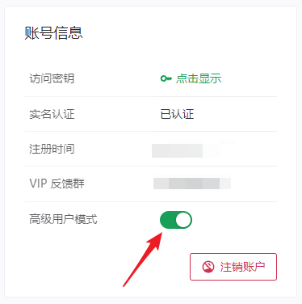

# 极客用户相关说明

如果您是极客用户，下方的内容可能会对您有所帮助。

## 数据安全 {#data-security}

我们严格按照 [隐私策略](https://www.natfrp.com/policy/privacy) 执行，并使用最新版本服务端软件。

在架构设计适宜、法律法规许可的情况下我们会优先采用 E2E 设计，以保证我们也无法解密您的数据。

## 软件安全 {#software-security}

我们的客户端软件并不开源，但对外分发的二进制文件均未经过加密或混淆，您可以直接拖进 IDA 等工具中进行审计。

## 自定义性 {#customization}

对于我们的修改版 frpc，绝大部分功能都可以通过配置文件进行控制，详情请查看 [frpc 用户手册](/frpc/manual.md) 。

要加入任何隧道参数，建议在管理面板的「自定义设置」文本框中填入，从而在使用 `-f` 启动 frpc 时自动同步。

也可使用直接编辑 `frpc.ini` 的方式自定义，只要不修改关键连接参数（`host`, `port`, `user`, 隧道名, 类型, 远程端口, 绑定域名），均可正常连接到我们的服务。

## 兼容性 {#compatibility}

::: tip 提示
上游版本缺少很多专有优化，建议您尽可能使用由我们分发的客户端以获得最佳性能  
由 SakuraFrp 分发的客户端已与上游相差 1000+ 次提交，比较二者的版本号意义不大  
如果您认为上游的某个功能很有用，欢迎在 [社区论坛](https://github.com/natfrp/wiki/discussions) 中提出建议，我们会考虑实现相关功能
:::

### 服务端

我们的节点兼容 [上游开源版本](https://github.com/fatedier/frp) 的客户端 `0.18.0+` 。

也就是说您可以使用几乎任何现有的 frp 客户端来使用我们的服务，只需根据隧道的「配置文件」手动填写关键连接参数，或直接复制配置文件启动即可。

如果您是使用 Windows XP 或 Windows Vista 的极客用户，请使用上游的 [0.28.2 版本](https://github.com/fatedier/frp/releases/tag/v0.28.2) 。

### 客户端

我们的客户端尽可能维持了对上游 frps 的兼容性，关闭 `sakura_mode` 开关后即可正常连接上游 frps。

部分完全由客户端实现的功能（如访问认证、自动 HTTPS 等）在这种情况下也可以正常工作。

## 高级用户模式 {#advanced-mode}

::: warning 警告
打开高级用户模式时请仔细阅读弹出的安全警告并确认您能驾驭这些功能
:::

为了减少因配置错误而造成的使用问题，管理面板中的部分功能默认被隐藏。此外，为了加强用户的安全意识，我们还增设了一部分安全提示框。

如果您具有 **专业计算机知识** 且 **熟悉 frpc 的配置与使用**，可以在 [用户信息](https://www.natfrp.com/user/profile) 页面打开 **高级用户模式** 来显示这些配置，并隐藏一部分安全提示。

## 启动器移植 {#porting-launcher}

如果您想要自己实现启动器的话，可以参考 [SakuraFrp API 文档](https://api.natfrp.com/docs/) 接入我们的服务。

目前存在的第三方启动器实现：

- [yuhencloud/SakuraFrpLauncher in Qt](https://github.com/yuhencloud/SakuraFrpLauncher)
