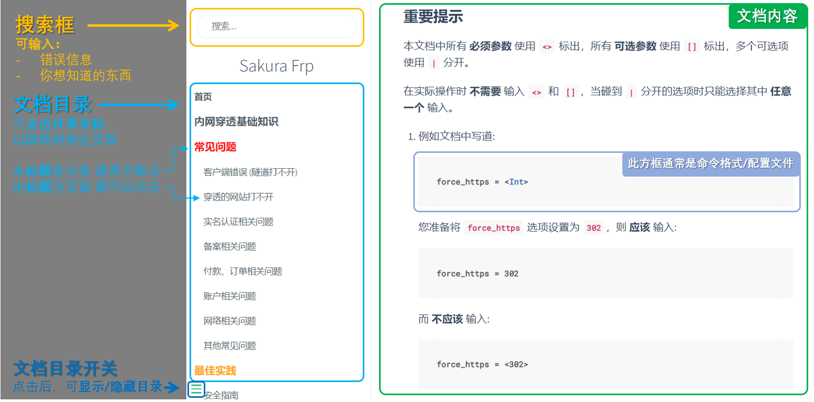

 
::: tip 如何永久关闭首页到处飞的文档链接
点击右下角那个关闭按钮即可永久关闭，您也可以在控制台运行 `localStorage.close_rtfm_alert = '20220119'` 进行关闭
:::

## 帮助文档的正确使用姿势 {#how-to-use}

- 顶栏右侧有常用条目的链接，部分页面的左边栏会显示相关条目的链接
- 在顶部搜索框中输入关键字、报错信息等可进行全文搜索，请善用搜索功能
- 本文档托管于 GitHub，您可以 [前往托管仓库](https://github.com/natfrp/wiki)，或是点击页面底部的编辑链接帮助我们完善文档

::: details 点击展开图片说明




:::

## 重要提示 {#important-note}

所有命令建议复制使用，如果要自行输入，请注意区分 `0` (数字) 和 `O` (大写字母) 和 `o` (小写字母)。

本文档中所有 **必须参数** 使用 `<>` 标出，所有 **可选参数** 使用 `[]` 标出，多个可选项使用 `|` 分开。

在实际操作时 **不需要** 输入 `<>` 和 `[]`，当碰到 `|` 分开的选项时只能选择其中 **任意一个** 输入。

1. 例如文档中写道:

   ```ini
   force_https = <Int>
   ```

   您准备将 `force_https` 选项设置为 `302`，则 **应该** 输入:

   ```ini
   force_https = 302
   ```

   而 **不应该** 输入:

   ```ini
   force_https = <302>
   ```

2. 例如文档中写道:

   ```bash
   # 执行
   service frpc <restart|start>
   ```

   您准备执行该命令，则 **应该** 使用:

   ```bash
   service frpc restart
   # 或
   service frpc start
   ```

   而 **不应该** 使用:

   ```bash
   service frpc restart|start
   ```

## 交流群 {#community}

### QQ 水群 {#community-qq}

- 群号: 1036050697, 766865191 ( 满人即清 ), 1011690081 ( 已满员 ), 650510813( 满人即清 )
- 入群问题不是摆设, 你不好好填是不会让你进的
- 请注意,添加一个群即可,不要添加多个群聊加重管理人员负担以及人口压力
- 非官方群, 群内没有网站管理员

### 社区论坛 {#community-forum}

- [点击访问 SakuraFrp BBS](https://www.natfrpbbs.com)
- **非官方论坛**，由社区人员管理

### 其他 IM 水群 {#community-other-im}

- [Telegram](https://t.me/natfrp_unofficial)
- [Matrix](https://matrix.to/#/!GFWDTqltQmjaSCDGij:atunemic.cn?via=atunemic.cn&via=t2bot.io)
- 非官方群, 群内没有网站管理员

### 官方 QQ 反馈群 {#community-official-qq}

::: warning 注意
官方 QQ 群需在验证问题处填写访问密钥，由机器人自动审核加群请求并绑定账户。  
请不要在加入非官方群时填写访问密钥，否则可能造成您的账户信息被泄露。
:::

- 公开用户群：  
  请前往 [管理面板](https://www.natfrp.com/user/) 点击 `帮助 > QQ 反馈群`，阅读加群须知后点击 `确认加群` 按钮。

- VIP 反馈群：  
  请前往 [用户信息](https://www.natfrp.com/user/profile) 页面查看详情。
