# 安卓平台启动器后台说明

安卓平台启动器因为系统限制，可能出现切到后台/锁屏后无法正常工作，再次打开应用时出现日志 "网络波动导致数据连接断开"。

此时我们需要在系统设置中设置允许应用后台运行。

通常来说，您可以在启动器中找到 “申请电池优化豁免” 按钮，点击后即可直接允许应用后台运行：

如果设置无效，您可以尝试下面的方法手动设置。

## 手动设置方法

除华为外，手动设置方法可以总结为：进入应用设置，打开电池/耗电设定，设置为允许应用后台运行。

下面为通常会提出这个问题的手机系统用户提供设置方法参考：

::::: tabs

@tab 小米 {#xiaomi}

演示系统版本：HyperOS 1.0.13.0，其他版本可能略有不同，请根据实际情况操作。

1. 长按应用图标，进入应用信息

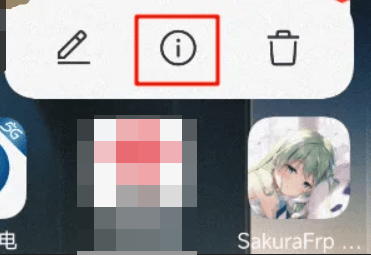

1. 进入 “省电策略”

1. 选择 “无限制”

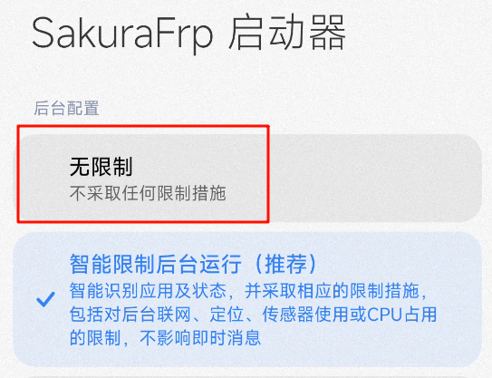

@tab OPPO {#oppo}

演示系统版本：ColorOS 14，其他版本可能略有不同，请根据实际情况操作。

1. 长按应用图标，进入应用详情

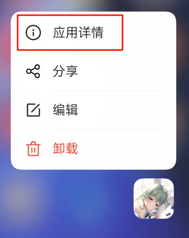

1. 进入 “耗电管理”

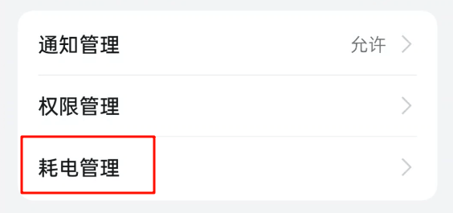

1. 启用 “允许完全后台行为”

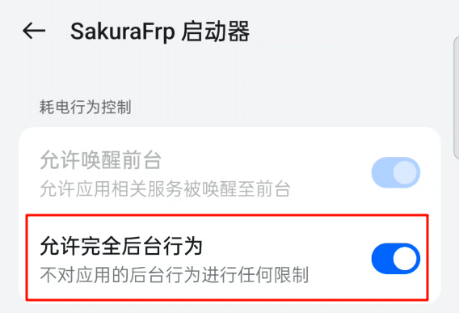

@tab VIVO {#vivo}

1. 长按应用图标，进入应用信息

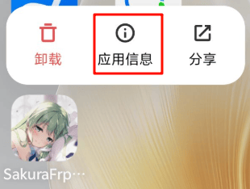

1. 进入 “电量”

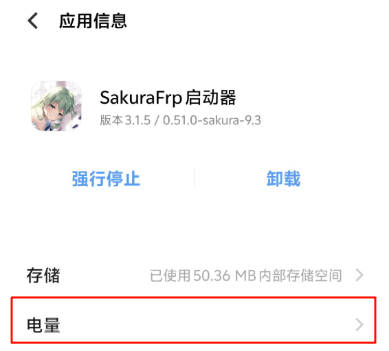

1. 进入 “后台耗电管理”

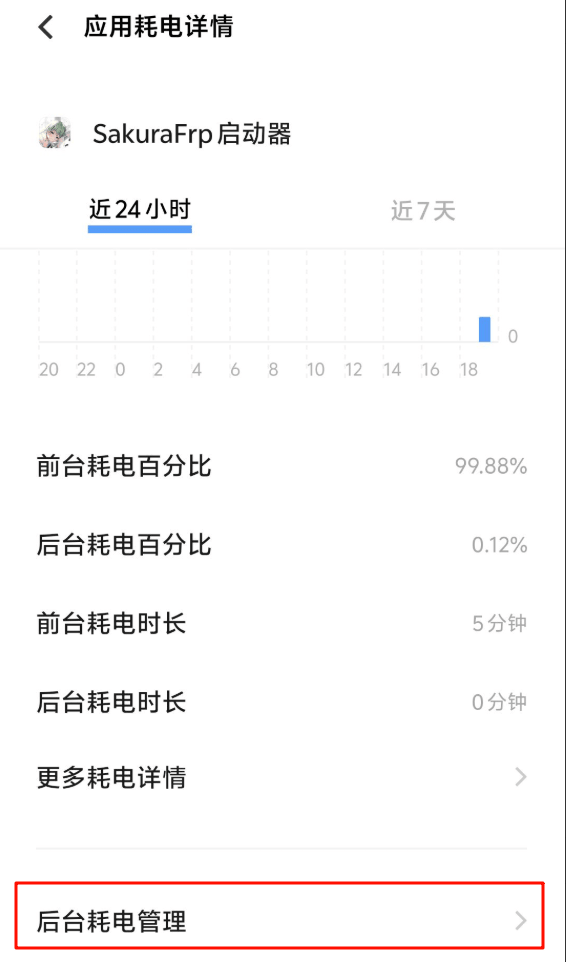

1. 选择 “允许后台高耗电”

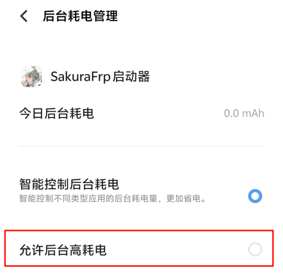

@tab 华为（非 NEXT） {#huawei}

演示系统版本：HarmonyOS 4.2，其他版本可能略有不同，请根据实际情况操作。

华为在系统中删除了便捷进入应用设置的入口，同时将设置分散到了整个“设置”应用中，  
下面我们会尝试提供一个设置方法，但我们并不确定一个设置是否总会有用。

1. 打开设置，进入 “电池”

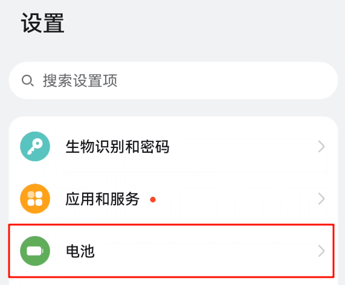

1. 下滑菜单，找到 “SakuraFrp 启动器”

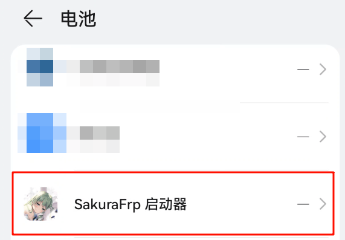

1. 选择 “启动管理”

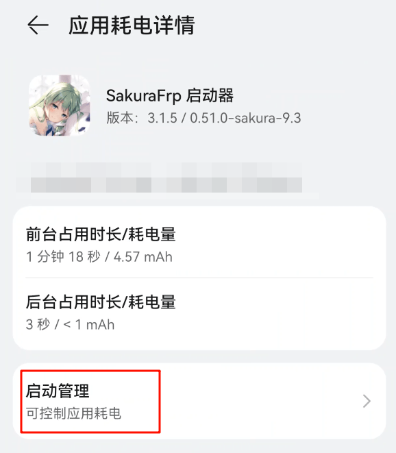

1. 在弹窗中关闭 “自动管理” 开关，然后打开 “允许后台活动” 开关

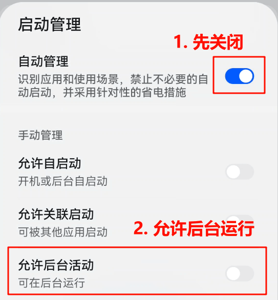

@tab 三星 {#samsung}

演示系统版本：One UI 6.1，其他版本可能略有不同，请根据实际情况操作。

1. 长按应用图标，进入应用信息

1. 进入 “电池”

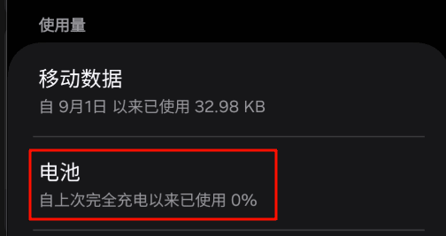

1. 选择 “不受限制”

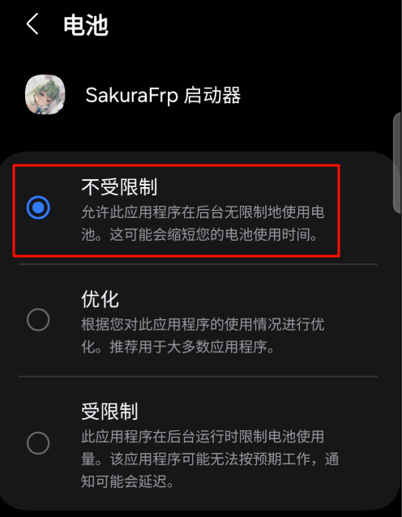

:::::
