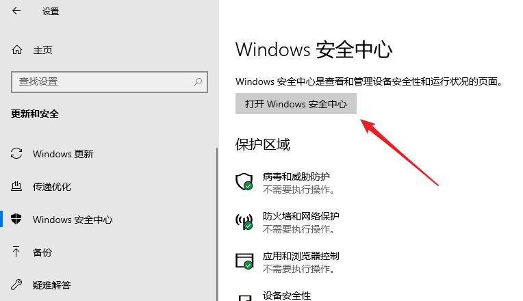
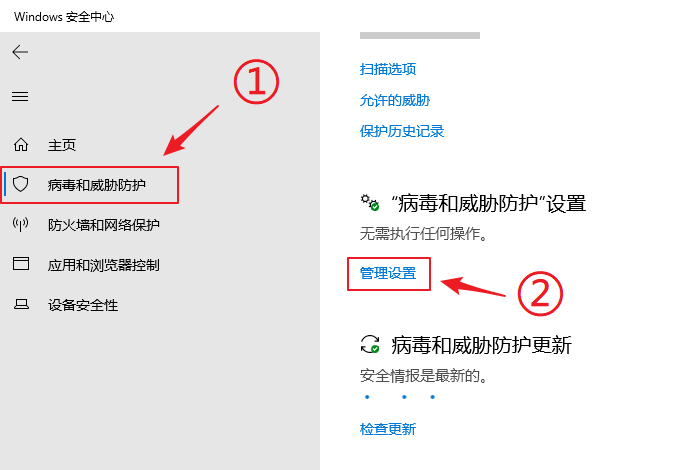
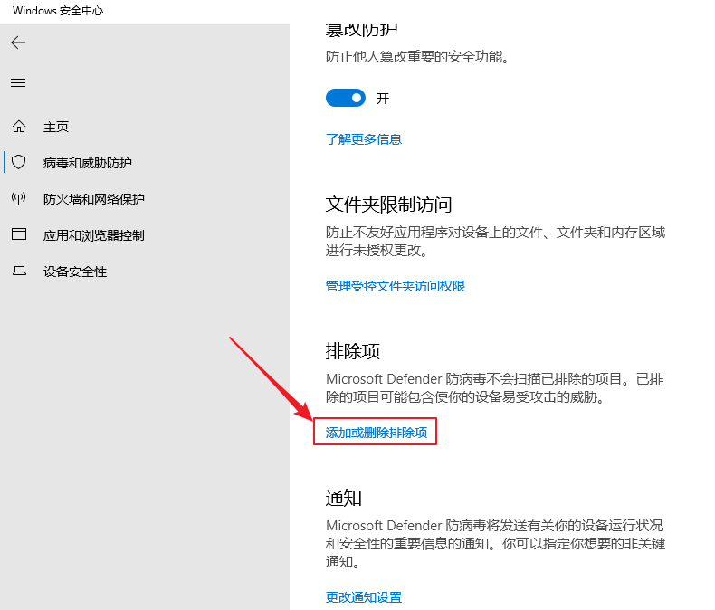
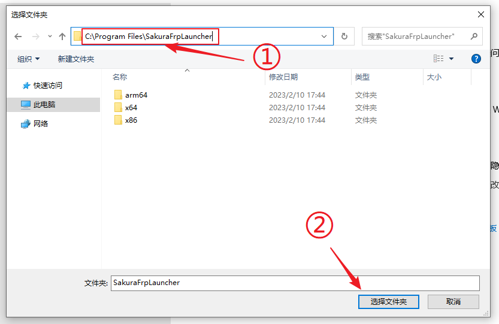
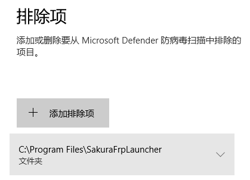
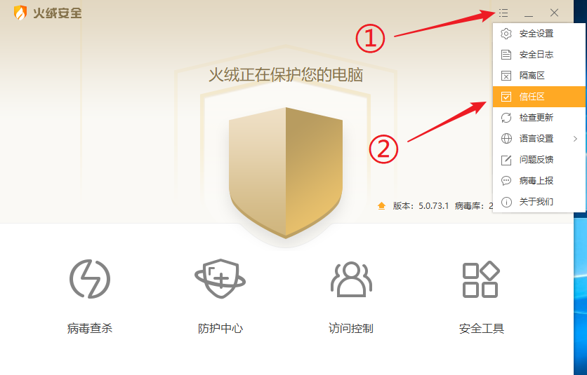
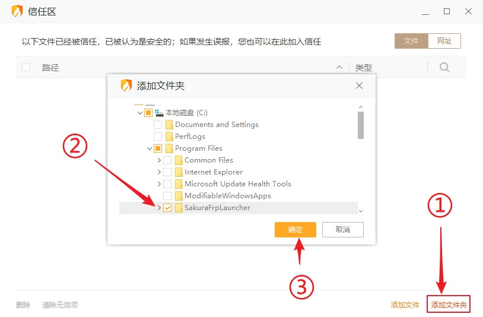
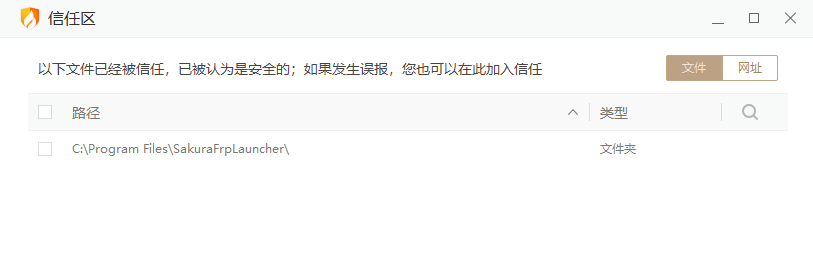

# 将 SakuraFrp 启动器添加到杀软白名单中

有时杀毒软件会误杀启动器或 frpc，产生下方的一种或多种错误信息：

- `隧道启动失败: 拒绝访问`
- `无法启动 frpc: exec "(启动器安装目录)\frpc.exe": file does not exist`
- `无法启动 frpc: fork/exec (启动器安装目录)\frpc.exe: Access is denied.`
- `错误: 启动器文件损坏`, `下列文件不存在: (启动器安装目录)\frpc.exe`
- `无法成功完成操作，因为文件包含病毒或潜在的垃圾软件`

如果您信任由我们分发的软件，可以参考本文添加对应的白名单以确保软件正常工作。否则，您可以卸载启动器并使用上游开源 frpc

::: tip
如果添加白名单后启动器启动器仍无法正常工作，可能是杀软删除 / 隔离了相关文件，重新安装启动器即可
:::

## 安全须知

内网穿透软件因为可能被黑客用于攻击企业内网，因此常常被报毒，其中较为负责的杀毒软件会说明 `RiskWare` (有风险的软件)，`Not-a-virus` (非病毒的风险软件)，`PUP`、`PUA` (可能不需要的软件)。  
您可以根据自己的需求，根据自己是否需要使用我们的软件、是否已经做好了安全措施，来判断我们的软件对您是否是有风险的。

如果您的电脑上在您不知情的情况下突然出现本软件，请立即删除。

::: tip 多重认证
如果您使用了随 Windows 自带的 Defender 杀毒软件，  
鉴于 Windows Defender (或更名后的 Microsoft Defender) 有长期误报软件的历史、且与系统强行捆绑几乎无法删除，  
我们建议您使用知名的杀毒结果比对网站 [VirusTotal](https://www.virustotal.com/) 再次确认您是否应该信任它的杀毒结果。

建议您参考下列引擎的扫描结果：

- Kaspersky (卡巴斯基，俄罗斯，各种测试中的佼佼者，曾作为俄罗斯软件在美国政府系统中被广泛使用)
- ESET (捷克斯洛伐克，以极强的分析和特征提取能力闻名)
- BitDefender (比特梵德，罗马尼亚，拥有规模极大的病毒库，360杀毒(前)/腾讯电脑管家 的杀毒引擎提供商)
- Antiy-AVL (安天，中国，知名杀毒引擎服务商，华为/小米/OPPO/VIVO 的杀毒引擎提供商)

其他引擎的结果多受这其中的 Kaspersky、ESET 与 Bitdefender 影响，甚至部分软件的工作是检查有其他软件报毒就报毒，因此只推荐您参考这些核心软件的报毒结果。

:::

## 添加白名单

:::: tabs

@tab Windows Defender

1. 首先，[点击这里](ms-settings:windowsdefender) 打开 Windows 安全中心

   

2. 前往 **病毒与威胁防护** 设置，向下滚动找到并点击点击 **管理设置**

   

3. 向下滚动找到 **排除项**，点击 **添加或删除排除项**

   

4. 点击 **添加排除项** 按钮，选择 **文件夹** 类型

   

5. 前往 `C:\Program Files\SakuraFrpLauncher` 目录，点击 **选择文件夹**

   

6. 确认排除已添加完成，再使用安装包重装一次启动器就可以正常使用了

   

@tab 火绒安全软件

::: warning
火绒通常不会误杀启动器组件。如果您发现相关文件被拦截，建议先检查电脑是否感染了病毒
:::

1. 打开火绒主程序，点击右上角的菜单按钮，然后打开 **信任区**

   

1. 点击右下角 **添加文件夹** 按钮，选中 `C:\Program Files\SakuraFrpLauncher` 目录，最后点击 **确定**

   

1. 确认排除已添加完成，再使用安装包重装一次启动器就可以正常使用了

   

::::
