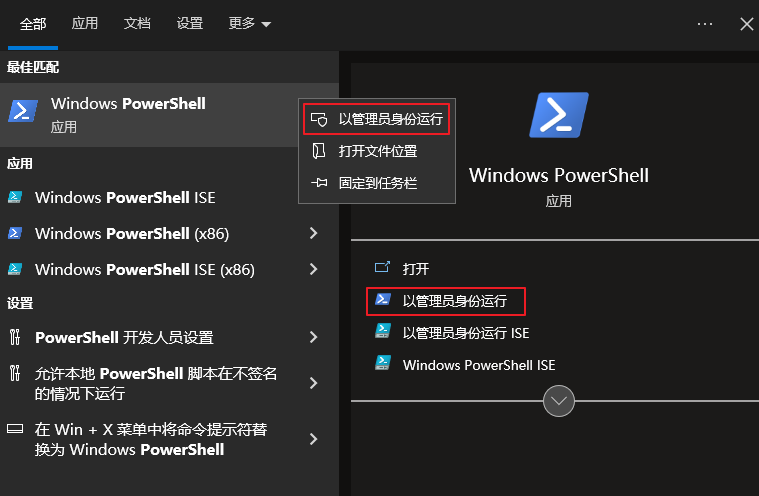
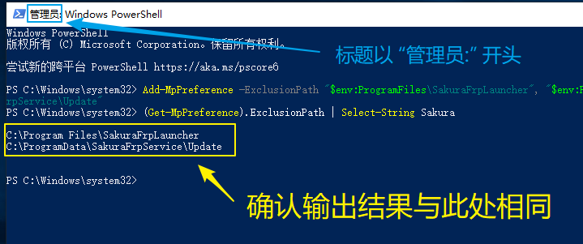

# 将 SakuraFrp 启动器添加到杀软白名单中

有时杀毒软件会误杀启动器或 frpc，产生下方的一种或多种错误信息：

- `隧道启动失败: 拒绝访问`
- `无法启动 frpc: exec "(启动器安装目录)\frpc.exe": file does not exist`
- `无法启动 frpc: fork/exec (启动器安装目录)\frpc.exe: Access is denied.`
- `错误: 启动器文件损坏`, `下列文件不存在: (启动器安装目录)\frpc.exe`
- `无法成功完成操作，因为文件包含病毒或潜在的垃圾软件`
- `未连接到守护进程, 大部分功能将不可用, 请尝试重启启动器` 且 [常见问题](/faq/launcher.md#service-disconnected) 中的方案无效

如果您信任由我们分发的软件，请参考本文添加对应的白名单以确保软件正常工作。否则，您可以使用上游开源 frpc。

如果添加白名单后启动器启动器仍无法正常工作，可能是杀软删除 / 隔离了相关文件，重新安装启动器即可。

## 安全须知 {#security-notice}

内网穿透软件常被黑客用于攻击企业内网，因此常常被报毒，其中较为负责的杀毒软件会提示：

- `RiskWare` (有风险的软件)
- `Not-a-virus` (非病毒的风险软件)
- `PUP`、`PUA` (可能不需要的软件)

您可以根据自己的使用环境和需求来判断我们的软件是否存在风险。

如果您的电脑上在您不知情的情况下突然出现本软件，请立即删除。

::: tip 多重认证
如果您使用了随 Windows 自带的 Defender 杀毒软件，  
鉴于 Windows Defender (或更名后的 Microsoft Defender) 有长期误报软件的历史、且与系统强行捆绑几乎无法删除，  
我们建议您使用知名的杀毒结果比对网站 [VirusTotal](https://www.virustotal.com/) 再次确认您是否应该信任它的杀毒结果。

建议您参考下列引擎的扫描结果：

- Kaspersky (卡巴斯基，俄罗斯，各种测试中的佼佼者，曾作为俄罗斯软件在美国政府系统中被广泛使用)
- ESET (捷克斯洛伐克，以极强的分析和特征提取能力闻名)
- BitDefender (比特梵德，罗马尼亚，拥有规模极大的病毒库，360杀毒(前)/腾讯电脑管家 的杀毒引擎提供商)
- Antiy-AVL (安天，中国，知名杀毒引擎服务商，华为/小米/OPPO/VIVO 的杀毒引擎提供商)

其他引擎的结果多受这其中的 Kaspersky、ESET 与 Bitdefender 影响，甚至部分软件的工作是检查有其他软件报毒就报毒，因此只推荐您参考这些核心软件的报毒结果。

:::

## 启动器被 SmartScreen 拦截 {#launcher-smartscreen}

- 如果您使用 Edge 浏览器，下载启动器时可能提示  
  `SakuraLauncher.exe 已被 Microsoft Defender SmartScreen 当作可能不需要的应用加以阻止。`

  

  请按下图操作，解除拦截：

  

- 运行启动器安装包时可能提示 `无法成功完成操作，因为文件包含病毒或潜在的垃圾软件`

  

  此时 Windows 安全中心应该会弹出提示 `找到可能不需要的应用`，点击通知打开安全中心：

  

  点击 `找到可能不需要的应用` 展开历史记录，然后按下图操作允许启动器安装包运行：

  

## 手动添加杀软白名单 {#add-av-whitelist}

启动器会在安装时自动添加 Windows Defender 排除项，您也可以参考下方文档手动进行添加。

:::: tabs

@tab Windows Defender

::: warning
其他杀毒软件可能会禁用或删除 Windows Defender，导致下面的命令报错并且无效  
请在操作前确认电脑上 **没有** 安装其他杀毒软件（如联◯电脑管家），如有安装请到对应的杀软中添加白名单
:::

1. 打开开始菜单或搜索框，搜索 `powershell`，右键选择 **以管理员身份运行**

   

2. 确认标题栏中有 `管理员:` 字样，复制并运行下面的命令

   ```powershell
   Add-MpPreference -ExclusionPath "$env:ProgramFiles\SakuraFrpLauncher", "$env:ProgramData\SakuraFrpService"
   (Get-MpPreference).ExclusionPath | Select-String Sakura
   ```

3. 检查命令输出结果，确认和图中一致

   

4. 如果之前碰到的报错是 `Access is denied`，现在启动器应该已经可以使用了  
   否则，再使用安装包重装一次启动器即可正常使用

@tab Windows Defender (GUI)

1. 首先，[点击这里](ms-settings:windowsdefender) 打开 Windows 安全中心

   

1. 前往 **病毒与威胁防护** 设置，向下滚动找到并点击点击 **管理设置**

   

1. 向下滚动找到 **排除项**，点击 **添加或删除排除项**

   

1. 点击 **添加排除项** 按钮，选择 **文件夹** 类型

   

1. 前往 `C:\Program Files\SakuraFrpLauncher` 目录，点击 **选择文件夹**

   

1. 确认排除已添加完成，再用相同的方法添加 `C:\ProgramData\SakuraFrpService`

   

1. 最后使用安装包重装一次启动器就可以正常使用了

@tab 火绒安全软件

::: warning
火绒通常不会误杀启动器组件。如果您发现相关文件被拦截，建议先检查电脑是否感染了病毒
:::

1. 打开火绒主程序，点击右上角的菜单按钮，然后打开 **信任区**

   

1. 点击右下角 **添加文件夹** 按钮，选中 `C:\Program Files\SakuraFrpLauncher` 目录，最后点击 **确定**

   

1. 确认排除已添加完成，再用相同的方法添加 `C:\ProgramData\SakuraFrpService`

   

1. 最后使用安装包重装一次启动器就可以正常使用了

::::
