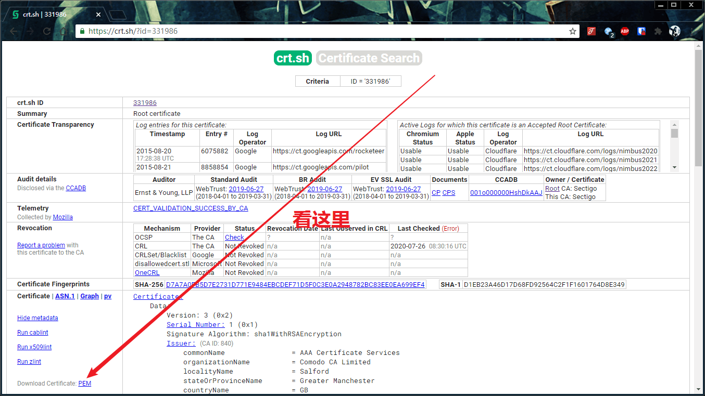
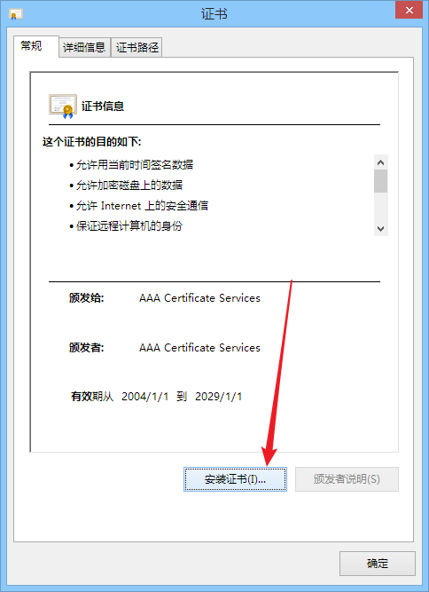
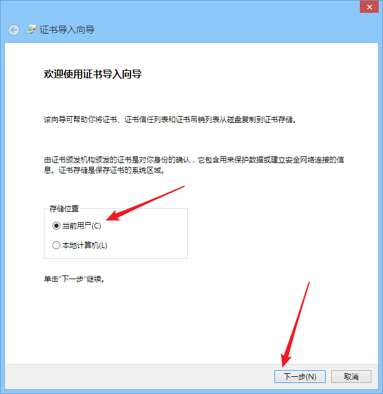
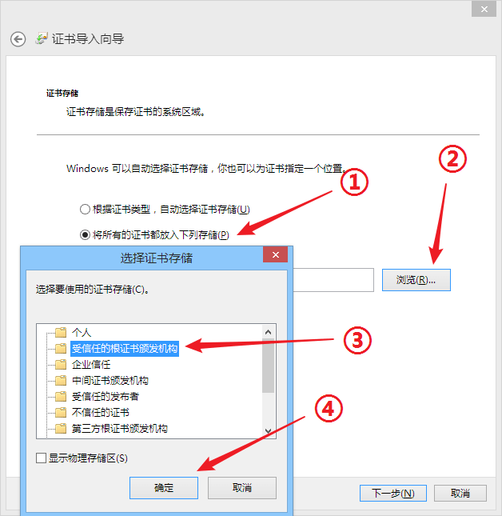
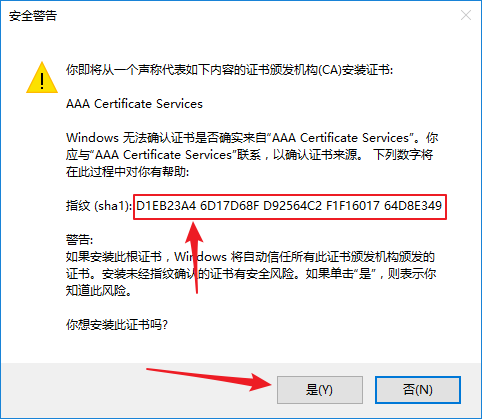

# 启动器常见问题

### 不支持请求的安全协议

报错 `System.NotSupportedException: 不支持请求的安全协议。`

安装 `.NET Framework 4.5` 或以上版本（[点击前往微软官方下载页面](https://dotnet.microsoft.com/download/dotnet-framework/net45)），如果还碰到问题请确认 `Windows Update` 是否已安装最新的补丁。

### 该软件需要安装xxx

出现 `该软件需要安装 .NET Framework 4.0 及以上` 类似提示

解决方案同上，安装 `.NET Framework 4.5` 或以上版本即可（[点击前往微软官方下载页面](https://dotnet.microsoft.com/download/dotnet-framework/net45)）。

### 远程证书无效

报错 `System.Net.WebException: 基础连接已关闭，根据验证过程，远程证书无效`

碰到这个问题说明你的系统上缺少 AAA Certificate Services 的根证书，需要安装此证书。

!> <strong style="color: red">注意: 安装根证书是很严肃的一件事，请谨慎按照教程操作，否则可能给计算机带来安全隐患。</strong>

1. 首先，访问 <https://crt.sh/?id=331986> 这个链接，找到左下角的 `Downoad PEM` 按钮，点击 PEM

  

2. 下载完成后，我们应该会获得一个 crt 文件，双击打开它。先确认你看到的信息和我图里红框中相同，但这还不够，切换到 “详细信息” 一栏。

  

3. 把滚动条拉到底，选择 “指纹”，仔细对比你看到的内容，必须确保你看到的内容和我图中的完全一致。

  

4. 现在我们就可以放心的安装证书了，返回 “常规”，点击 “安装证书” 。

  

  存储位置一般选择 “当前用户” 就行

  

  在这里按照下图选择好证书存储路径，注意别选错了，然后点下一步

  

  这个时候计算机应该会弹出安全警告，再次核对你的证书指纹，确认和我图中完全一致后点击 “是”，提示导入成功后问题应该就解决了。

  

### 开机启动

请参阅 [启动器使用教程](/launcher/usage#配置开机启动)

~~**`1.0.2.0` ~ `1.0.2.2` 版本的启动器均有一定概率出现无法正常自启隧道的问题，更新到 `v1.0.2.3` 及以上版本即可解决。**~~ 不推荐使用旧版本启动器
