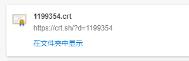
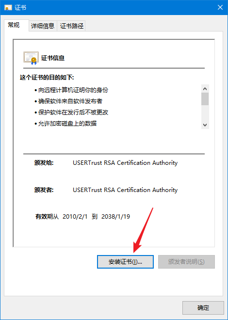
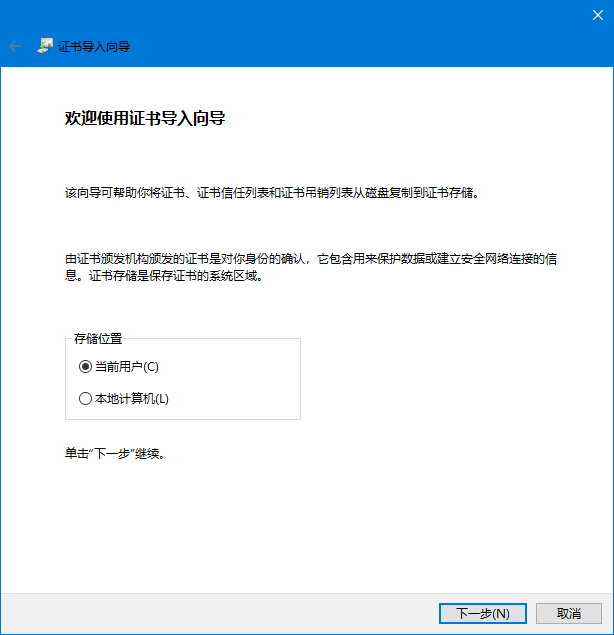
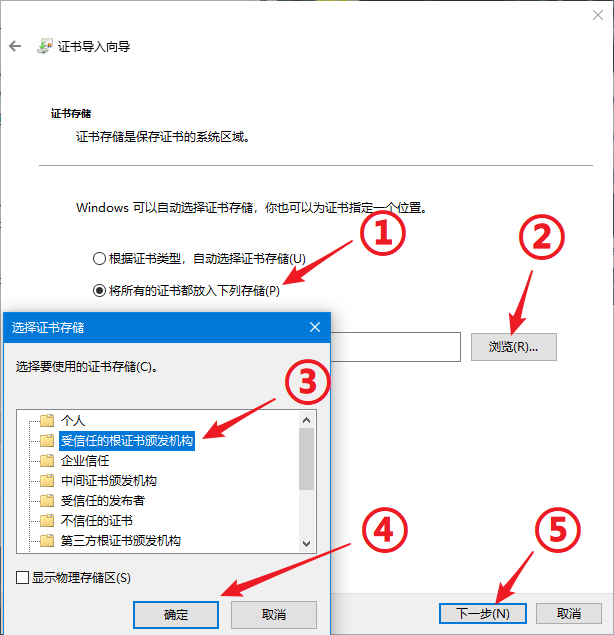
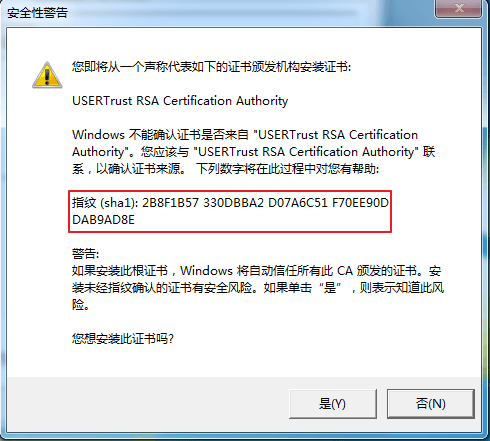

# 启动器常见问题

### 不支持请求的安全协议

报错 `System.NotSupportedException: 不支持请求的安全协议。`。

安装 `.NET Framework 4.5` 或以上版本 ([点击前往微软官方下载页面](https://dotnet.microsoft.com/download/dotnet-framework/net48 ':target=_blank'))，如果还碰到问题请确认 `Windows Update` 是否已安装最新的补丁。

### 该软件需要安装xxx

出现 `该软件需要安装 .NET Framework 4.0 及以上` 类似提示。

解决方案同上，安装 `.NET Framework 4.5` 或以上版本即可 ([点击前往微软官方下载页面](https://dotnet.microsoft.com/download/dotnet-framework/net48 ':target=_blank'))。

### 远程证书无效

报错 `System.Net.WebException: 基础连接已关闭，根据验证过程，远程证书无效`。

碰到这个问题说明您的系统上缺少 *USERTrust RSA Certification Authority* 根证书，需要安装此证书。

首先，点击 [这里](https://crt.sh/?d=1199354 ':target=_blank') 下载证书文件。

下载完成后，双击打开这个 crt 文件，点击 `安装证书`。

存储位置一般选择 `当前用户` 就行。

按照下图选择好证书存储路径，注意不要选错了，然后点下一步。

这个时候计算机应该会弹出安全警告，确认图中红框圈出的部分和您看到的提示完全一致后点击 `是`，证书就安装完成了。

!> 如果您看到的证书指纹和图中不一致，请立即点击 `否` 取消安装

### 开机启动

请参阅 [启动器使用教程](/launcher/usage#开机启动)

