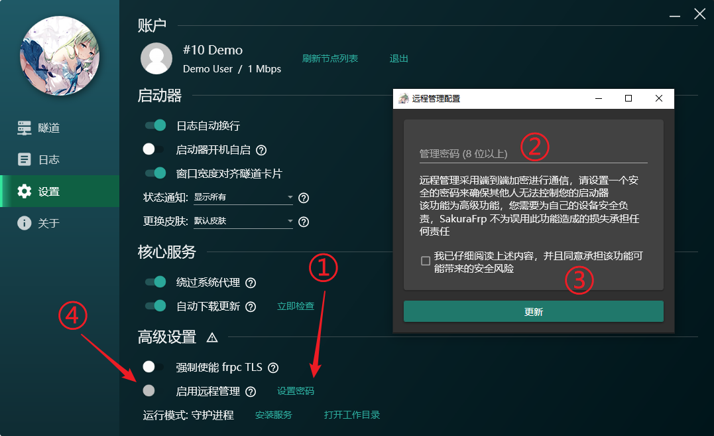
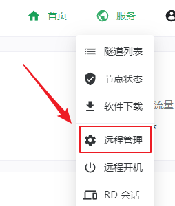
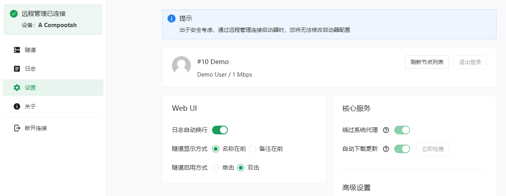

# SakuraFrp 启动器远程管理 V2 配置指南

SakuraFrp 启动器 3.0 及以上版本采用远程管理 V2 协议，提供与本地几乎一致的使用体验与更优秀的安全性。

## 配置远程管理 {#setup}

首先，您需要配置端对端加密密码，点击 **设置密码** 按钮配置密码，然后打开远程管理：



检查日志，看到 `远程管理连接成功` 字样则说明远程管理配置成功：

```log
2023/02/31 22:29:00 I Service/Remote 远程管理连接中...
2023/02/31 22:29:01 I Service/Remote 远程管理连接成功
```

## 连接远程设备 {#connect}

1. 登录管理面板，转到 `服务 > 远程管理`：

   

1. 选择您的设备，输入之前配置的密码，然后点击连接：

   

1. 如果您配置了 TOTP，请在接下来的提示框中输入 TOTP 代码，否则请忽略这一步

1. 连接成功后就可以像本地 Web UI 一样控制启动器了

   

## 进阶配置 {#geek}

### 关于 "安全性" 的一点说明 {#geek-security}

远程管理功能采用 **XSalsa20 / Poly1305** 进行端对端加密，并使用 **Challenge-Response** 认证模式在一定程度上防范 MITM 攻击和提供 TOTP 支持。

_注：我们确实没有实现 AEAD 认证。如果您是非常激进的加密爱好者并对此感到不适，请考虑其他方案。_

您输入的明文密码将通过 `PBKDF2 / SHA256` 进行 `10000` 次迭代生成 32 字节的密钥并存储在本地。出于安全考虑，我们已限制远程管理只能通过 Nyatwork OpenID 登录面板后进行使用，访问密钥泄露不会直接导致任何人都能连接您的启动器。

_注：显然，存储在本地的密钥泄露 + 您的 Session 或面板账户泄露 = 攻击者可以连接您的设备，不过这种情况下您的设备可能已经被攻击者拿下了。_

### 配置项说明 {#geek-config}

#### remote_management_auth_mode {#config-auth-mode}

用于指定远程管理认证模式。端对端加密总是有效，认证过程也是包在加密里面的。

| 模式 | 说明 |
| --- | --- |
| `nonce` | 简单的 HMAC-SHA256 Nonce 认证 |
| `totp` | 基于 TOTP 代码的认证，必须配置 `remote_management_auth_conf` |

#### remote_management_auth_conf {#config-auth-conf}

用于指定认证模式的特定配置。

- `nonce`：该参数无需配置。

- `totp`：指定一个 `otpauth://` URI，或者只填 TOTP 种子使用默认配置。

  | 参数 | 默认值 | 说明 |
  | --- | --- | --- |
  | secret | 空 | Base32 种子，全大写 |
  | skew | `1` | 允许的时间偏移量，单位为周期，如 1 表示允许正负偏移一个周期（30 秒） |
  | algorithm | `sha1` | TOTP 算法，可选值为 `md5`、`sha1`、`sha256`、`sha512` |
  | digits | `6` | TOTP 代码长度，通常你会选择 `6` 或者 `8` |

  举个例子: `otpauth://totp/auto?secret=<种子>&digits=<数字>&skew=<周期>&algorithm=<算法>`
