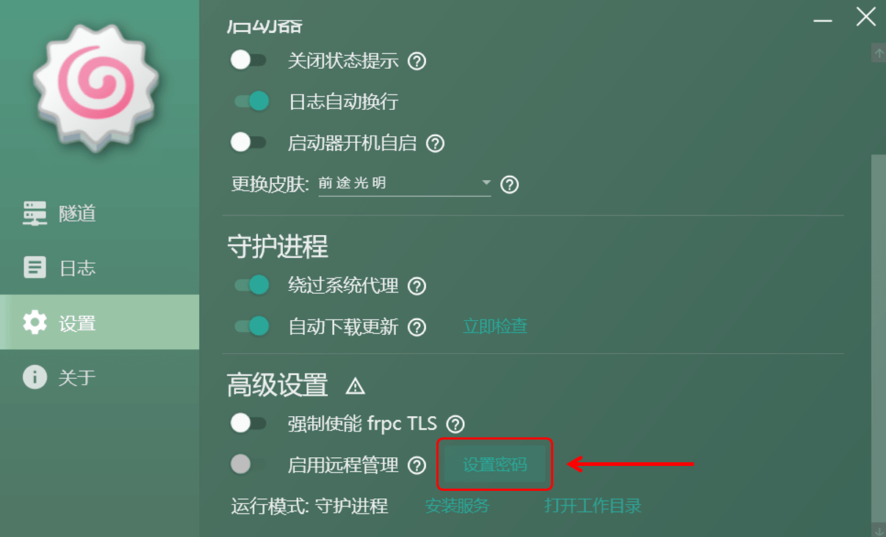
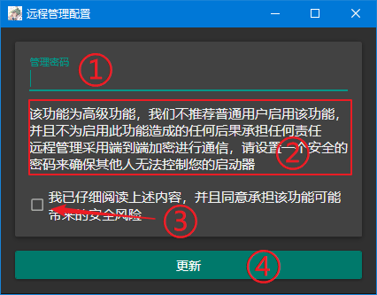
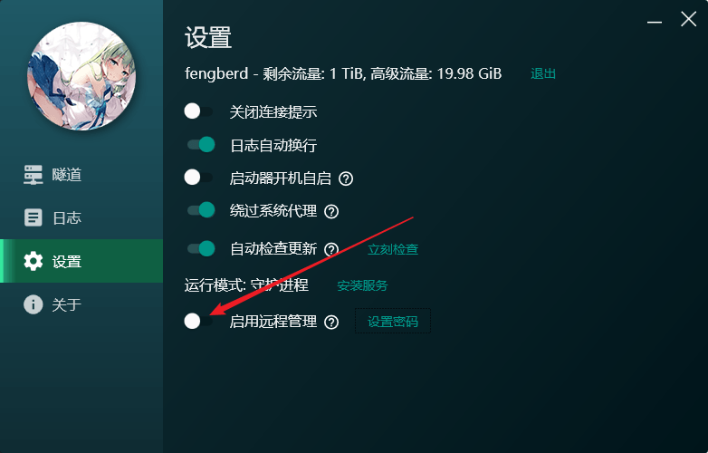
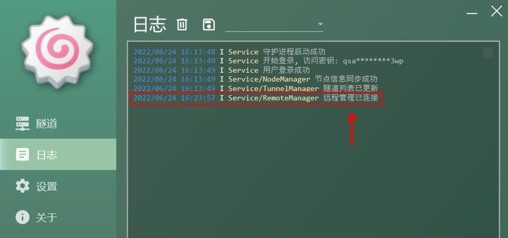
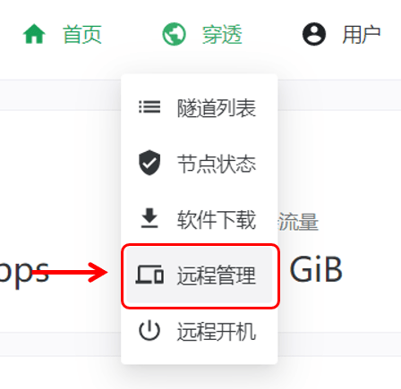
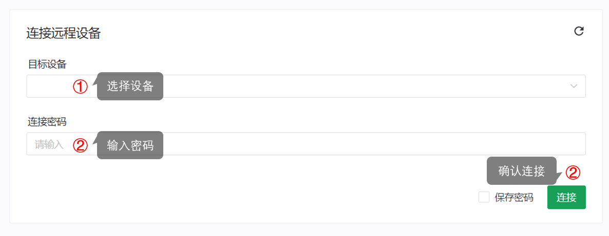
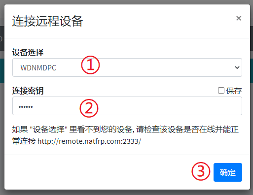
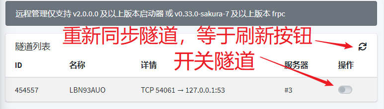
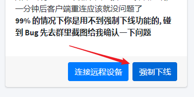

# 远程管理

SakuraFrp Launcher v2.0.0.0 及以上版本提供了远程管理功能，可以在 Sakura Frp 网站上对启动器进行管理

!> 从 v2.0.1.2 开始，启动器远程管理支持 Windows 7 及以上系统。仅 WPF 启动器支持远程管理  
该功能需要安装 `Visual C++ 2015 Runtime (x86)` 才能正常运行，[点此前往下载页面](https://support.microsoft.com/zh-cn/help/2977003/the-latest-supported-visual-c-downloads)

远程管理功能使用端对端加密技术，这可以确保即使 Sakura Frp 的远程管理服务器遭到攻击，您的计算机也不会因为开启了远程管理功能而被攻击

### 配置远程管理

首先，您需要配置端对端加密密码，点击 “设置密码” 按钮

?> 您可以随时更新密码，更新完毕后即时生效，无需开关远程管理

输入一个 **安全** 的密码 (建议长度大于 14 位，包含字母数字和标点符号)，随后阅读并同意风险提示，点击 “更新” 来设置密码

随后，打开远程管理开关

检查日志，看到 `远程管理已连接` 字样则说明远程管理配置成功，如果看到其他错误请自行排查

### 连接远程设备

登录管理面板，在侧边栏点击 “远程管理”

点击右侧的 “连接远程设备”

?> 点击确定后页面未响应一段时间是正常的，这是因为页面正在计算加密密钥  
您可以勾选 “保存” 在本地存储计算后的密钥，下次连接时就不会卡顿了 (不推荐)

按计算机名选择要连接的设备，然后输入端对端加密密钥并点击确定

连接成功后就会显示 **隧道列表**、**日志查看** 两个卡片，否则页面会提示错误信息

如果连接后需要切换设备，再次点击 “连接远程设备” 即可

### 管理远程设备

在 **隧道列表** 卡片中可以开关各个隧道或从 Sakura Frp 重新同步隧道信息

!> 日志不是实时显示的，需要手动刷新

在 **日志查看** 卡片中可以看到启动器的日志信息，右上角可以清空日志或刷新

### 强制下线

!> 强制下线后启动器会重新初始化远程管理，不保证能正常重连到管理服务器，请小心操作  
大多数情况下不需要使用此功能，只有出现莫名其妙的 Bug 时才有强制下线的必要  
绝大多数 Bug 在内测期间已被修复，碰到问题请先等几分钟或者刷新页面重试，不要急着点下线

点击 “强制下线” 按钮，在弹出的提示框中确认操作

在正常情况下启动器会出现图中的日志并在一分钟后重连，此时远程管理已断开，刷新是刷不到这个日志的

**等待 1~2 分钟**，然后重新点击 “连接远程设备” 即可正常连接客户端
