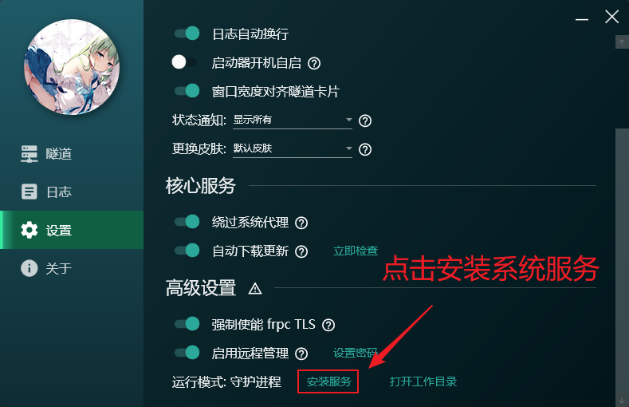
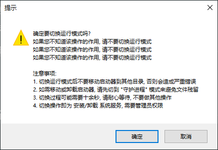
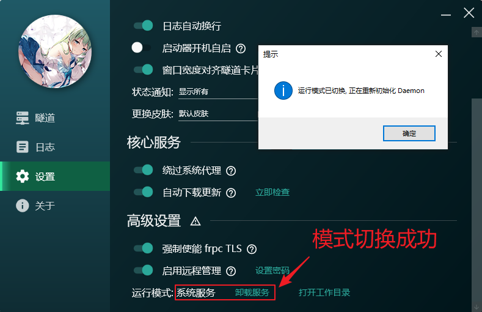
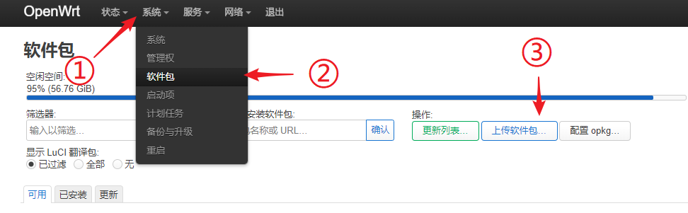
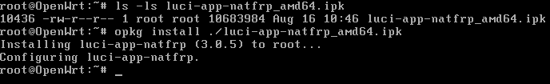
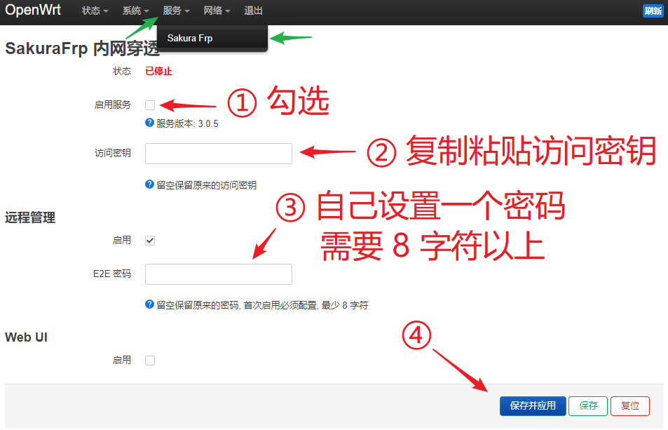
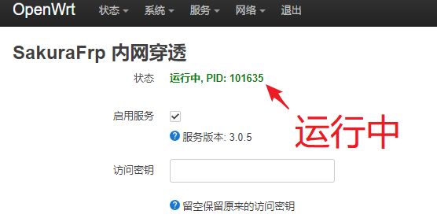
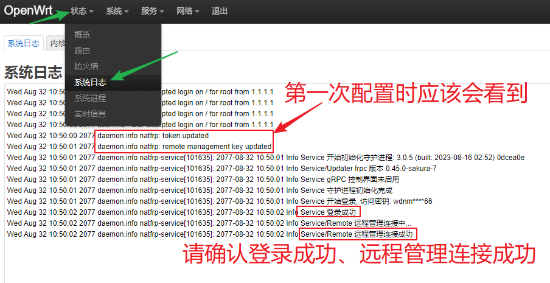

# SakuraFrp 启动器安装 / 使用指南

## 安装启动器 {#install}

::::: tabs

@tab Windows {#windows}

::: tip
如果在安装过程中碰到问题，请参阅 [启动器常见安装问题](/faq/launcher.md#install)  
常见问题大多与 .NET Framework 有关，可以尝试先装好 `.NET Framework 4.8` 再安装启动器  
**高级用户** 也可以选择不装用户界面，使用 Web UI（配置复杂，仅限高级用户）
:::

运行安装程序并根据向导提示进行安装，通常情况下一直点 **下一步** 即可。

默认组件适合大部分用户使用，您也可以参考下图选择需要安装的组件：


## 关于开机启动 {#windows-autostart}

打开启动器设置里的开关，就能实现登入桌面后自动启动隧道：


如果需要不登录 Windows 就启动隧道（例如穿透远程桌面服务），请参考下面的说明安装系统服务。

## 安装系统服务 {#windows-service}

如果您正在安装启动器，直接勾选 `安装为系统服务` 并完成安装即可。否则，请按下面的步骤操作：

1. 点击 `高级设置 > 安装服务` 按钮

   

1. 阅读操作说明，然后点击确认继续操作：

   

1. 看到运行模式切换成功的提示就安装好了，此时运行模式会显示为 **系统服务**

   ::: tip
   运行模式显示为 **系统服务** 后，**不需要** 打开 `启动器开机自启` 这个开关隧道也会在开机时自动启动
   :::

   

1. 如果需要卸载系统服务，点击 `卸载服务` 按钮即可

@tab macOS {#macos}
::: warning
启动器自 3.1.0 起仅适用于 macOS 13 及以上版本，自 3.0.6 起仅适用于 macOS 11 及以上版本  
如您还在使用更古老的版本的 macOS，请更新系统或 [使用 frpc (不推荐)](/frpc/usage.html#macos)
:::

打开下载的 `.dmg` 文件，然后按箭头指示将启动器拖到 `Applications` 文件夹中即可：


## 关于开机启动 {#macos-autostart}

如果需要在启动时自动打开用户界面，请参考 Apple 帮助文档：[Mac 启动时自动打开应用](https://support.apple.com/zh-cn/guide/mac-help/mh15189/mac)

如果只需要启动隧道、不显示用户界面，请打开下图所示的开关：


如果您正在使用 macOS 13.0 或更新的系统，请更新至启动器 3.1.0 及以上版本以确保该开关正常工作。

@tab Linux 桌面环境 {#linux}

::: tip
这篇指南适合普通 Linux 桌面用户，希望在 **自己登录桌面后，桌面注销前** 使用映射服务的情况  
如果您需要服务在开机后总是可用，或者使用 root 账户，请查看 [Linux 服务器](#linux-server) 标签  
如果您使用 Debian 系发行版，请留意 [安装启动器后登录桌面卡在黑屏](/faq/launcher.md#linux-stuck-login) 的问题

出于安全考虑，`natfrp-service` 默认不允许以 root 权限运行，我们也推荐您不要使用 root 用户登录桌面
:::

::: danger 请留意当前账户
以下指南基于您正在使用 **非 root** 账户登录桌面环境，且 shell 中不是 root 账户  
如果您正在使用 root 账户且决定一直使用 root 账户，您应该可以自己解决问题
:::

::: details 视频教程 (点击展开)

:::

1. 由我们分发的压缩包采用 [zstd](https://github.com/facebook/zstd) 进行压缩，如果您还没有 `zstd`，请先在系统上安装。

   下载由我们分发的 `.tar.zst` 文件后，在合适的地方建一个文件夹并解压 `natfrp-service` 与 `frpc`：

   ```bash
   # 创建文件夹，例如 ~/.config/natfrp/ (只是举个例子)
   mkdir -p ~/.config/natfrp/
   cd ~/.config/natfrp/

   # 打开 https://www.natfrp.com/tunnel/download
   # 复制对应的架构的 Linux / FreeBSD 启动器链接并下载
   # curl -LO https://nya.globalslb.net/natfrp/client/launcher-unix/....

   # 解压
   tar -I zstd -xvf natfrp-service_*.tar.zst
   rm natfrp-service_*.tar.zst

   # 设置权限
   chmod +x frpc natfrp-service
   ```

   

1. 运行 `./natfrp-service webui --init` 初始化配置文件，此时浏览器应该会自动打开。

   如果没有看到浏览器请手动点击安装 URL，安装 URL 包含您的 **启动器连接密码**，请注意不要泄露：

   

1. 然后先把浏览器放到一边，参考发行版的相关教程配置您的初始化系统来启动 `natfrp-service --daemon`。

   以 Systemd 为例，在用户文件夹建立一个 Unit 文件即可。如果需要进行高级配置请参考 [启动器用户手册](/launcher/manual.md)。

   这是一个简单的示例文件，您可以直接把它复制到 `~/.config/systemd/user/natfrp.service`：

   ```systemd
   [Unit]
   Description=SakuraFrp Launcher
   After=network.target

   [Service]
   Type=simple
   TimeoutStopSec=20

   Restart=always
   RestartSec=5s

   ExecStart=%h/.config/natfrp/natfrp-service --daemon

   [Install]
   WantedBy=default.target
   ```

1. 让初始化系统拉起启动器进程并确认启动器在运行，这里还是以 Systemd 为例：

   ```bash
   systemctl --user enable --now natfrp.service
   systemctl --user status natfrp.service
   ```

   

1. 现在回到浏览器，安装 PWA 并点击下面的继续按钮。

   如果您使用的是 Chromium，可以参考下图操作：

   

   由于 Firefox 不支持 PWA，直接刷新一下就行了，什么都不需要点，然后就能看到启动器的 Web UI：

   

   这样启动器就安装完成了，并且会在登录时自动启动。您随时可以打开 Web UI 进行管理。

@tab Linux 服务器 {#linux-server}

::: warning
这篇指南内容比较复杂且容易操作错误，如非特殊情况，请务必使用 [Docker](#docker) 安装启动器  
如果您正在远程连接到服务器，请使用 [Docker](#docker) 中 `同时启用远程管理` 的方式安装启动器
:::

::: tip
这篇指南假设您以 `root` 权限进行安装，若您使用其他用户请使用 `sudo -i` 或 `su -` 切换到 root 账户执行特权指令
:::

::: tip
如果您安装的机器中装有桌面环境，请留意 [安装启动器后登录桌面卡在黑屏](/faq/launcher.md#linux-stuck-login) 的问题
:::

1. 由我们分发的压缩包采用 [zstd](https://github.com/facebook/zstd) 进行压缩，如果您还没有 `zstd`，请先在系统上安装。

1. 出于安全考虑，`natfrp-service` 默认不允许以 root 权限运行，创建一个新账户：

   ```bash
   useradd -r -m -s /sbin/nologin natfrp
   ```

1. 下载由我们分发的 `.tar.zst` 文件，将其安装到系统中：

   ```bash
   # 您可以将其安装到任意目录，这里直接装到 HOME 是为了简化操作
   # 对路径出警的 Issue 或 PR 可能不会得到处理
   cd /home/natfrp/

   # 打开 https://www.natfrp.com/tunnel/download
   # 复制对应的架构的 Linux / FreeBSD 启动器链接并下载
   # curl -LO https://nya.globalslb.net/natfrp/client/launcher-unix/....

   # 解压
   tar -I zstd -xvf natfrp-service_*.tar.zst
   rm natfrp-service_*.tar.zst

   # 设置权限
   chmod +x frpc natfrp-service
   chown natfrp:natfrp frpc natfrp-service .
   ```

1. 参考发行版的相关教程配置您的初始化系统来启动 `natfrp-service --daemon`。

   以 Systemd 为例，建立一个 Unit 文件即可。如果需要进行高级配置请参考 [启动器用户手册](/launcher/manual.md)。

   这是一个简单的示例文件，您可以直接把它复制到 `/etc/systemd/system/natfrp.service`：

   ```systemd
   [Unit]
   Description=SakuraFrp Launcher
   After=network.target

   [Service]
   User=natfrp
   Group=natfrp

   Type=simple
   TimeoutStopSec=20

   Restart=always
   RestartSec=5s

   ExecStart=/home/natfrp/natfrp-service --daemon

   [Install]
   WantedBy=multi-user.target
   ```

1. 配置完成后，启动并停止一次 `natfrp-service` 来生成配置文件：

   ```bash
   # 请确保您的工作目录正确
   cd /home/natfrp/

   systemctl start natfrp.service
   sleep 3
   systemctl stop natfrp.service

   # 确认 config.json 已生成
   ls -ls .config/natfrp-service/
   ```

1. 修改配置文件，填入访问密钥。同时另准备一个启动器远程管理密码：

   ```bash
   # 请确保您的工作目录正确
   cd /home/natfrp/

   # 生成处理后的远程管理密码，复制输出的 Base64 字符串备用
   # 注意命令中的启动器远程管理密码是您自己在此处设定的
   # 注意如果结尾有等号 (=) 出现，请一起复制，它们也是 Base64 的一部分
   ./natfrp-service remote-kdf <您的启动器远程管理密码>

   # 编辑配置文件, 以 vim 为例
   vim .config/natfrp-service/config.json
   ```

   找到并修改 `token`、`remote_management`、`remote_management_key` 三项：

   ```json
   {
      "token": "SakuraFrp 访问密钥，在管理面板找到",
      "remote_management": true,
      "remote_management_key": "处理后的远程管理密码",

      "log_stdout": true, // 推荐开启 log_stdout 让 Systemd 管理日志
   }
   ```

1. 启用服务

   ```bash
   systemctl enable --now natfrp.service
   systemctl status natfrp.service

   # 查看日志，确认看到 "远程管理连接成功" 的输出
   journalctl -u natfrp.service -f
   ```

1. 最后，打开 [远程管理](https://www.natfrp.com/remote/v2)，连接您的服务器并启用隧道：

   

### 关于卸载方式 {#linux-uninstall}

如果您是按照教程安装的，把安装过程中进行的操作反过来进行一遍即可。

```bash
# 停用并删除 Unit 文件
systemctl disable --now natfrp.service
rm /etc/systemd/system/natfrp.service

# 删除用户和 HOME 目录
userdel -r natfrp
```

@tab OpenWrt {#openwrt}

::: tip 系统需求

- 系统版本：`OpenWrt 18` 及以上
- 依赖 `luci-compat` 包（**opkg** 应该会自动安装）
- 占用 **10~30 MiB** 硬盘空间（不同架构各不相同）
- 核心服务进程、每个 frpc 进程占用约 **30 MiB RAM**
- 如果设备 RAM 小于 **256 MiB**，不推荐使用启动器，请考虑 [直接使用 frpc](/frpc/service/openwrt.md)

如果您还在使用旧版本系统，最好先进行更新，或是参考 [此处](https://github.com/natfrp/luci-app-natfrp#%E7%B3%BB%E7%BB%9F%E9%9C%80%E6%B1%82) 进行操作
:::

1. 确认您的路由器架构，然后到 [Nyatwork CDN](https://nya.globalslb.net/natfrp/client/launcher-openwrt/) 下载对应的 IPK 文件

1. 如果您的 OpenWrt 版本较新，可以前往 `系统 > 软件包` 页面点击 `上传软件包` 按钮直接进行安装：

   

1. 如果 LuCI 面板中没有上传软件包按钮，请将软件包通过 SSH 传输到路由器并手动执行命令安装：

   ```bash
   opkg install ./luci-app-natfrp_<架构>.ipk
   ```

   

1. 安装完成后，**退出并重新登录 LuCI 面板**，转到 `服务 > SakuraFrp` 页面并按图示设置：

   

   ::: warning 注意
   如果在 **启动服务** 选择框下方未正确显示服务版本，您下载的架构可能有误  
   建议先检查下载的架构是否正确、确认 `natfrp-service -V` 能输出版本号再继续配置
   :::

1. 如果一切正常，`访问密钥` 与 `E2E 密码` 输入框的内容会被清空，状态会变成绿色的 `运行中`：

   

1. 转到 `状态 > 系统日志` 页面，拉到最下面确认服务登录成功并且连接上了远程管理：

   

1. 最后，打开 [远程管理](https://www.natfrp.com/remote/v2)，连接您的路由器并启用隧道：

   

@tab Docker {#docker}

::: tip
这篇指南以命令行操作 Docker 为例，您应当可以很轻松地将这篇指南中提供的经验迁移到各种 GUI 中
:::

1. 迁移隧道配置

   为了提高灵活度，在这篇指南中我们将以 主机网络 模式运行容器。  
   您此前为 Docker 设置的隧道需要将本地 IP 修改回 `127.0.0.1` 方可使用。

   对于在其他部署方式中本就可以使用的隧道，您不需做出修改。

1. 启动容器

   ::: tip
   自 `3.1.3` 起, 启动器的 WebUI 默认端口已从 `4101` 更改为 `7102`  
   如果您曾使用旧版启动器初始化过配置文件, 可能需要将下方的 `7102` 替换为 `4101`
   :::

   执行下面的指令即可启动：

   ```bash
   docker run \
      -d \
      --network=host \
      --restart=on-failure:5 \
      --pull=always \
      --name=natfrp-service \
      natfrp.com/launcher
   ```

   如需同时启用远程管理（如在远程配置服务器时，不方便打开浏览器），可以在启动容器时添加环境变量：

   其中的远程管理密码为您自行拟定，在远程连接时需要输入，用于执行端到端的加密和认证。  
   替换时请务必删除 `<` 和 `>` 及其中间的内容，不要保留括号。

   ```bash
   docker run \
      -d \
      --network=host \
      --restart=on-failure:5 \
      --pull=always \
      --name=natfrp-service \
      -e NATFRP_TOKEN=<访问密钥> -e NATFRP_REMOTE=<设定一个远程管理密码，最少8个字符> \
      natfrp.com/launcher
   ```

   启动后即可按照 [连接远程设备](/launcher/remote-v2.md#connect) 远程管理您的内网穿透。

   ::: tip 重建容器保留配置
   因为启动器内建自更新，通常情况下您不需要重建容器进行更新。

   如果您因为某种原因需要重建容器但没有保留数据的工具，  
   只需在启动命令中间的部分加入 `-v natfrp-vol:/run \`，即可将您的配置文件保存到一个 Docker 卷中。  
   如果您希望在容器外部编辑、查看这些运行文件，可以使用 `-v /path/to/config:/run`。
   :::

   ::: warning
   非 Linux 系统 (Windows, macOS) 不支持 `--network=host`，  
   我们推荐您不要在此情况下使用 Docker，而是使用相应的客户端安装程序

   您如果执意要如此做，可能需要将 `--network=host` 更改为 `-p 7102:7102`，这将会把 `7102` 端口映射到 localhost (127.0.0.1)。
   同时请将隧道本地 IP 修改为 Docker 网关地址或者局域网访问地址。
   :::

   如果您卡在了 `Pulling from natfrp.com/launcher`，请尝试将最后一行 `natfrp.com/launcher` 替换为下面几个镜像之一：

   - `natfrp/launcher`
   - `ghcr.io/natfrp/launcher`
   - `registry.cn-hongkong.aliyuncs.com/natfrp/launcher`

   如果您遇到了错误 `Bind for 0.0.0.0:7102 failed: port is already allocated`，请查找本机监听 `7102` 的程序关闭，或参考 [高级用户](#advance-docker) 替换监听端口。

1. 获取连接信息

   执行 `docker logs natfrp-service` 即可查看容器的日志，您将看到类似下面的回显内容：

   ```text
   ============= Service Running =============
   WebUI 端口: <端口>
   WebUI 密码: <密码>
   请使用 https:// 进行连接
   ============= Service Running =============

   ...
   ...
   ...
   2038-01-01 00.00.00 Info Service 守护进程初始化完成
   ```

   请记下其中的 `<端口>` 和 `<密码>` 处的内容，它们只会显示一次。

   您只需本机打开 `https://127.0.0.1:<端口>` 即可访问 WebUI 管理界面。

   默认情况下 WebUI 向您连入的所有网络开放，如果您需要访问，可以使用 `https://内网IP:<端口>`，
   如果您需要修改监听 IP，请参考 [高级用户](#advance-docker)。

1. 高级用户 {#advance-docker}

   如果您需要自行配置，请先阅读 [配置文件详解](/launcher/manual.md#config)，然后将容器内的 `/run/config.json` 挂载编辑即可。

:::::

## 登录启动器 {#login}

::: tip
各平台启动器的操作体验基本一致，本文档将用 Windows WPF 启动器进行演示
:::

安装完成后打开启动器的管理界面。进入 [用户信息](https://www.natfrp.com/user/profile) 页面，复制 **访问密钥** 到启动器，点击 **登录**：


## 创建隧道 {#create-tunnel}

您可以点击隧道列表的创建按钮或到 [SakuraFrp 管理面板 > 隧道列表](https://www.natfrp.com/tunnel/) 创建隧道。

本文档提供了 HTTP、RDP、Minecraft 等常见应用的配置指南，如需帮助请查看右上角的 **配置指南** 列表。

## 启动隧道 {#windows-start-tunnel}

1. 在隧道标签中找到您要启用的隧道，点击右上方开关启用。

   启用隧道后稍等一会才能连接成功，**不要频繁开关隧道**。建议打开开关后切换到 **日志** 标签检查状态。

   

1. 隧道连接成功后系统会弹出通知，显示隧道连接方式。该通知可以在设置中通过 `状态通知` 配置项禁用。

   如果没有看到通知，请检查系统设置里的通知权限、勿扰模式等设置。

   

1. 转到日志标签可以复制隧道的连接方式，具体连接方式请参考各个应用 **配置指南** 中给出的连接方式：

   

## 删除隧道 {#windows-delete-tunnel}

将鼠标放到隧道卡片上悬停一会，卡片右上角会出现删除按钮：


点击删除按钮，然后确认操作即可删除隧道：


