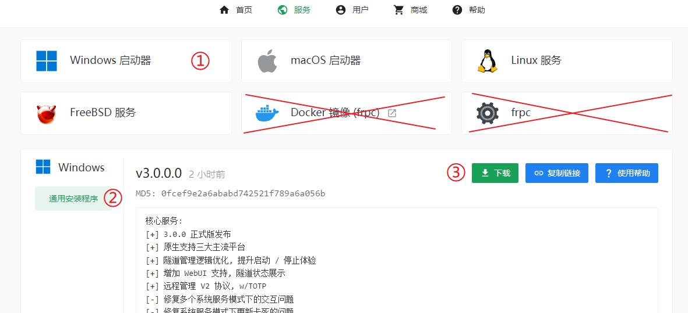
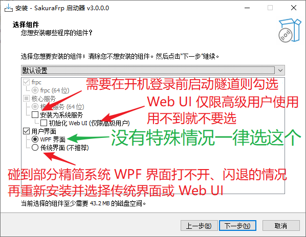
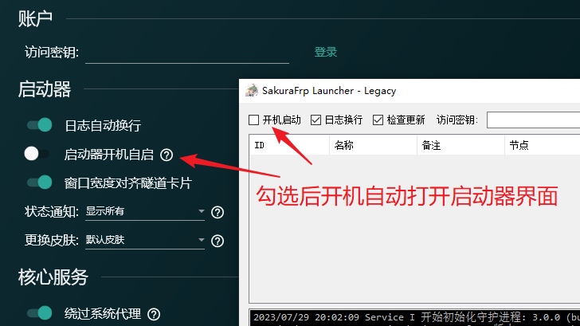
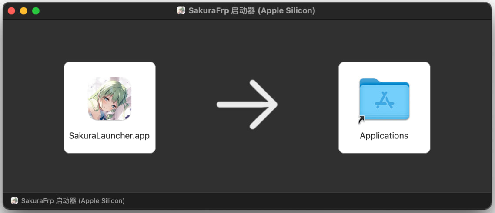
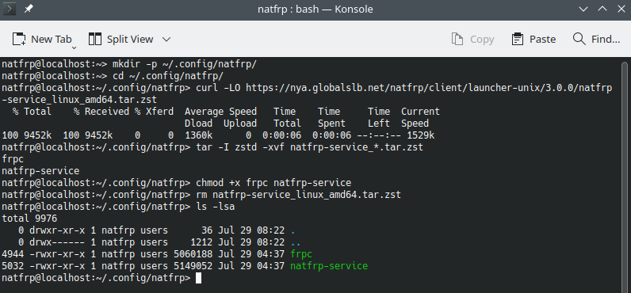
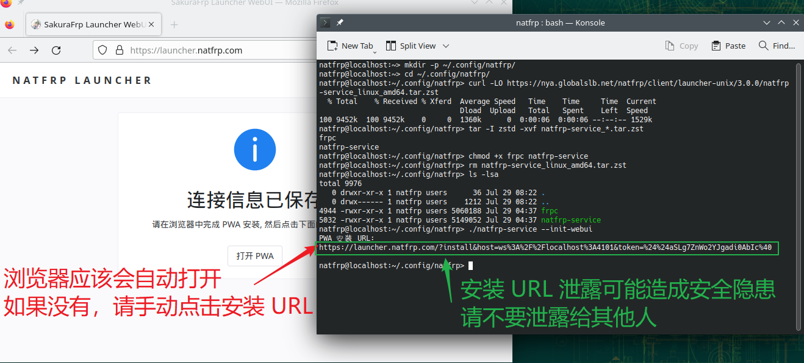
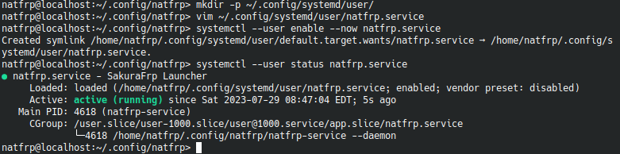
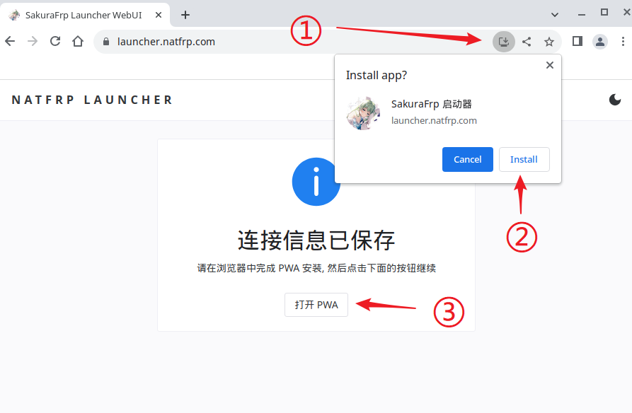
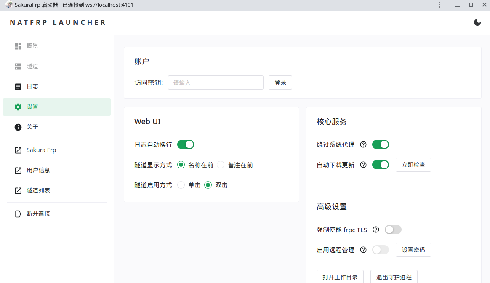

# SakuraFrp 启动器安装 / 使用指南

## 下载启动器 {#download}

::: details 这一节非常简单，推荐您直接跳过 (点击展开)

1. 登录管理面板，转到 **软件下载** 页面：

   

1. 选择正确的平台与架构，然后点击右侧下载按钮下载启动器安装程序：

   

:::

## 安装启动器 {#install}

::::: tabs

@tab Windows {#windows}

::: tip
如果在安装过程中碰到问题，请参阅 [启动器常见安装问题](/faq/launcher.md#install)  
常见问题大多与 .NET Framework 有关，可以尝试先装好 `.NET Framework 4.8` 再安装启动器  
**高级用户** 也可以选择不装用户界面，使用 Web UI（配置复杂，仅限高级用户）
:::

运行安装程序并根据向导提示进行安装，通常情况下一直点 **下一步** 即可。

默认组件适合大部分用户使用，您也可以参考下图选择需要安装的组件：



## 关于开机启动 {#windows-autostart}

如果需要不登录 Windows 就自启（例如穿透远程桌面服务），请参阅 [系统服务](/launcher/service.md) 页面了解服务启动方式。

否则在大多数情况下，直接打开启动器设置里的开关就能满足使用需求：



@tab macOS {#macos}

打开下载的 `.dmg` 文件，然后按箭头指示将启动器拖到 `Applications` 文件夹中即可：



## 关于开机启动 {#macos-autostart}

如果需要在启动时自动打开用户界面，请参考 Apple 帮助文档：[Mac 启动时自动打开应用](https://support.apple.com/zh-cn/guide/mac-help/mh15189/mac)

如果只需要启动隧道、不显示用户界面，请打开下图所示的开关：


@tab Linux 桌面环境 {#linux}

::: tip
出于安全考虑，`natfrp-service` 默认不允许以 root 权限运行，我们也不推荐您使用 root 用户登录桌面环境
:::

1. 由我们分发的压缩包采用 [zstd](https://github.com/facebook/zstd) 进行压缩，如果您还没有 `zstd`，请先在系统上安装。

   下载由我们分发的 `.tar.zst` 文件后，在合适的地方建一个文件夹并解压 `natfrp-service` 与 `frpc`：

   ```bash
   # 创建文件夹，例如 ~/.config/natfrp/ (只是举个例子)
   mkdir -p ~/.config/natfrp/
   cd ~/.config/natfrp/

   # 复制对应的下载链接并下载
   # curl -LO https://....

   # 解压并设置权限
   tar -I zstd -xvf natfrp-service_*.tar.zst
   chmod +x frpc natfrp-service

   # 删除压缩包
   rm natfrp-service_*.tar.zst
   ```

   

1. 运行 `./natfrp-service --init-webui` 初始化配置文件，此时浏览器应该会自动打开。

   如果没有看到浏览器请手动点击安装 URL，安装 URL 包含您的 **启动器连接密码**，请注意不要泄露：

   

1. 然后先把浏览器放到一边，参考发行版的相关教程配置您的初始化系统来启动 `natfrp-service --daemon`。

   以 Systemd 为例，在用户文件夹建立一个 Unit 文件即可。如果需要进行高级配置请参考 [启动器用户手册](./manual.md)。

   这是一个简单的示例文件，你可以直接把它复制到 `~/.config/systemd/user/natfrp.service`：

   ```systemd
   [Unit]
   Description=SakuraFrp Launcher
   After=network.target

   [Service]
   Type=simple
   TimeoutStopSec=20

   Restart=always
   RestartSec=5s

   ExecStart=%h/.config/natfrp/natfrp-service --daemon

   [Install]
   WantedBy=default.target
   ```

1. 让初始化系统拉起启动器进程并确认启动器在运行，这里还是以 Systemd 为例：

   ```bash
   systemctl --user enable --now natfrp.service
   systemctl --user status natfrp.service
   ```

   

1. 现在回到浏览器，安装 PWA 并点击下面的继续按钮。

   如果您使用的是 Chromium，可以参考下图操作：

   

   由于 Firefox 不支持 PWA，直接刷新一下就行了，什么都不需要点，然后就能看到启动器的 Web UI：

   

   这样启动器就安装完成了，并且会在登录时自动启动。您随时可以打开 Web UI 进行管理。

:::::

## 登录启动器 {#login}

::: tip
各平台启动器的操作体验基本一致，本文档将用 Windows WPF 启动器进行演示
:::

安装完成后打开启动器的管理界面。进入 [用户信息](https://www.natfrp.com/user/profile) 页面，复制 **访问密钥** 到启动器，点击 **登录**：


## 创建隧道 {#create-tunnel}

请到 [SakuraFrp 管理面板 > 隧道列表](https://www.natfrp.com/tunnel/) 创建隧道以取得最佳使用体验。

本文档提供了 HTTP、RDP、Minecraft 等常见应用的配置指南，如需帮助请查看右上角的 **配置指南** 列表。

Windows / macOS 启动器的内置创建隧道功能相对简陋，只推荐临时有需求但又没登录面板时使用。

## 启动隧道 {#windows-start-tunnel}

1. 在隧道标签中找到您要启用的隧道，点击右上方开关启用。

   启用隧道后稍等一会才能连接成功，**不要频繁开关隧道**。建议打开开关后切换到 **日志** 标签检查状态。

   

1. 隧道连接成功后系统会弹出通知，显示隧道连接方式。该通知可以在设置中通过 `状态通知` 配置项禁用。

   如果没有看到通知，请检查系统设置里的通知权限、勿扰模式等设置。

   

1. 转到日志标签可以复制隧道的连接方式，具体连接方式请参考各个应用 **配置指南** 中给出的连接方式：

   

## 删除隧道 {#windows-delete-tunnel}

将鼠标放到隧道卡片上悬停一会，卡片右上角会出现删除按钮：


点击删除按钮，然后确认操作即可删除隧道：


