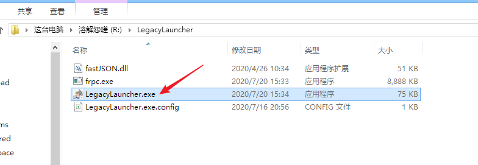
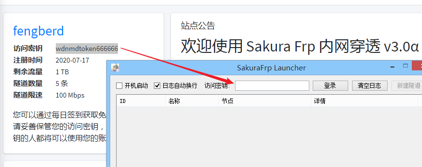
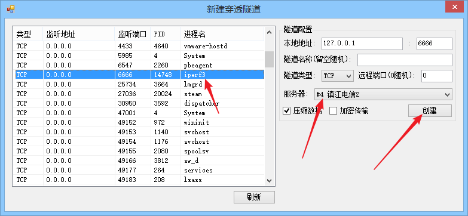

# 使用传统启动器

传统启动器是给一些打不开 WPF 启动器的用户使用的，正常系统不需要用这个.

下载、解压流程请参见新版启动器的使用教程，在此不再赘述. 左键双击 LegacyLauncher.exe 或者 右键 -&gt;选择 "打开"

访问管理面板，把你的访问密钥复制过来，然后点击 "登录"

操作和 WPF 启动器基本一致，按流程创建隧道

创建好隧道后勾选要启动的隧道前面这个框即可开启隧道，勾选后请耐心等一会

传统启动器是没有消息框提示的，请关注日志输出，获取到连接方式就可以使用了

