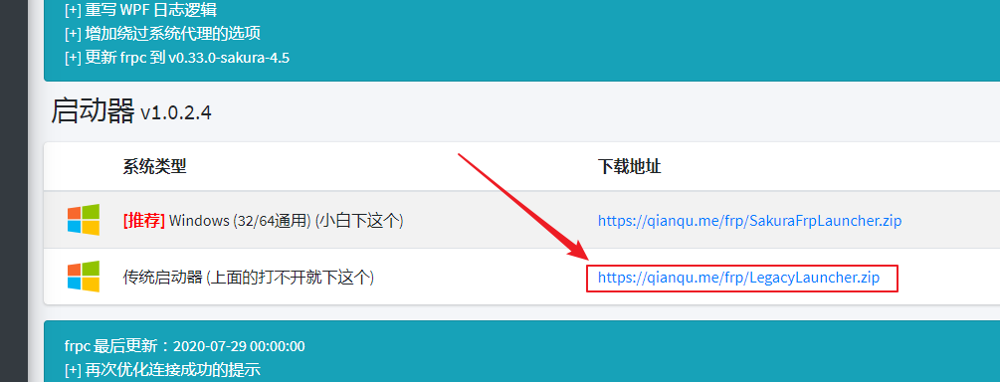
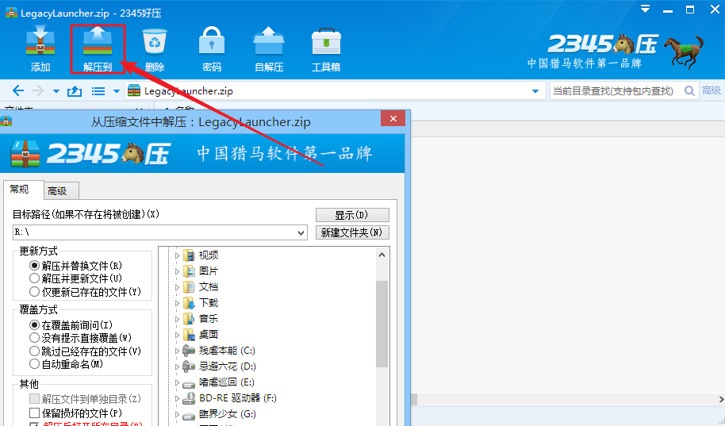
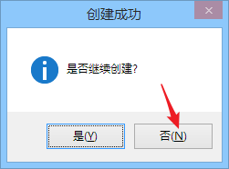
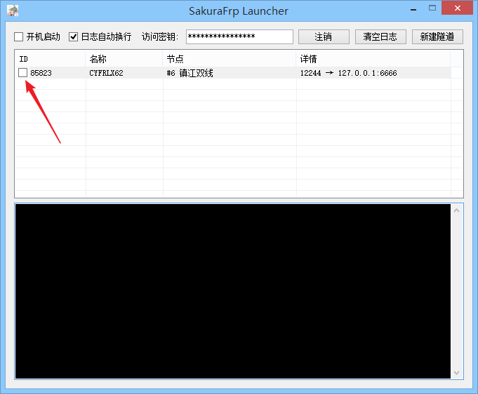
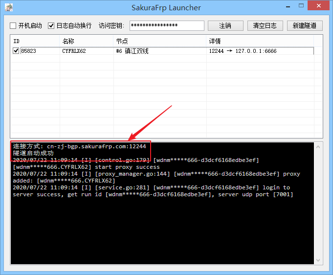

# 使用传统启动器

传统启动器是给一些打不开 WPF 启动器的用户使用的，正常系统不需要用这个.

首先，你需要从网站下载启动器，在侧边栏点击 “软件下载” :

然后点这个，下载传统启动器

下载完毕后解压到一个单独的文件夹，不要直接运行

解压完成后左键双击 LegacyLauncher.exe 或者 右键 -&gt;选择 "打开"

访问管理面板，把你的访问密钥复制过来，然后点击 "登录"

接下来选择你要映射的服务，本文以映射 `iperf3` 服务器为例，直接找到进程 `iperf3` 点击，然后选择一个服务器，最后点创建即可

创建成功后按需要选择是否继续创建

接下来勾选要启动的隧道前面这个框即可开启隧道，勾选后请耐心等一会

传统启动器是没有消息框提示的，请关注日志输出，获取隧道的连接方式

获取连接方式后, 我们的服务就可以在外网被访问到了

