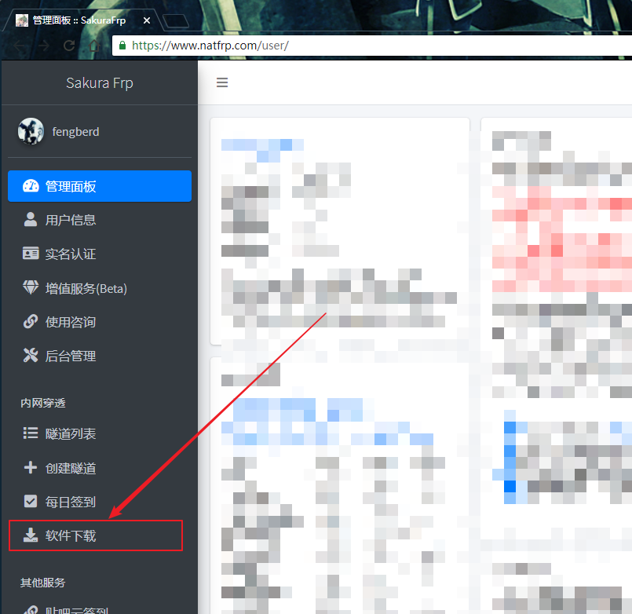
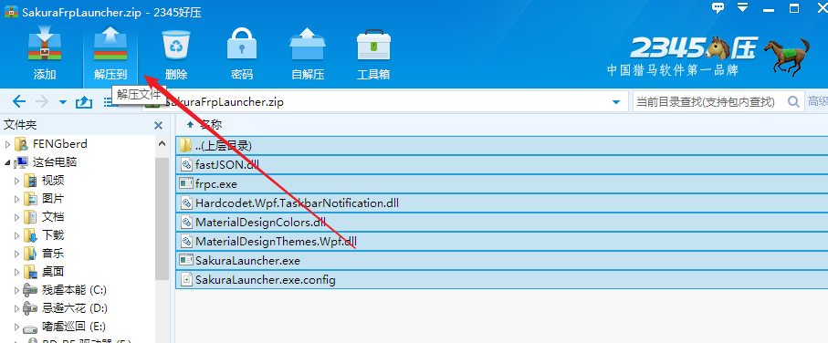
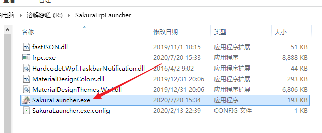
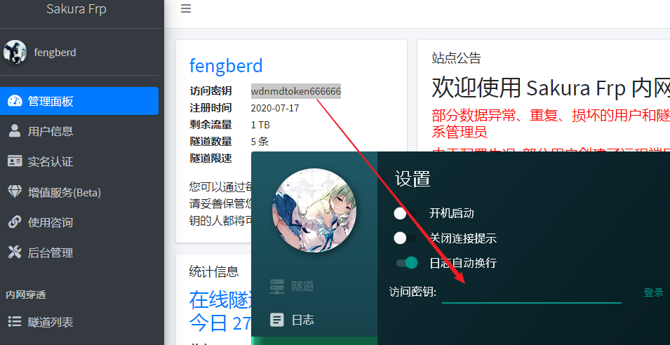
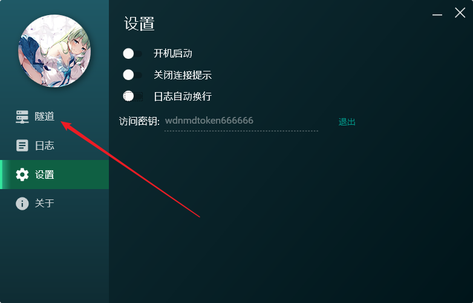
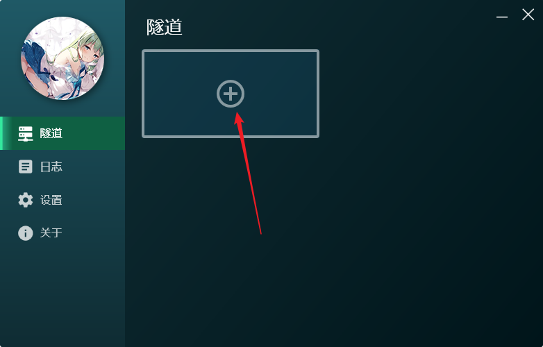
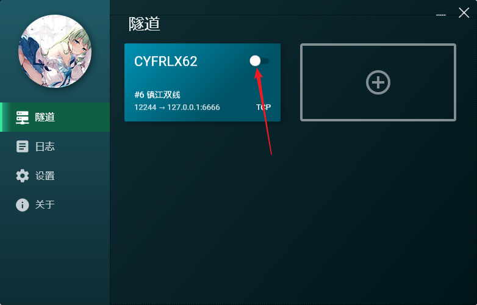
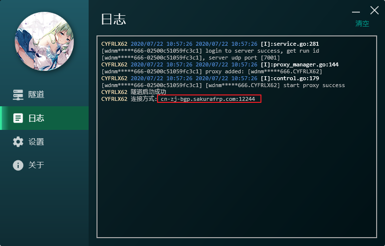

# 使用新版启动器

首先，你需要从网站下载 WPF 启动器，在侧边栏点击 “软件下载” :

然后点这个，下载 WPF 启动器

下载完毕后解压到一个单独的文件夹，不要直接运行

解压完后用鼠标左键双击 SakuraLauncher.exe，或者 右键-&gt;选择 “打开”

到管理面板复制访问密钥，然后点击登录

登录成功后点击 “隧道” 标签

然后点击这个加号新建隧道

接下来选择你要映射的服务，本文以映射 `iperf3` 服务器为例，直接找到进程 `iperf3` 点击，然后选择一个服务器，最后点创建即可

创建成功后按需要选择是否继续创建

全部设置完毕后，返回主界面，点击这个开关启用隧道

启动成功后会有一个提示

记下这个地址，你也可以到日志标签复制 (别忘了点确定)

这样我们的服务就可以在外网被访问到了

如果 WPF 启动器能正常使用，请直接跳过下面的 0x02 章节，从 0x03 开始阅读
