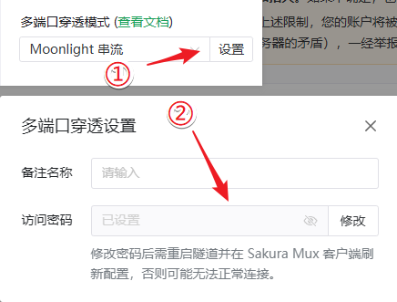

# 多端口应用穿透指南

::: tip 版本需求
开启多端口穿透隧道需使用 **v0.51.0-sakura-15** 及以上版本的 frpc
:::

通过 Sakura Mux，您可以穿透占用多个端口、对端口 Offset 有严格要求的各类应用。

可在 [Nyatwork CDN](https://nya.globalslb.net/natfrp/client/mux-windows/) 下载 Sakura Mux 客户端。

## 应用教程索引 {#app-index}

- [Moonlight / Sunshine 游戏串流](./moonlight.md)

## 客户端使用说明 {#client-brief}

配置隧道并启动后，会看到如下所示的示例日志：

```log
2077/10/08 20:41:30 I Tunnel/Noonlight [233/10/XXXX] 连接节点成功, 运行 ID [10-XXXXXXXX]
2077/10/08 20:41:30 I Tunnel/Noonlight [233/10/XXXX] 隧道启动中: [Noonlight, tcp]
  Tunnel/Noonlight 多端口隧道启动成功
  Tunnel/Noonlight 通过 Sakura Mux 客户端输入访问码 >>AAA BBB CCC<< 连接隧道
  Tunnel/Noonlight * 已启用密码保护, 忘记密码可编辑隧道进行重置
2077/10/08 20:41:30 I Tunnel/Noonlight [233/10/XXXX] 隧道启动成功
```

其中，`AAA BBB CCC` 就是隧道的 **访问码**，可通过该访问码连接到您的隧道。

如果只看到 **TCP 隧道启动成功** 等字样，请先确认客户端已更新到受支持的版本，且 **多端口穿透模式** 设置正确。

::: warning 安全提示
请妥善保存访问码，**截图打码，不要泄露给不信任的人**，否则可能产生严重的安全问题  
我们始终建议您在配置多端口隧道时启用密码保护：


:::

隧道访客下载 Sakura Mux 客户端后，按照下图说明下操作，输入 **访问码** 添加配置文件：


开启对应的连接，即可通过目标应用进行连接：


