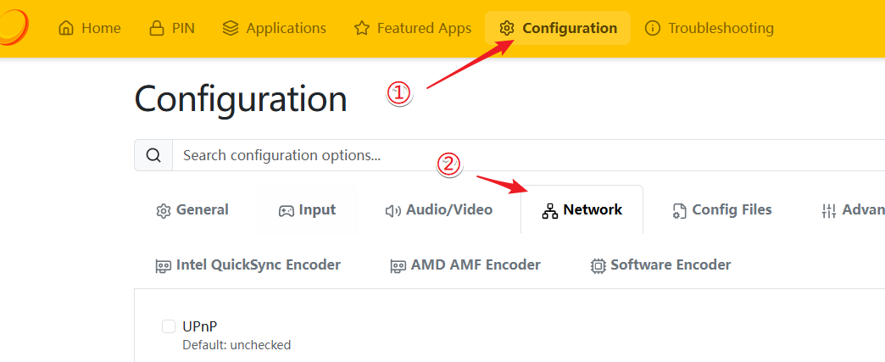
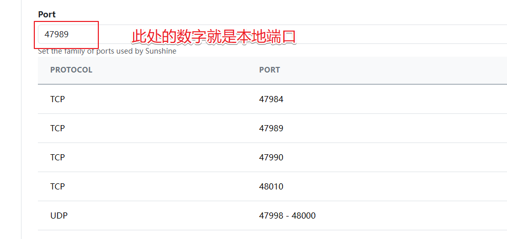
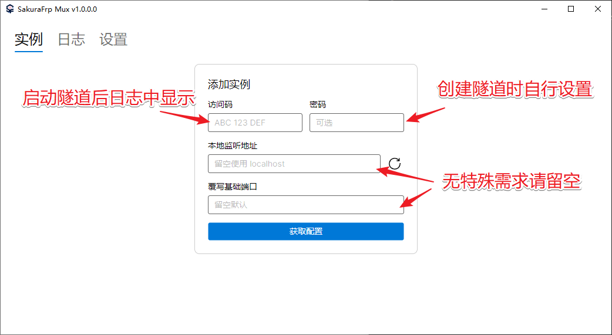
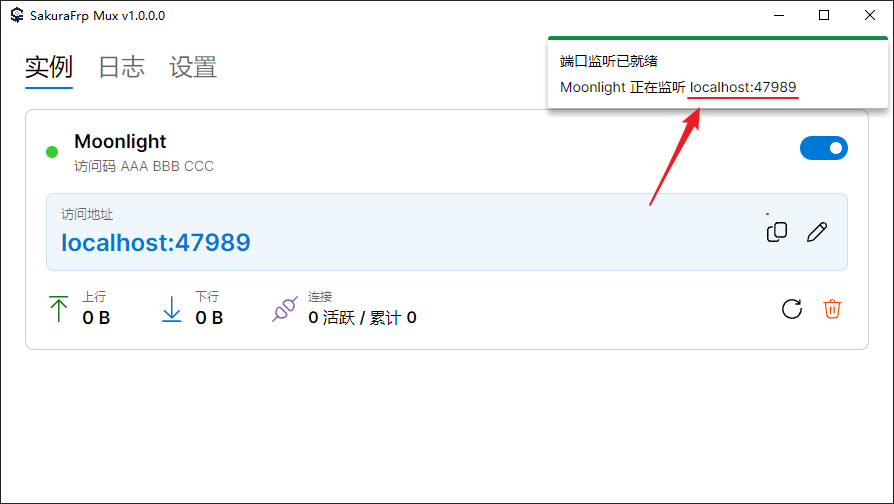
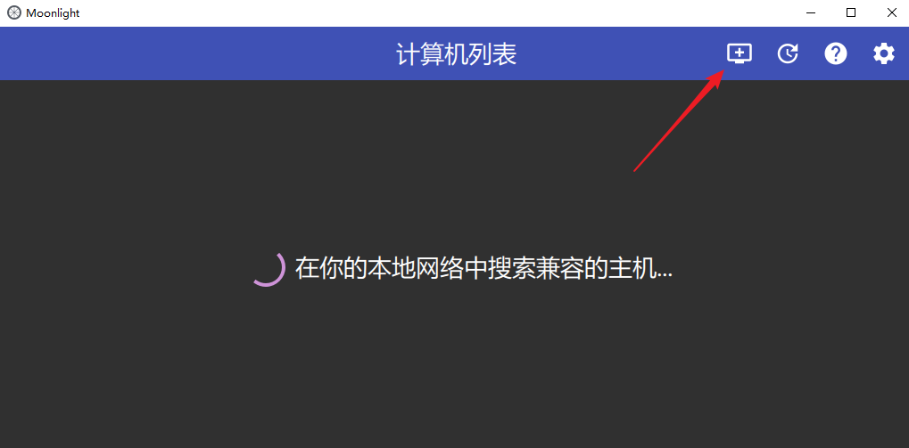
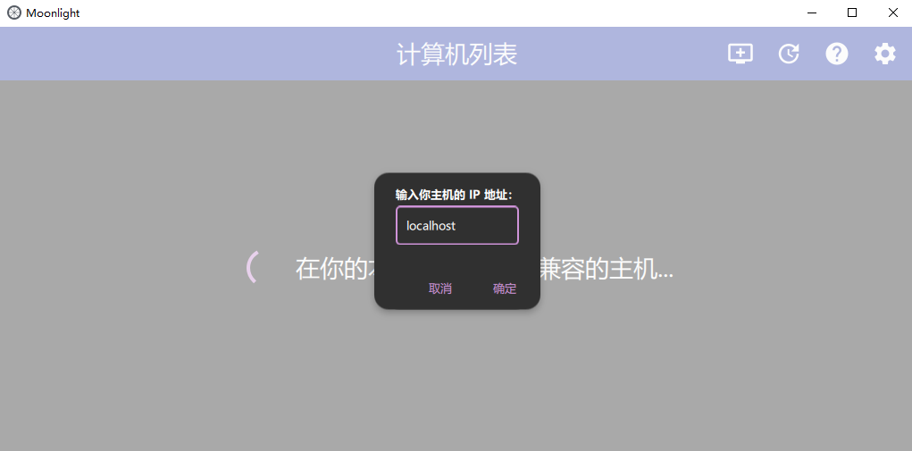

# Moonlight / Sunshine 游戏串流

::: tip 版本需求
开启多端口穿透隧道需使用 **v0.51.0-sakura-15** 及以上版本的 frpc
:::

::: tip 流量消耗提示
Moonlight 串流 **会消耗大量流量**，请确保您的账户流量充足，并在开始串流前检查码率设置  
通过隧道连接时，建议适当降低码率以节省流量使用。若码率远超限速范围，可能出现黑屏无画面的情况
:::

::: tip 串流延迟提示
Moonlight 串流 **对延迟较为敏感**，可在串流启动后通过 `Ctrl-Alt-Shift-S` 组合键打开左上角统计信息  
建议多试几个节点，对比 `Average network latency` 值，使用延迟最低的节点以获得更好的串流体验
:::

## 准备工作 {#preparation}

如果您还没有配置 NVIDIA GameStream 或安装 Sunshine 等方案，  
请先安装 [Sunshine](https://github.com/LizardByte/Sunshine/releases/latest) 并在内网先测试好 Moonlight 连接，确保配置正确。

## 确认本地 IP 和端口 {#confirm-local-port}

本教程以 Sunshine 为例。

- 如果运行 Sunshine 的电脑和运行隧道的电脑是同一台，则 **本地 IP** 为 `127.0.0.1`
- 否则，**本地 IP** 请填写运行 Sunshine 的电脑（或游戏机）的内网 IP

可以在 Sunshine 管理面板中确认 **本地端口**，打开 `Configuration` -> `Network` 页面：



往下滚动，找到 `Port` 输入框，这里面的数字就是 **本地端口**，如果没有修改过，默认是 `47989`：



我们 **不建议** 您修改 Sunshine 的端口设置，这可能引发未知问题。

## 创建 TCP 隧道 {#create-tcp-tunnel}

前往 SakuraFrp [隧道列表](https://www.natfrp.com/tunnel/) 创建一条隧道：

- **隧道名称**：`Moonlight`
- **隧道类型**：`TCP`
- **本地 IP**、 **本地端口**：按上一节确认
- **远程端口**：留空随机分配
- **多端口穿透模式**：`Moonlight 串流`，同时建议点击右边的 `设置` 按钮输入访问密码

其他设置保持默认。创建完成后，在电脑上打开 SakuraFrp 启动器，刷新隧道列表并启动 `Moonlight`。

打开启动器的 **日志** 标签，确认看到 **多端口隧道启动成功** 和连接方式：

```log
2077/08/25 09:29:49 I Tunnel/Noonlight [233/10/XXXX] 连接节点成功, 运行 ID [10-XXXXXXXX]
2077/08/25 09:29:49 I Tunnel/Noonlight [233/10/XXXX] 隧道启动中: [Noonlight, tcp]
  Tunnel/Noonlight 多端口隧道启动成功
  Tunnel/Noonlight 通过 Sakura Mux 客户端输入访问码 >>AAA BBB CCC<< 连接隧道
  Tunnel/Noonlight * 已启用密码保护, 忘记密码可编辑隧道进行重置
2077/08/25 09:29:49 I Tunnel/Noonlight [233/10/XXXX] 隧道启动成功
```

其中，`AAA BBB CCC` 就是隧道的 **访问码**，可通过该访问码连接到您的隧道。

如果只看到 **TCP 隧道启动成功** 等字样，请先确认客户端已更新到受支持的版本，且 **多端口穿透模式** 设置正确。

## 连接客户端 {#connect-client}

访客（运行 Moonlight 的一方）需在 [Nyatwork CDN](https://nya.globalslb.net/natfrp/client/mux-windows/) 下载 Sakura Mux 客户端。

按照下图说明下操作，输入 **访问码** 添加配置文件：



开启对应的连接，注意右上角弹出的 **访问地址**：



打开 Moonlight 客户端，点击右上角的添加 IP 按钮：



在弹出的对话框中输入 **localhost**（即访问地址，默认端口可省略，若自定义了访问地址请输入自定义值）：



确定并保存后即可看到添加的主机，然后正常进行配对和连接即可。
