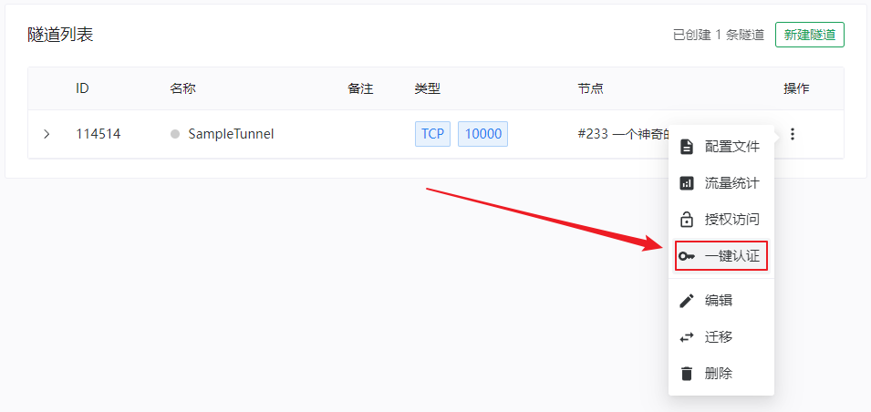
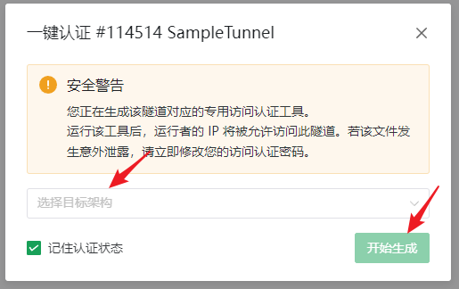
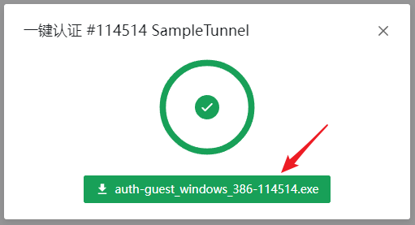
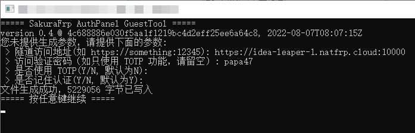
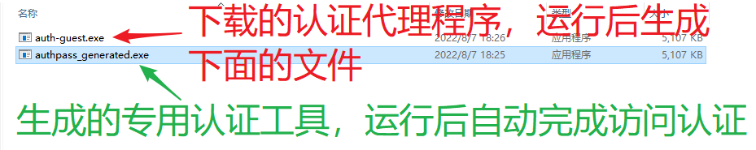
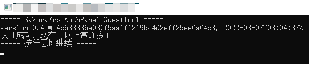

# 生成并使用 SakuraFrp 认证代理

如果您已按照 [配置访问认证](/bestpractice/frpc-auth.md) 一节配置过访问认证功能，想必您会对于经常需要打开浏览器进行验证感到厌烦。

除了参考上述文档中给出的示例制作 bash 脚本外，您可以使用 [SakuraFrp 认证代理](https://github.com/natfrp/auth-guest/) 制作内嵌了认证信息的专用工具。

嵌入了相关信息的工具运行后会自动完成认证流程，且能够在多个平台运行，便于分发给多个访客。

## 通过管理面板自动生成 (推荐) {#generate-from-panel}

1. 当您完成访问认证相关配置后，对应的隧道操作菜单中就会出现 **一键认证** 选项，点击该选项：

   

2. 在一键认证对话框中选择运行认证代理的目标系统架构，随后点击 **开始生成** 按钮：

   

3. 生成完成后即可点击底部按钮下载该隧道的专用认证工具：

   

## 通过认证代理生成 {#generate-from-auth-guest}

::: tip
下面的操作以 Windows 系统为例，其它系统大同小异，不再赘述
:::

1. 请于 [GitHub Release](https://github.com/natfrp/auth-guest/releases/latest) 或 [Nyatwork CDN](https://nya.globalslb.net/natfrp/client/auth-guest/) 按照您的系统和架构下载程序。

2. 直接执行您下载的程序，程序会询问您的信息，并生成一个访问认证工具，如图所示

   

3. 您会在同目录下看到文件名为 `authpass_generated.exe` 的程序，只需执行该程序即会自动进行访问认证，无需打开浏览器

   

4. 将此程序分发给您的访客，访客只需在访问前执行一次此程序即可自动通过访问认证

   

## macOS arm64 注意事项 {#macos-arm-note}

苹果在 arm64 版本的 macOS 上强制所有二进制文件进行签名，否则不允许执行，因为 auth-guest 在本质上是在生成一个修改版的二进制文件，所以将不被允许运行。表现如下：

```bash
user@devName auth-guest_0.5_darwin_arm64 % ./authpass_generated
zsh: killed     ./authpass_generated
```

可能的解决方案如下：

* 执行 `codesign -s - authpass_generated` 以本地签名生成的程序
* 使用 `darwin_amd64` 版程序，此限制仅适用于 arm64 程序

## 命令行开关一览 {#switches}

| 开关 | 说明 |
| --- | --- |
| -nopersist | 不记住认证状态，等效于浏览器认证时不勾选 "记住我" 选项 |
| -u &lt;String&gt; | 开启了访问认证功能的隧道地址 |
| -p &lt;String&gt; | 访问认证密码 |
| -o &lt;String&gt; | 将生成的工具写入指定文件 (默认为 `authpass_generated` 或 `authpass_generated.exe`) |
| -totp | 启动时询问 TOTP 代码 |
