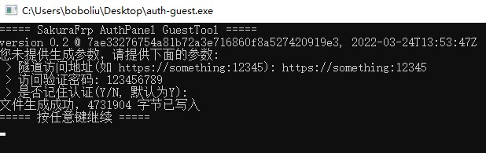
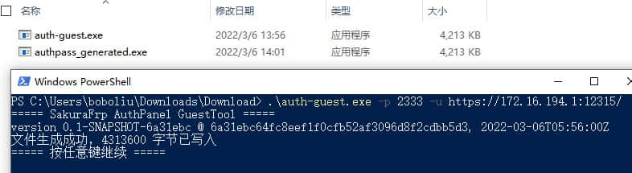
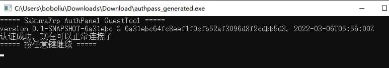

# 使用 SakuraFrp AuthPanel GuestTool 制作专用的访问认证工具

如果您已按照 [最佳实践/安全](/bestpractice/security) 中 frpc 访问认证 一节配置的访问认证面板，想必您会对于经常需要打开浏览器进行验证感到厌烦。

除了参考上述文档中给出的示例制作 bash 脚本外，您可以使用 SakuraFrp AuthPanel GuestTool 制作内嵌地址和密码的访问认证工具，分发给其他访客时也会更加方便。

?> 下面示例以 Windows 系统为例，其它系统大同小异，不再赘述

## 下载 SakuraFrp AuthPanel GuestTool

请于 [GitHub Release](https://github.com/natfrp/auth-guest/releases/latest) 或 [Nyatwork Static CDN](https://nyat-static.globalslb.net/natfrp/client/auth-guest-0.2/) 按照您的系统和架构下载程序。

## 制作访问认证工具

1. 直接执行您下载的程序，程序会询问您的信息，并生成一个访问认证工具，如图所示



2. 您会在同目录下看到文件名为 `authpass_generated.exe` 的程序，只需执行该程序即会自动进行访问认证，无需打开浏览器



3. 您的访客在访问前只需执行生成的此程序即可通过访问认证



## macOS arm64 注意事项

苹果在 arm64 版本的 macOS 上强制所有二进制文件进行签名，否则不允许执行，因为 auth-guest 在本质上是在生成一个修改版的二进制文件，所以将不被允许运行。表现如下：

```
user@devName auth-guest_0.2_darwin_arm64 % ./authpass_generated.exe
zsh: killed     ./authpass_generated.exe
```

解决方案为：

* 执行 `codesign -s - authpass_generated.exe` 以本地签名生成的程序
* 使用 `darwin_amd64` 版程序，此限制仅适用于 arm64 程序

选一执行即可。

## 其他参数

SakuraFrp AuthPanel GuestTool 提供的其他可自定义项，请通过 `-h` 参数查看。
