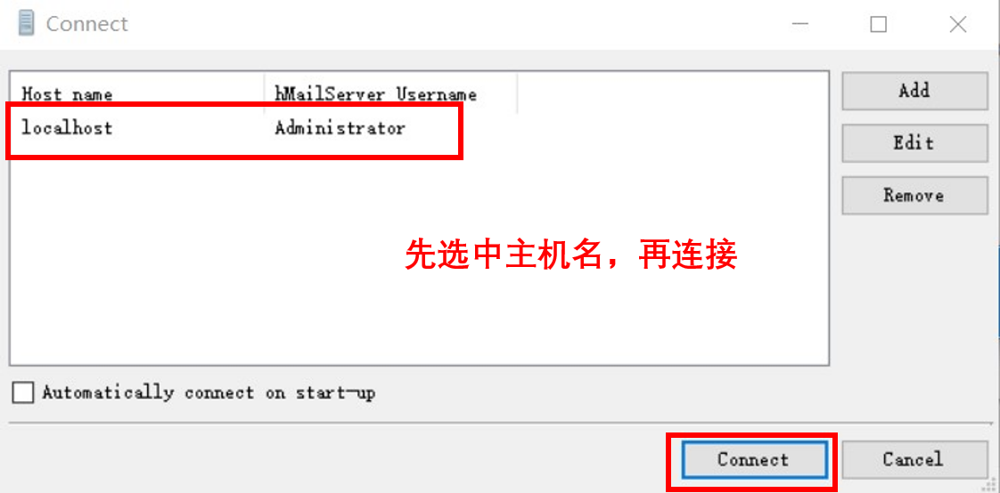
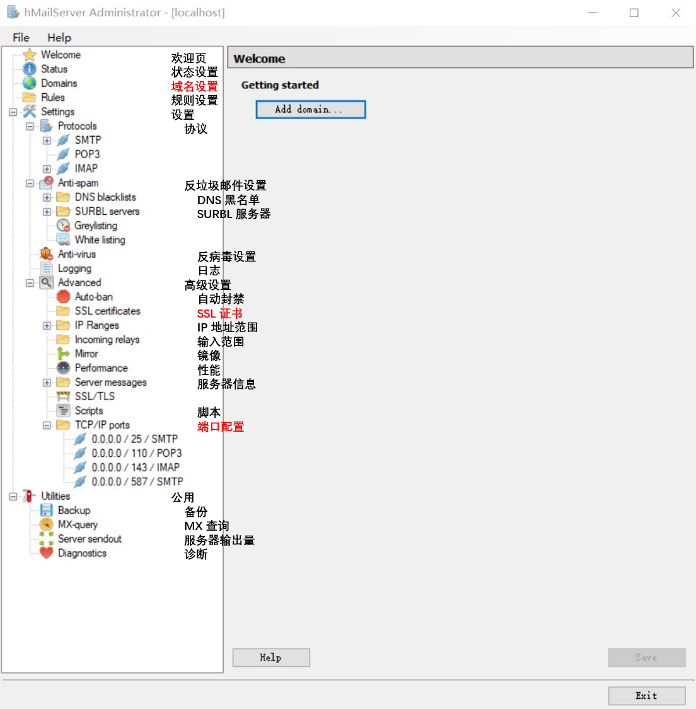
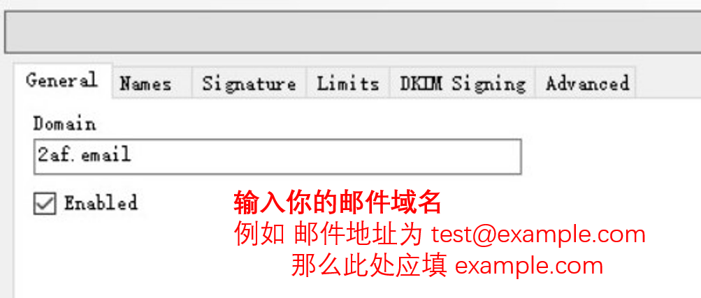
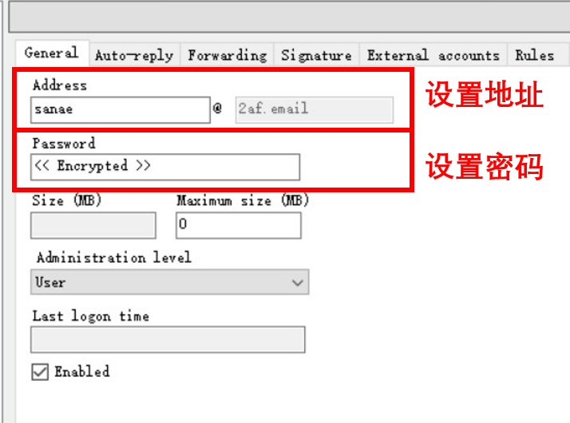
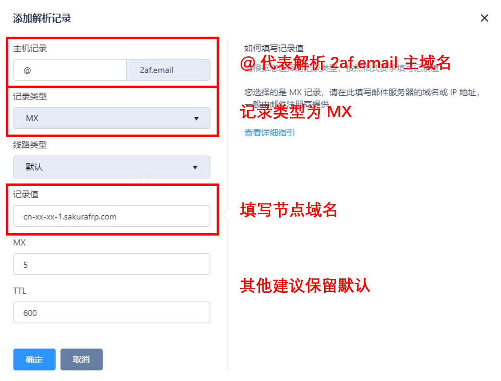
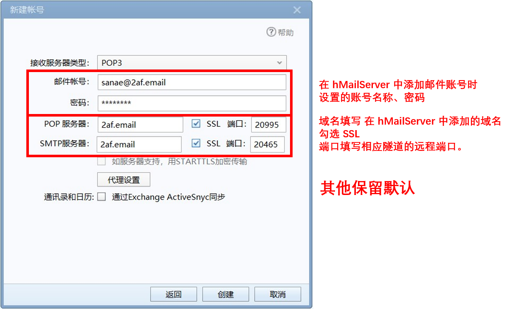
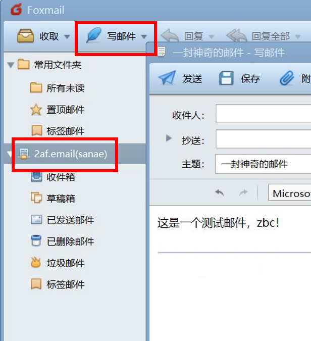
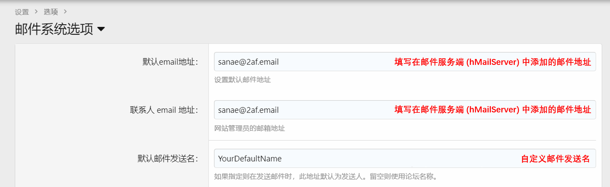
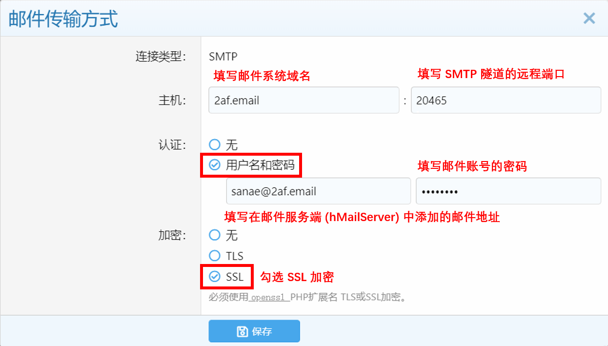

# hMailServer 邮件服务穿透

::: warning
由于 [此原因](#pop3)，穿透邮件服务仅可用于发信，不能使用 POP3 收信。
:::
因此，仅适用于 **网站邮箱验证** 等使用环境。

> 如果您穿透的邮件服务 **不需要外网访问**，那么穿透它 **并没有实际意义**，仅在您的邮件服务需要配置 SSL 证书时才是必须的。

## 准备事项 {#prepare}

### 安装 hMailServer {#prepare-hms}

若要使用 SakuraFrp 搭建邮件服务器，那么首先需要有本地的邮件服务端。

以下是一些常用的邮件服务端及下载方式：

| 名称        | 操作系统               | 官网                                | 下载                                               | 官方文档                                           |
| ----------- | ---------------------- | :---------------------------------: | :------------------------------------------------: | :------------------------------------------------: |
| hMailServer | Windows                | [访问](https://www.hmailserver.com) | [官网下载](https://www.hmailserver.com/download)   | [查看](https://www.hmailserver.com/documentation/) |
| iRedMail    | Linux 或 Free/OpenBSD  | [访问](https://www.iredmail.com/)   | [官网下载](https://www.iredmail.com/download.html) | [查看](https://docs.iredmail.org/index-zh_CN.html) |

> 此教程使用 hMailServer 作演示。如您有使用其他邮件服务端的经验，欢迎补充。

### 安装测试客户端 {#prepare-foxmail}

请在 [这里](https://www.foxmail.com/) 下载 FoxMail。

安装后，请先不要登录或添加邮件。添加邮件需要在配置邮件服务器后进行。

## 使用 hMailServer 搭建邮件服务器 {#hmailserver}

### 安装 hMailServer {#hmailserver-install}

安装时，通常一路 Next 即可。但有两个界面需要注意：

1. 选择数据库类型时，请选择 `Built-In` 模式。
1. 设置密码用于给管理软件连接服务端，因此请务必牢记密码。

#### 使用管理软件连接 hMailServer

在 hMailServer 安装完成后，请打开附带的 `hMailServer Administrator` 管理软件。

此时将显示默认的主机名 `localhost`。选中它，并点击右下角的 `Connect` 以连接。

> 连接时需要输入密码。[我的密码是什么？](#hmailserver-install)

连接后，将进入如下图所示的主页。

> hMailServer 不自带中文，因此已写出对于菜单的部分简体中文翻译。标红的项为稍后需要用到的。

### 配置 hMailServer {#hmailserver-config}

#### 设置邮件域名

请点击欢迎页右侧的 `Add domain...` 来添加邮件域名。

随后，按下图提示输入您的邮件域名。

#### 设置邮件账号

请依次点击菜单栏中的 `Domains` `%YourDomain%` `Accounts`，进入邮件账号设置界面。

随后，点击右侧的 `Add` 以添加邮件账号。

如图设置完成后，请点击右下角 `Save` 以保存。

#### 设置 SSL 证书

> 大部分常用邮件系统 (如网易邮箱、QQ 邮箱) 通常都会要求发件方使用 SSL 等方式验证身份。

请在 [**SSL 服务商**](https://get.ssl.moe) 处为您的邮件域名申请 SSL 证书，并下载如下文件 (yourdomain 仅作示例):

1. `yourdomain.crt` 证书文件
1. `yourdomain.key` 私钥文件

随后，依次点击 `hMailServer` 主菜单中的 `Settings` `Advanced` `SSL certificates`，以配置 SSL 证书。

进入 **SSL 证书设置界面** 后，请点击右上角的 `Add`，并在添加证书界面中填写如下信息：

1. `Name`: 证书的名称。类似于备注，可以自定义填写。
1. `Certificate file`: 证书的 crt 文件。请点击右侧 `...` 按钮，选中相应的文件。
1. `Private key file`: 证书的 key 文件。请点击右侧 `...` 按钮，选中相应的文件。

设置完成后，点击右下角 `Save` 以保存。

#### 设置端口

> 除非系统有其他服务正在占用默认端口，否则请保留默认。
此章节仅用于将 SSL 证书在相应端口和协议中启用。

依次点击 `hMailServer` 主菜单中的 `Settings` `Advanced` `TCP/IP ports` `0.0.0.0 / 25 / SMTP`。

随后点击右下角 `Save` 以保存。

::: warning
保存时会提示 **"需要重启以生效"**，因此请在 **确认可重启 hMailServer** 后再点击确定。
:::

随后，您也可以在左侧菜单找到 POP3 的页面进行设置，方法同上。

### 隧道配置 {#hmailserver-tunnel}

> 虽然仅 SMTP 穿透有效，但由于 **邮件客户端** 通常需要同时连接 **POP3** (收件) 和 **SMTP** (发件) 端口，因此需要两个隧道。

| 对应协议 | 节点 | 隧道类型 | 本地端口(默认) | 远程端口 |           本地 IP          | 其他配置项       |
| -------- | ---- | -------- | :------------: | :------: | :------------------------: | :--------------: |
| SMTP     | 任意 | TCP      | 25             | 任意     | hMailServer 运行的 IP 地址 | 保留默认值或留空 |
| POP3     | 任意 | TCP      | 110            | 任意     | hMailServer 运行的 IP 地址 | 保留默认值或留空 |

### 设置域名解析 {#hmailserver-dns}

不同于其他服务，邮件服务有专用的 `MX` 解析类型。

| 主机记录 | 记录类型 | 记录值   | 其他配置项           |
| :------: | :------: | :------: | :------------------: |
| 自定义   | **MX**   | 节点域名 | 无特殊需求请保留默认 |

> 示例:
邮件地址为 `test@example.com`，那么 **主机记录** 应填写 `@`。
邮件地址为 `test2@your.domain.com`，那么 **主机记录** 应填写 `your`。

请按上表信息添加解析记录。您也可以参考下方的图片。

与此同时，也应添加一个 **主机记录相同** 的 **A 记录**，指向节点 IP 地址。

| 主机记录 | 记录类型 | 记录值       | 其他配置项           |
| :------: | :------: | :----------: | :------------------: |
| 自定义   | **A**    | 节点 IP 地址 | 无特殊需求请保留默认 |

各参数设置方法同上。

> 您可以通过 **ping** 或 **查看隧道启动日志** 来查看节点 IP 地址。

### 测试邮件系统 {#hmailserver-test}

搭建邮件服务器基本已经完成。接下来，需要测试邮件系统是否可正常发信。

此处使用 [前文](#prepare) 安装的 FoxMail 作演示。您也可以使用其他可添加第三方邮箱的客户端。

#### 添加邮件账号

请打开 FoxMail，并添加 `其他邮箱`，随后在相应页面选择 `手动配置`。

请按上图设置各项参数，随后点击 `创建`。

不出意外的话，此时将创建成功，并进入 **FoxMail 主界面**。

#### 发信测试

在 Foxmail 主页左侧选中相应的邮箱账号，随后点击顶部的 `写邮件`。

各参数填写内容：

- 收件人: 外部常用邮件系统的邮箱地址，例如 QQ 邮箱。
- 主题和正文: 自定义

填写完成后，发送此邮件，并在其他客户端中登录相应的收件邮箱，检查是否可以正常发信。

## 常见应用接入 hMailServer {#app}

### Web 程序 {#app-web}

#### xenForo {#app-web-xenforo}

这里以最新的 xenForo 作演示。

进入 `管理后台`，依次进入如下路径: `设置 > 选项 > 邮件系统选项`

接下来，请按下图设置邮件账号，完成后保存。

随后，在下方找到 `邮件传输方式` 设置项，连接类型选择 `SMTP`，并按下图配置。

最后，点击 `保存` 以应用设置。

您可以通过 **注册账号** 等方式，来验证邮件系统是否正常。

### 其他程序 {#app-others}

STFW。

## POP3 穿透说明 {#pop3}

> POP3 不同于 SMTP 的发信，它是收信时的常用协议。

其他用户在向 **您的邮箱** 发送邮件时，设置了地址: `test@example.com`。

同时，邮局间的交换使用 SMTP，`example.com` 而对应的 `MX` 解析记录类型无法设置端口。

而 SakuraFrp 并不支持将 `远程端口` 设为 `25` `995` 等低位端口，因此无法直接穿透 POP3。

关于 **无法穿透超出范围端口** 的原因，见[此页](/faq/misc.md#lower-ports)。
