# Minecraft Java 版开服指南

::: warning
按照教程进行以下下载、安装、运行服务器操作代表您已经同意 [Minecraft 最终用户许可协议 (“EULA”)](https://www.minecraft.net/zh-hans/eula) 以及 [Microsoft 隐私声明](https://go.microsoft.com/fwlink/?LinkId=521839)
:::

由于 Minecraft Java 服务端配置的复杂、多样性，本教程仅教学在 Windows 系统下简单且 "尽量不犯错误" 开启服务器的方法，您可以在网上找到其他更多信息。

如果您游玩整合包，部分作者会将服务器端整合在发布页面中，其会为您省下大量安装和构建时间。一般其也会附带简单的开启教程。

## 安装对应版本的 Java {#install-java}

对于不同的系统，安装 Java 环境的方法不尽相同。  
对于 Windows 系统，您可以直接使用双击安装包的方式安装。

不同版本的 Minecraft 服务器对 Java 的版本需求也不同，见下：

框图中的 Java 版本可点击，将带您下载 Adoptium 版本 Java 环境，**点击其中的 `.msi` 按钮 即可下载安装包**。

```flow
st=>start: 选定服务端版本
cond1=>condition: 相比于 1.8|approved
cond2=>condition: 相比于 1.17|approved
cond3=>condition: 相比于 1.20.5|approved
unknown=>operation: 未知版本|invalid
Java 8=>operation: Java 8|future:>https://adoptium.net/zh-CN/temurin/releases/?os=windows&arch=x64&package=jre&version=8
Java 17=>operation: Java 17|rejected:>https://adoptium.net/zh-CN/temurin/releases/?os=windows&arch=x64&package=jre&version=17
Java 21=>operation: Java 21|current:>https://adoptium.net/zh-CN/temurin/releases/?os=windows&arch=x64&package=jre&version=21

st->cond1
cond1(yes@小于, bottom)->unknown
cond1(no@大于或等于, right)->cond2
cond2(yes@小于, bottom)->Java 8
cond2(no@大于或等于, right)->cond3
cond3(yes@小于, bottom)->Java 17
cond3(no@大于或等于, right)->Java 21
```

::: tip
部分 Java 安装包在默认安装过程中并不会更改 `JAVA_HOME` 变量，为了方便操作，请在安装您需要的 Java 环境时勾选上相关选项，例如：  
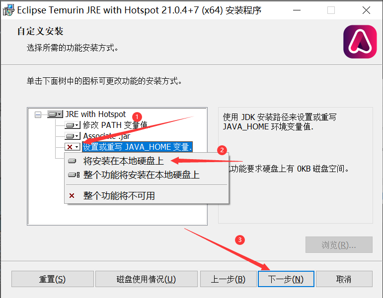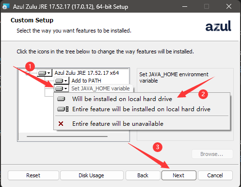
:::

下面为您另提供一些常用版本的 Windows 安装包下载链接，这些版本的主要区别是出品公司，请根据您的信任选择：

:::: tabs

@tab Adoptium

由 Eclipse 开源基金会创建、阿里巴巴、华为、IBM 等参与的 Java 环境项目。

| Java 8 | Java 17 | Java 21 |
| --- | --- | --- |
| [下载链接](https://adoptium.net/zh-CN/temurin/releases/?os=windows&arch=x64&package=jre&version=8)<br>点击 `.msi` 下载 | [下载链接](https://adoptium.net/zh-CN/temurin/releases/?os=windows&arch=x64&package=jre&version=17)<br>点击 `.msi` 下载 | [下载链接](https://adoptium.net/zh-CN/temurin/releases/?os=windows&arch=x64&package=jre&version=21)<br>点击 `.msi` 下载 |

@tab Zulu

由知名 Java 开发企业 Azul 制作的 Java 环境安装包。

| Java 8 | Java 17 | Java 21 |
| --- | --- | --- |
| [下载链接](https://www.azul.com/downloads/?version=java-8-lts&os=windows&architecture=x86-64-bit&package=jre#zulu)<br>点击 `Download` - `.msi` 下载 | [下载链接](https://www.azul.com/downloads/?version=java-17-lts&os=windows&architecture=x86-64-bit&package=jre#zulu)<br>点击 `Download` - `.msi` 下载 | [下载链接](https://www.azul.com/downloads/?version=java-21-lts&os=windows&architecture=x86-64-bit&package=jre#zulu)<br>点击 `Download` - `.msi` 下载 |

@tab Microsoft Build of OpenJDK

由微软制作的 Java 环境安装包。

| Java 8 | Java 17 | Java 21 |
| --- | --- | --- |
| 不提供 | [下载链接](https://learn.microsoft.com/zh-cn/java/openjdk/download#openjdk-17)<br>选择 `Windows X64 msi` 下载 | [下载链接](https://learn.microsoft.com/zh-cn/java/openjdk/download#openjdk-21)<br>选择 `Windows X64 msi` 下载 |

@tab Dragonwell

由阿里巴巴维护的 Java 环境。不提供一键安装包，有意尝试请下载解压后配置 Java 路径。

| Java 8 | Java 17 | Java 21 |
| --- | --- | --- |
| [官网](https://dragonwell-jdk.io/)<br>不提供安装包 | [官网](https://dragonwell-jdk.io/)<br>不提供安装包 | [官网](https://dragonwell-jdk.io/)<br>不提供安装包 |

::::

## 准备服务端核心 {#prepar-core}

::: warning
按照教程进行以下下载、安装、运行服务器操作代表您已经同意 [Minecraft 最终用户许可协议 (“EULA”)](https://www.minecraft.net/zh-hans/eula) 以及 [Microsoft 隐私声明](https://go.microsoft.com/fwlink/?LinkId=521839)
:::

::: tip
由于服务端核心数量和分支极多，此处仅列出部分核心
:::

请先确认您需要的服务器核心类型：

:::: tabs

@tab 原生 (Vanilla) 核心

由 Mojang 提供的官方服务器核心

具有以下特性：

- 支持所有的原版特性，包括 `0tick` 等特殊的游戏特性
- 支持以数据包扩展游戏内容
- 不支持任意类型的第三方插件或模组

下载方式：

您可以在 [Minecraft 官网](https://www.minecraft.net/zh-hans/download/server) 点击 `minecraft_server.xx.xx.jar` 下载到最新 [正式版](https://zh.minecraft.wiki/w/Java%E7%89%88%E7%89%88%E6%9C%AC%E8%AE%B0%E5%BD%95#%E6%AD%A3%E5%BC%8F%E7%89%88) 服务端 jar 文件。

您可以在 [MCVersions](https://mcversions.net/)、[FastMirror](https://www.fastmirror.net/#/download/Vanilla?coreVersion=release) 等镜像站下载到其他版本的服务端 jar 文件。

@tab 插件 (Plugin) 类核心

具有以下特性：

- 支持以数据包和服务端插件的形式扩展游戏内容
- 不支持任意类型的模组

其中，插件类核心还具体分为：

[CraftBukkit](https://bukkit.org/)

- 支持通过 BukkitAPI 运行的插件
- 性能无任何改进

[Spigot](https://www.spigotmc.org/)

- 支持通过 BukkitAPI 或 SpigotAPI 运行的插件
- 包含一些优化，性能较佳

::: tip
由于 CraftBukkit 和 Spigot 安装（构建）方法较为复杂，此处仅做介绍，不教学使用方法
:::

[Paper](https://papermc.io/)

- 支持大部分通过 BukkitAPI、SpigotAPI、PaperAPI 运行的插件
- 包含更多优化，性能更佳
- 修复了一些原版特性，包括 `0tick` 和部分刷物品刷方块的修复

您可以在 Paper 官网的 [Build Explorer](https://papermc.io/downloads/all) 下载 Paper 核心

您也可以在 [Fastmirror](https://www.fastmirror.net/#/download/Paper) 镜像站下载 Paper 核心

@tab 模组 (Mod) 类核心

具有以下特性：

- 支持以数据包和模组的形式扩展游戏内容
- 不支持任意类型的插件

其中，模组类核心还具体分为：

[MinecraftForge](https://minecraftforge.net/)

- 历史悠久的模组框架，也被称作 `forge`
- 支持通过 MinecraftForgeAPI 运行的模组

您可以通过 [MinecraftForge 官网](https://files.minecraftforge.net/net/minecraftforge/forge/) 点击 `installer` 再点击右上角 `skip` 下载安装器

::: tip
MinecraftForge 官网的下载链接可能需要通过 adfoc 广告页面，请注意辨别页面真假，且有可能无法加载
:::

您也可以通过 [Fastmirror](https://www.fastmirror.net/#/download/Forge) 镜像站下载安装器

[NeoForge](https://neoforged.net/)

- 新兴模组框架
- 支持通过 NeoForgeAPI 运行的模组

您可以通过 [NeoForged Project Listing](https://projects.neoforged.net/neoforged/neoforge) 页面下载对应安装器

[Fabric](https://fabricmc.net/)

- 新兴模组框架
- 支持通过 Fabric Loader、FabricAPI 方式加载的模组

您可以通过 [Fabric 官网](https://fabricmc.net/use/installer/) 点击 `Download For Windows` 下载安装器

@tab 混合类核心

::: tip
由于混合核心的复杂性，此处仅做介绍，不做下载安装教学
:::

具有以下特性：

- 支持以数据包、插件和模组的形式扩展游戏内容
- 由于其复杂性，对模组和插件的兼容都会有一定损失

其中，混合类核心还具体分为：

[Arclight](https://github.com/IzzelAliz/Arclight)

- 支持 MinecraftForge/NeoForge/Fabric (其一) + spigotAPI 的兼容方式

[Mohist](https://mohistmc.com/)

- 支持 MinecraftForge/Fabric (其一) + spigotAPI 的兼容方式

[CatServer](https://catmc.org/)

- 支持 MinecraftForge + spigotAPI 的兼容方式

::::

## 安装核心 {#install-core}

不同核心有不同的安装方法。此处仅介绍部分核心的安装方式

::: tip
在开始之前，推荐您新建一个独立文件夹（并在安装的时候选择您新建的文件夹）供服务器使用。服务器运行过程中会生成大量文件，如果您在自己的工作或桌面文件夹启动服务器可能会造成一定混乱
:::

:::: tabs
@tab 官方服务器核心

原生核心无需安装，**请勿双击打开**，下载好后请查看文档下一节

@tab Paper

Paper 核心可以在启动过程中完成安装，**请勿双击打开**，直接参考以下文档完成启动过程

@tab MinecraftForge/NeoForge

MinecraftForge 和 NeoForge 的安装方法和安装界面较为相似，当您正确安装 java 环境后，双击启动安装器，可选择的选项如下：

<div class="natfrp-side-by-side"><div>

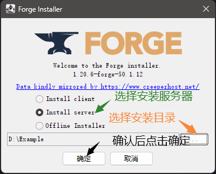

</div><div>

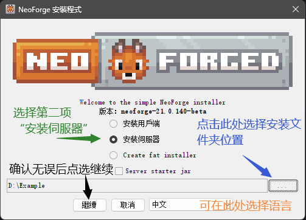

</div></div>

::: tip
由于网络环境不同，点击安装后可能需要一定时间下载依赖库和相关文件，请耐心等待
:::

当正确安装完成后，您可以看到如下界面：

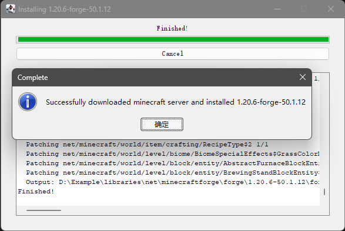

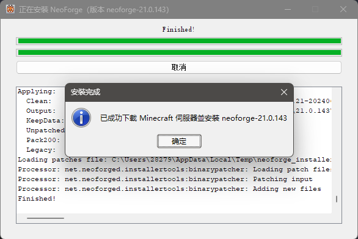

::: tip
如果显示 `build failed` 或者其他失败图标，请尝试多试几次，或在 [sakura交流群](/index.md#community) 中的水群提问，官方群不受理此类问题
:::

@tab Fabric

当您正确安装 java 环境后，双击启动安装器，可选选项如下：

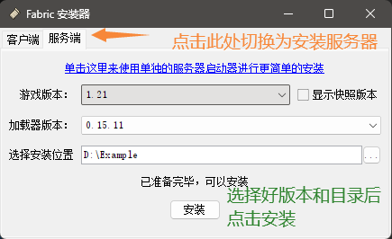

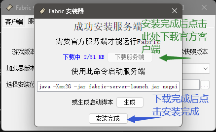

::::

## 运行服务端 {#run_server}

在此教程中，我们仅教给您基础的使用批处理脚本启动服务器的方式，如您使用面板或者开服软件启动，请自行寻找相关文档。

### 前提要求

在继续教学之前，您需要启用文件扩展名以方便您更改文件类型。请选择适合您的系统的教程：

:::: tabs

@tab Windows 11

如图所示，勾选上 `文件扩展名` 选项

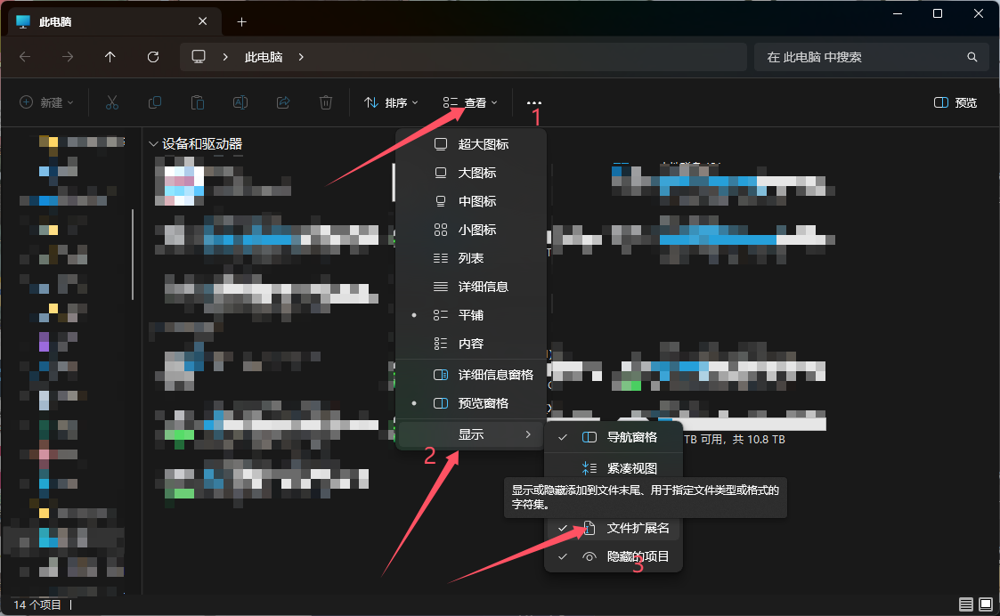

@tab Windows 10

如图所示，勾选上 `文件扩展名` 选项

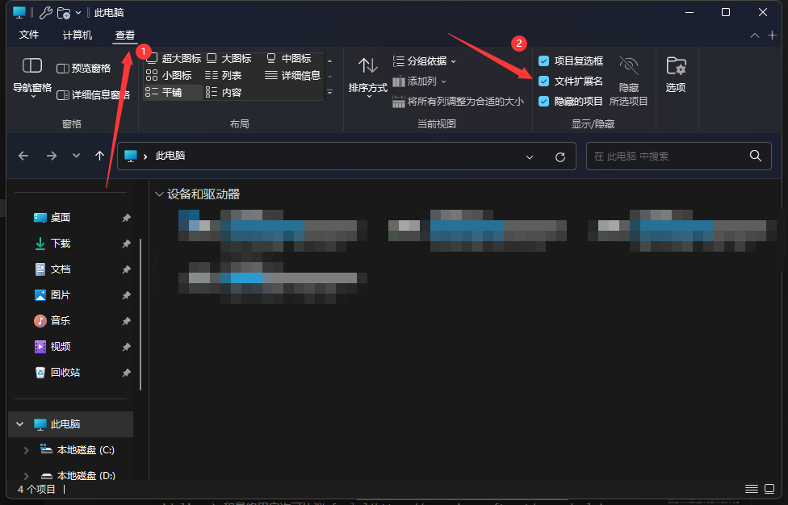

::::

### 确认 Java 环境版本

首先，我们需要确认您电脑上的 Java 环境已经正确安装并且可以正常使用。

您可以通过按 Win+R 按键唤出一个 `运行` 窗口，在窗口中输入 `cmd` 并点击确认或回车，即可唤出命令提示符窗口。

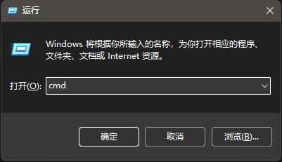

在这个黑色的命令提示符窗口中，输入 `java -version` 并回车就会输出当前的默认 Java 环境版本。

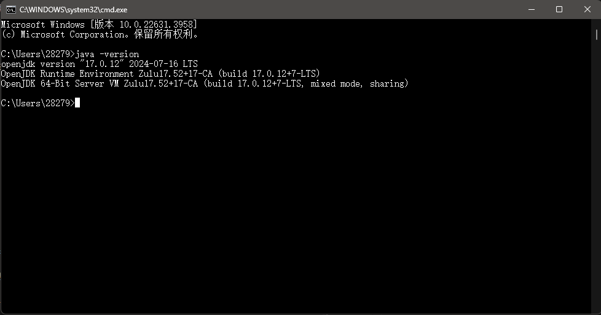

在这张图中，输出结果为：

``` txt
openjdk version "17.0.12" 2024-07-16 LTS
OpenJDK Runtime Environment Zulu17.52+17-CA (build 17.0.12+7-LTS)
OpenJDK 64-Bit Server VM Zulu17.52+17-CA (build 17.0.12+7-LTS, mixed mode, sharing)
```

在此，我们仅需要注意第一行：被双引号包起来的 `17.0.12` 代表目前默认 Java 版本为 Java17。您需要确保显示的 Java 版本为您 [需要的版本](#install-java) 。

另外需要注意的是，Java8 的版本号可能会显示为 `1.8.*` 或 `1.8.0_*` 格式。

### 编写启动变量

::: tip
本节内容为了容易理解简化了很多内容，语言表示可能并不严谨
:::

在此之前，希望您能清楚您系统中 `物理运行内存` 的大小。如果您不知道，请尝试寻求他人的帮助或询问电脑厂商客服。

对于启动服务器的需求而言，我们需要的有以下变量：

`Xmx` 和 `Xms` 。其中，`Xmx` 指定了服务器能占用您电脑上的最大内存数量，而 `Xms` 则指定了服务器占用内存的最小量。由于 Java GC 的复杂性和各种原因，在此您只需要理解一件事：将 `Xmx` 和 `Xms` 设为相同可以提高性能。

如何设置这个参数取决于您启动游戏后还有多少内存。一般情况下，如果您有 16G 的运行内存，启动游戏后还剩 6G ，那么可以将服务器占用内存设为 4G 。此时，您的启动变量看起来像这样：

`-Xmx4G -Xms4G`

另外，我们需要一个额外的 `jar` 参数告诉 Java 我们想要启动的文件为 jar 打包的文件。加上这个参数之后您的启动变量看起来像这样：

`-Xmx4G -Xms4G -jar`

::: warning
请注意，此处的内存参数 **并不是** 越大越好！如果您设置的参数超出了您可用的剩余内存，则服务器会在请求更多内存时 **立刻崩溃** ！
:::

### 编写启动脚本

根据不同的服务器核心，下一步您需要进行的操作有所不同。请根据您所使用的服务器核心选择教程：

:::: tabs

@tab 官方原生核心

官方核心下载后默认文件名为 `server.jar` 。将其移动到您准备用来开服的文件内，并新建一个文本文件。

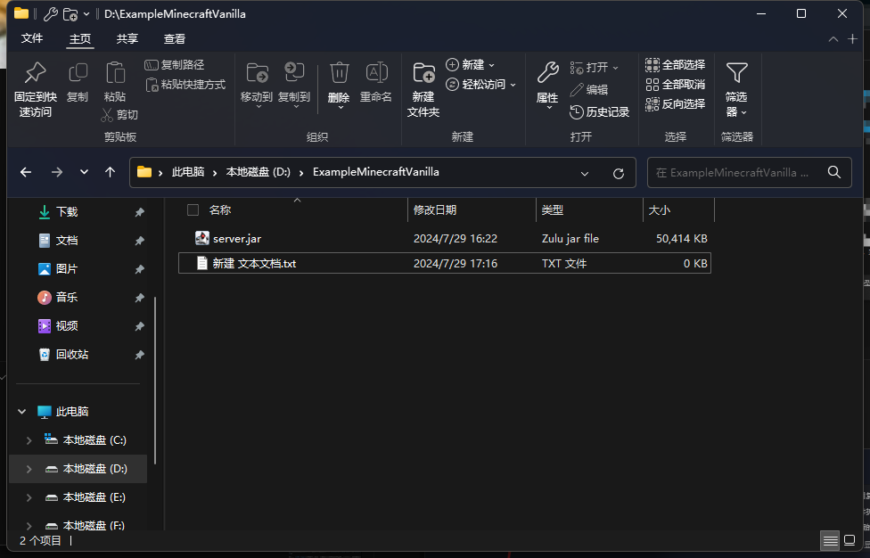

打开您新建的文本文件，在其中写入以下内容

``` bat
java "您在上一节获得的启动变量" "服务器核心文件名称"  
@pause
```

例如，您在上一节编写了 `-Xmx4G -Xms4G -jar` 的启动变量，且您没有更改下载的服务器核心名称，则文件中应该写入以下内容：

``` bat
java -Xmx4G -Xms4G -jar server.jar
@pause
```

保存文件，将文件名 `新建 文本文档.txt` 改为 `启动服务器.bat` ，观察文件类型是否更改为批处理文件。

@tab MinecraftForge

对于 MinecraftForge ，安装器已经在安装时生成了启动脚本和对应的文件。刚刚安装完成的目录看起来应该如下：

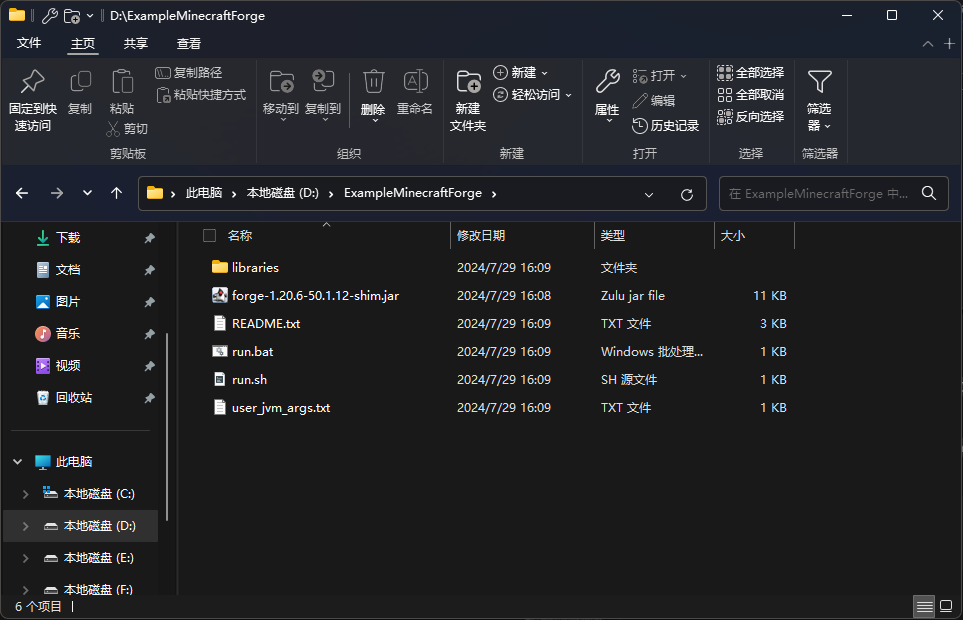

您只需将您获得的启动变量 **去掉`-jar`选项** 之后覆盖掉 `user_jvm_args.txt` 文件的最后一行。例如：

``` txt
# Note: Not all server panels support this file. You may need to set these options in the panel itself.

# Xmx and Xms set the maximum and minimum RAM usage, respectively.
# They can take any number, followed by an M (for megabyte) or a G (for gigabyte).
# For example, to set the maximum to 3GB: -Xmx3G
# To set the minimum to 2.5GB: -Xms2500M

# A good default for a modded server is 4GB. Do not allocate excessive amounts of RAM as too much may cause lag or crashes.
# Uncomment the next line to set it. To uncomment, remove the # at the beginning of the line.
-Xmx4G -Xms4G
```

保存之后，文件夹内的 `run.bat` 文件即为您的启动脚本。

@tab NeoForge

类似于 MinecraftForge ，对于 NeoForge ，安装器已经在安装时生成了启动脚本和对应的文件。

您只需将您获得的启动变量 **去掉`-jar`选项** 之后覆盖掉 `user_jvm_args.txt` 文件的最后一行。例如：

``` txt
# Xmx and Xms set the maximum and minimum RAM usage, respectively.
# They can take any number, followed by an M or a G.
# M means Megabyte, G means Gigabyte.
# For example, to set the maximum to 3GB: -Xmx3G
# To set the minimum to 2.5GB: -Xms2500M

# A good default for a modded server is 4GB.
# Uncomment the next line to set it.
-Xmx4G -Xms4G
```

保存之后，文件夹内的 `run.bat` 文件即为您的启动脚本。

@tab Fabric

FabricLoader 安装器会在文件夹内生成一个启动用 jar 文件 `fabric-server-launch.jar` ，如果您按照我们的教程在退出安装器前点击了下载服务器文件，那么您应该同时看到 `server.jar` 在同一个文件夹内。  
如果您看到的是 `server.jar.tmp` ，则说明您在安装器还没下载完成时就退出了安装器，请重新回到安装器再次安装。

在您安装的文件夹内新建一个文本文件，文件夹内应该看起来像这样：

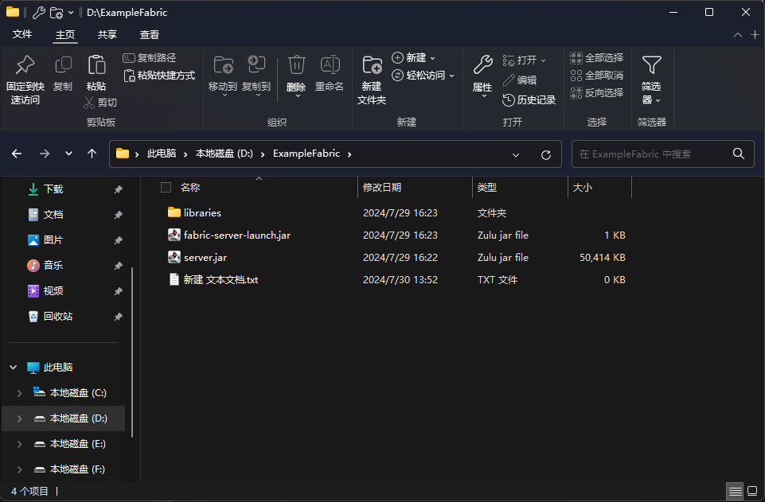

打开您新建的文本文件，在其中写入以下内容

``` bat
java "您在上一节获得的启动变量" "服务器核心文件名称"  
@pause
```

例如，您在上一节编写了 `-Xmx4G -Xms4G -jar` 的启动变量，且您没有更改下载的服务器核心名称，则文件中应该写入以下内容：

``` bat
java -Xmx4G -Xms4G -jar fabric-server-launch.jar
@pause
```

保存文件，将文件名 `新建 文本文档.txt` 改为 `启动服务器.bat` ，观察文件类型是否更改为批处理文件。

@tab Paper

Paper 的核心下载好后默认以 `paper-游戏版本号-Paper版本号` 的形式命名，如 `paper-1.21-119.jar` 代表您下载的是适用于 Minecraft 1.21 的 Paper 核心，版本号 119 。

在您打算运行服务器的文件夹内新建一个文本文件，文件夹内应该看起来像这样：

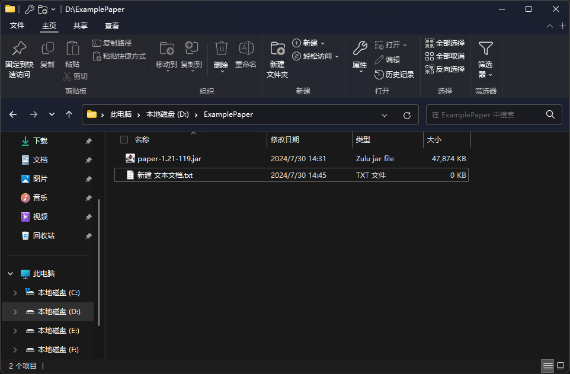

打开您新建的文本文件，在其中写入以下内容

``` bat
java "您在上一节获得的启动变量" "服务器核心文件名称"  
@pause
```

例如，您在上一节编写了 `-Xmx4G -Xms4G -jar` 的启动变量，且 Paper 服务器核心名称为 `paper-1.21-119.jar` ，则文件中应该写入以下内容：

``` bat
java -Xmx4G -Xms4G -jar paper-1.21-119.jar
@pause
```

保存文件，将文件名 `新建 文本文档.txt` 改为 `启动服务器.bat` ，观察文件类型是否更改为批处理文件。

::::

### 最终用户许可协议

::: warning
按照教程进行以下修改文件操作代表您已经同意 [Minecraft 最终用户许可协议 (“EULA”)](https://www.minecraft.net/zh-hans/eula) 以及 [Microsoft 隐私声明](https://go.microsoft.com/fwlink/?LinkId=521839)
:::

运行一次您的启动脚本 `启动服务器.bat` 或者 `run.bat` ，在一段时间后窗口最后一行即会显示

``` log
[**:**:** INFO]: You need to agree to the EULA in order to run the server. Go to eula.txt for more info.
请按任意键继续. . .
```

此时，您需要通过修改 eula 文件的形式来表示您同意 [Minecraft 最终用户许可协议 (“EULA”)](https://www.minecraft.net/zh-hans/eula) 以继续运行服务器。

按下任意按键即可关闭服务器窗口。查看服务器文件夹，您会发现目录下多了一个 `eula.txt` 文件，打开它，将其最后一行的 `eula=false` 改为 `eula=true` ，保存。

### 修改配置

按需调整服务器配置文件，例如 [server.properties](https://zh.minecraft.wiki/w/Server.properties)。

将您下载或所需要的模组、插件放到服务器对应目录中。一般来说， `plugins` 文件夹存放插件， `mods` 文件夹存放模组。

如果您打算重置这个服务器的存档和玩家数据，但是不打算更改服务器配置，您可以选择删除文件夹内的 `world` 文件夹以及所有 `world` 开头的文件夹。

此时再次打开启动脚本，服务器即开始启动。当您看到窗口输出最后一行出现 `>` 标记时，说明服务器已经 **部分** 载入完毕，您可以直接对窗口输入命令。

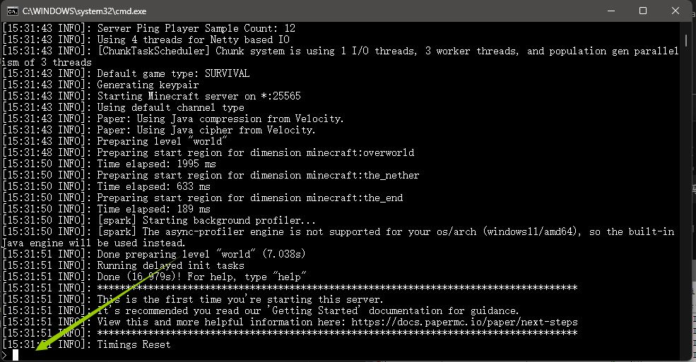

启动完成后，服务器会输出 `Done (**.***s)! For help, type "help"` 的一行日志，看到这行日志说明您的服务器已经全部载入完毕，可以进入游玩了。

启动完成后，您可能会看到两个窗口，一个黑色 `命令提示符` 窗口，一个白色 `Minecraft server` 窗口。需要注意的是：两个窗口都是服务器，关闭 **任意一个** 都会停止服务器的运行。

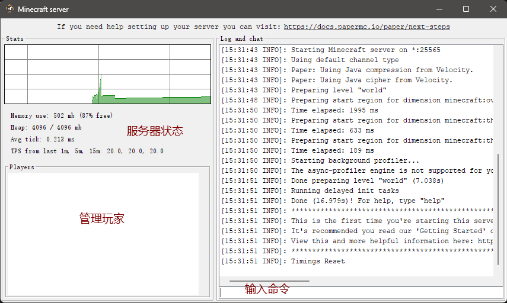

没有这个窗口也是正常的，部分服务器核心为了防止混乱去除了此窗口。

如果您想关闭服务器，请在任意窗口中输入 `stop` 命令并回车发送，服务器就会开始关闭并保存存档数据。当您看到 `请按任意键继续. . .` 的提示，按任意键即可关闭服务器窗口。

### 配置内网穿透

请参考 [创建隧道](/app/mc.md#create-tunnel) 一节，在运行服务端的机器上创建并启动指向本机 `25565` 端口的 TCP 隧道。

## 注意事项 {#server-tips}

如果您无意间在服务器运行的黑色窗口 `命令提示符` 上点击了，命令提示符窗口将会进入选中状态。在此状态下，服务器将会冻结且无法运行。命令提示符的标题将会增加一个 `选择` 在最前方。

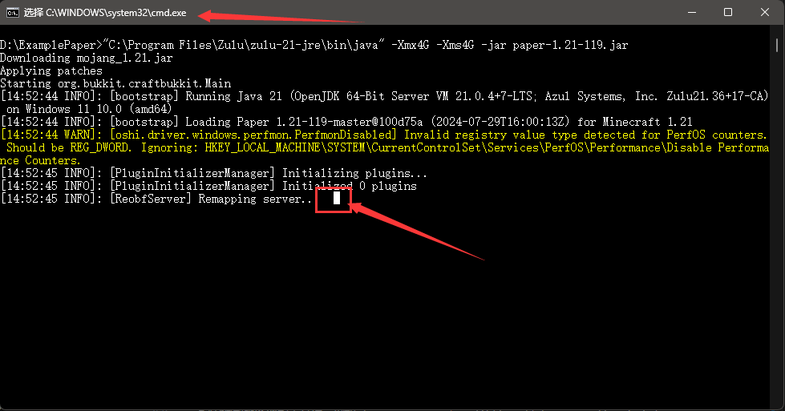

如果您不小心选中了文本，右键即可取消此状态。

::: tip
右键同时还会将您剪切板的内容黏贴到服务器命令行中，请注意确认相关操作不会影响您服务器的安全。
:::

您可以通过以下设置防止此事件的发生：

点击命令提示符窗口左上角的图标，选择属性

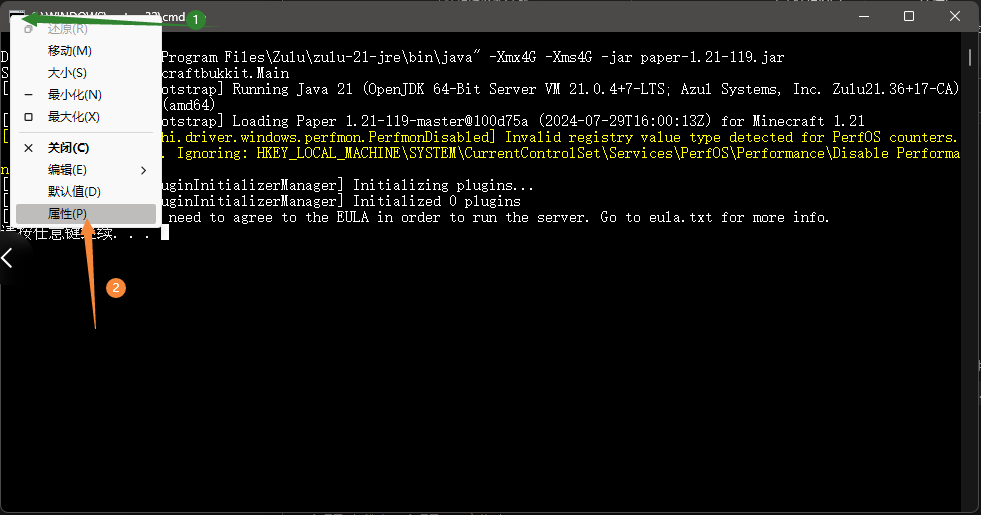

取消掉 `快速编辑模式` 的勾选

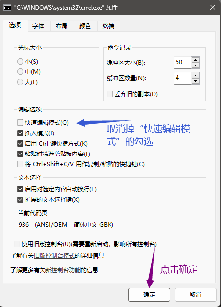

## 补充内容 {#other-content}

### Simple Voice Chat 简单语音聊天

如果您使用 Simple Voice Chat 模组/插件来进行语音聊天，您需要为它单独开一条隧道并进行配置。

1. 创建一个新的 **UDP** 隧道，设置本地端口选择 `和远程一致`，远程端口留空即可  
   *请确认协议选择了 `UDP` 而不是 `TCP`，这与您的 MC 主隧道不同，如果选择不正确将无法正常使用*
1. 创建后会随机生成一个远程端口及本地端口，请记下这个端口备用  
   *这是一个五位数的数字，您可以在启动器界面中一个隧道的左下角找到这个端口号，或者在网页后台该条隧道 `UDP` 字样的后面找到。*
1. 打开 Simple Voice Chat 的配置文件，找到 `port=` 项，将后面的数字修改为您刚刚看到的端口，修改完成后请不要关闭，还有下一步操作  
   *对于 mod 版本 (Fabric/NeoForge/Forge/Quilt)，配置文件在 `config/voicechat/voicechat-server.properties`  
   对于插件版本 (Paper/Spigot/Bukkit)，配置文件在 `plugins/voicechat/voicechat-server.properties`*
1. 开启隧道，类比前面的方法启动隧道并复制 **新隧道的** 连接信息  
   *请注意不要复制到 MC 主隧道或者其他隧道的连接信息*
1. 找到配置文件 `voice_host=` 项，将后面的内容修改为您刚刚复制的连接信息  
   *请注意不要有空格或其他不对劲的特殊字符*  
   *结果应该形如 `voice_host=frp-xxx.top:12345`*
1. **保存配置文件**，重启服务器
   *请一定要确定保存了，不保存是不会生效的*
1. 联机时请确保 **您新创建的隧道是开启状态**，否则您将无法正常使用语音聊天
