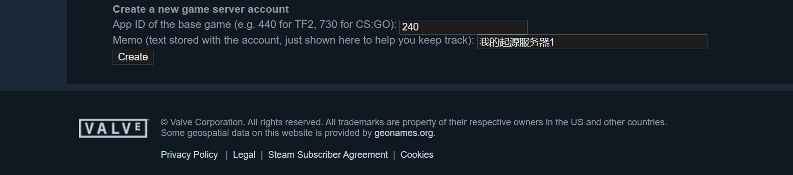

# 起源引擎 (CSGO, 求生之路 2) 等游戏服务器穿透指南

::: warning
本教程内容由社区贡献：[pr/33](https://github.com/natfrp/wiki/pull/33) & [pr/250](https://github.com/natfrp/wiki/pull/250)。  
请注意我们 **并不推荐** 您使用 SakuraFrp 穿透 CSGO 社区服务器，因为这很可能会为 SakuraFrp 招来无差别的打击，影响其他用户的正常使用。
:::

::: warning
本教程主要针对正版 (通过 Steam 认证) 的服务器。
:::

在我们开始进行穿透之前，您需要先了解一些关于起源引擎服务器的前置知识，这些知识将在您遇到困难时提供有利的帮助信息。

## 前置知识

### 哪些游戏属于起源引擎游戏

::: tip
反恐精英 1.6、Sven CO-OP、半条命等属于 GoldSrc 引擎游戏，不适用于本教程。
:::

起源引擎游戏服务器指使用起源引擎制作的支持网络对战的游戏，比较知名的游戏有反恐精英：全球攻势 (CSGO) , 求生之路 1/2 (Left 4 Dead 1/2) ，军团要塞2 (Team Fortress 2)，反恐精英：起源 (Counter-Strike Source)，盖瑞模组 (Garry's Mod)，胜利之日：起源 (Day of Defeat: Source) 等。

这些游戏 (或模组) 都遵循 Valve 制定的 Source Dedicated Server (srcds) 规则。

需要注意的是，不是所有由起源引擎开发的网络对战游戏都遵循 Source Dedicated Server 规则 (如原罪前传) 。如果您的游戏服务器启动程序为 `srcds_run` (Linux) 或 `srcds.exe` (Windows) 则表明该游戏 (或模组) 遵循 Source Dedicated Server 规则。

### 启动命令与 Server 配置文件

遵循 Source Dedicated Server 规则的游戏服务器在启动时一般都会先加载 cfg 文件夹下的 `server.cfg` 文件，该文件定义了服务器必要的基本参数 (如服务器名称，玩家人数等) ，这个文件本质上是一些游戏命令的合集，即在服务器初始化之前执行这些命令。

如何编写 `server.cfg` 不在本文的讨论范围内，且根据游戏不同配置文件的编写内容也不同。但起源引擎有一些命令适用于所有起源引擎制作的游戏 —— 特别是网络通信方面的。

srcds 支持启动时增加命令，命令又分为服务器内命令与启动命令，两者的主要区别就是以 `+` 或 `-` 号开头

在 Linux 下添加启动命令，您只需要将命令添加到启动代码后面即可

```bash
./srcds_run -game xxxx -port xxx +maxplayers 114514 +map 1919810
```

在 Windows 下添加启动命令，您需要先将 `srcds.exe` 添加快捷方式，随后修改 “目标” 一栏中修改：

```powershell
./srcds.exe -game sodayo -port xxx +maxplayers 114514 +map 1919810
```

或者将该命令编写为批处理脚本也能起到同样的效果。

### 游戏端口相关

::: warning
Source Dedicated Server 要求启动时指定的游戏端口与实际游戏服务器端口一致！这意味着您在启动时 `-port` 指定的端口必须与隧道的 TCP/UDP 端口号相同
:::

Source Dedicated Server 官方标准是使用 `27015` 到 `27019` 端口为游戏数据传输 (其他端口也可以) 、pings 和 rcon 端口。27020 为 Source TV 端口 (游戏观战) ，27005 为客户端端口 (玩家端口) ，26900 为服务器与 Steam 通信端口。

这些端口都有启动命令可以更改，但本教程只更改 **游戏数据传输端口**，即可满足玩家游玩的要求。

| 端口名称         | 更改命令      |
| ---------------- | ------------- |
| 游戏数据传输端口 | `-port`       |
| Source TV        | `+tv_port`    |
| 客户端端口       | `-clientport` |
| Steam 通信       | `-sport`      |

## 开始穿透

### SakuraFrp 上的工作

一个游戏服务器需要两个隧道，分别是 TCP 隧道与 UDP 隧道。如果您需要在一台服务器上架设两个求生之路 2 服务器，您需要申请 4 个隧道 (两条 TCP 隧道、两条 UDP 隧道) 。

回到您的服务器上，查看您的内网 IP，请不要使用 `127.0.0.1`，这样会导致 srcds 出现一些非预期的 bug 。

- 在 Linux 下可以使用 `ip addr` 命令查看设备的 IP 地址。
- 在 Windows 下可以使用 `ipconfig` 命令查看设备的 IP 地址。

1. 这样您就得到了您的内网 IP，在申请隧道时，隧道类型请选择 **TCP 隧道**，然后将您得到的 **内网 IP** 填写在 **本地 IP** 中。
2. **本地端口** 随意填写一个，因为我们现在还没有得知隧道的远程端口是什么 (您也可以指定远程端口，指定的 **远程端口** 与 **本地端口** 需相同) ，其他保留默认值。
3. 点击创建，您就获得了一条 TCP 隧道，在 SakuraFrp 控制面板中您可以看到新建隧道的远程端口，它位于 **类型** 下 **TCP** 旁边。
4. 随后点击操作 —— 编辑，将 **远程端口号** 输入进 **本地端口** 一栏中，点击保存。
5. 再次创建一条 **UDP 隧道**，此时的 **本地端口** 与 **远程端口** 处均填写 **TCP 隧道远程端口** 。

至此，隧道工作准备完成，您可以在服务器上启动 SakuraFrp 程序了。

### 起源引擎游戏服务器上的工作

您需要先确定下在服务器防火墙上，**TCP 隧道远程端口** 处于打开状态 (TCP/UDP 均被打开) ！如何操作防火墙不在本文讨论范围内，且部分 idc 供应商会使用自己的防火面板 (如阿里云的安全组，腾讯云的防火墙)

确认好端口开通后，您需要修改 `server.cfg` 文件并在任意位置向其添加`sv_lan 1` 选项。

::: tip
由于 Valve 的新规定，部分游戏服务器需要在 `server.cfg` 中使用 Steam 游戏服务器帐户令牌才能连接，请查看 [GSLT 令牌](#get-gslt)。
:::

### 启动

在启动服务器时，您需要在原版启动指令上做一些修改。

您需要在原版启动指令的基础上添加三个参数：

```bash
-port <您的 TCP 隧道远程端口> -ip <您的内网 IP> +hostip <可选，但建议您添加：您的内网 IP> +sv_setsteamaccount <可选，声明令牌>
```

### 举例

- 启动并穿透 求生之路 2 服务器：

```bash
./srcds_run -game left4dead2 -port 33562 -ip 192.168.2.103 +hostip 192.168.2.103 +map c1m1_hotel
```

- 启动并穿透 胜利之日：起源 (Day of Defeat: Source) 服务器：

```bash
./srcds_run -game dod -port 33562 -ip 192.168.2.168 +hostip 192.168.2.168 +map dod_avalanche +maxplayers 20
```

- 启动并穿透 反恐精英：全球攻势 (CSGO) 服务器：

```bash
./srcds_run -game csgo -port 33562 -ip 192.168.2.168 +hostip 192.168.2.168 +map de_dust2 +maxplayers 10 +sv_setsteamaccount 1145141919810sodayo
```

::: warning
启动 CSGO 服务器需要 GSLT 令牌，查看下面的段落以获取 GSLT 令牌。
:::

### GSLT 令牌 {#get-gslt}

由于 Valve 的新规定，在启动 **某些** 起源游戏服务器时，**需要** 有GSLT令牌。
那什么是 GSLT 令牌呢？ GSLT 令牌是一个专属的服务器身份识别码，类似于身份证，有了 GSLT，Valve 可以确定服务器属于谁，
收藏了带有 GSLT 令牌的服务器，即使更换 IP 地址，仍能出现在服务器列表里。

打开 [SteamDB](https://steamdb.info/) 在搜索框里打出您的游戏名字，记下详情页的 APPID 备用。

对于常用的游戏，下面是它们的 APPID：

| 游戏名 | APPID |
|---|----|
| 反恐精英：全球攻势 | 730 |
| 泰坦陨落 2 | 440 |
| 反恐精英：起源 | 240 |

接下来打开 [Valve 官方的 GSLT 令牌管理页面](https://steamcommunity.com/dev/managegameservers) 进行创建。

::: warning
如果您的 Steam 账号 **不拥有** 某一个游戏，将 **无法** 为那个游戏创建GSLT令牌
:::

然后把 SteamDB 详情页的第一行（APPID）后面的一串数字码填到第一个框里去，下一个框可以填一个自己喜欢的名字，便于记忆。




点击 `Create`，复制 `Login Token`，即是您的 GSLT 令牌。

在您的服务器开启指令中，加入下面的参数即可：

```
+sv_setsteamaccount <您的 GSL T令牌>
```
